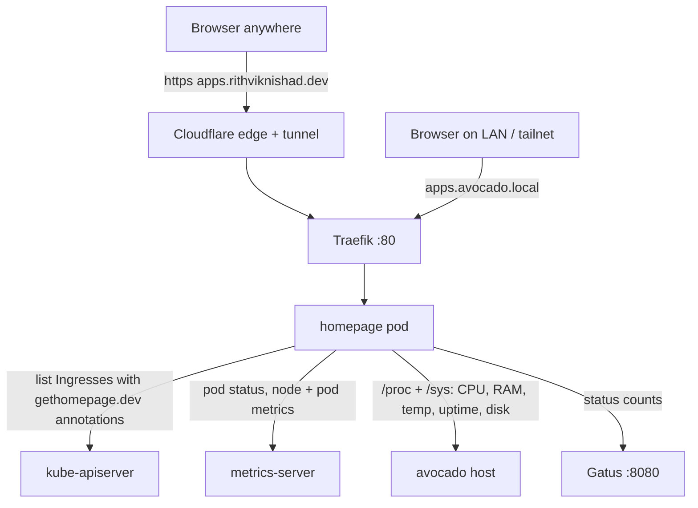

# App gallery: `apps.rithviknishad.dev`

A public launcher for everything avocado exposes. It runs
[Homepage](https://gethomepage.dev) on k3s under `k8s/homepage/`. Each public app
gets a tile with a live pod-status dot and CPU/RAM. Cluster and host stats sit
across the top.



| | |
|---|---|
| Public | `https://apps.rithviknishad.dev`. Cloudflare tunnel, **no auth, no Cloudflare Access** (by choice) |
| LAN / tailnet | `http://apps.avocado.local`, or `curl -H "Host: apps.avocado.local" http://avocado` |
| Image | `ghcr.io/gethomepage/homepage:v2.4.0`, pinned by digest |
| Config | ConfigMap `homepage-config` in `k8s/homepage/homepage.yaml` |
| Tiles | `gethomepage.dev/*` annotations on each app's own Ingress, plus a few static entries |
| State | none (no PVC, no Secret) |

## Tiles and groups

| Group | Tile | Host | Defined in |
|---|---|---|---|
| Personal | Immich | `photos.rithviknishad.dev` | `k8s/immich/immich.yaml` Ingress |
| Personal | suchi | `suchi.rithviknishad.dev` | `k8s/suchi/suchi.yaml` Ingress |
| CARE | CARE | `care.rithviknishad.dev` | `k8s/care/care.yaml` Ingress |
| CARE | CARE API | `care-api.rithviknishad.dev` | static, `services.yaml` |
| CARE | CARE box | `care-box.rithviknishad.dev` | static, `services.yaml`: on the Raspberry Pi lumine, not k3s, so its status comes from `siteMonitor` ([CARE in a box](care-box.md)) |
| Infrastructure | Kite | `kite.rithviknishad.dev` | `k8s/kite/kite.yaml` Ingress |
| Infrastructure | Grafana | `grafana.rithviknishad.dev` | `k8s/monitoring/grafana-ingress.yaml` |
| Infrastructure | Status (+ Gatus up/down widget) | `status.rithviknishad.dev` | `k8s/monitoring/gatus.yaml` Ingress |
| Dev Tools | Mailpit | `mailpit.rithviknishad.dev` | `k8s/mailpit/mailpit.yaml` Ingress |
| Dev Tools | hello | `hello.rithviknishad.dev` | `k8s/sample.yaml` Ingress |
| TeleICU | TeleICU Gateway | `care-teleicu-gateway.rithviknishad.dev` | `k8s/care-teleicu/care-teleicu.yaml` Ingress |
| TeleICU | TeleICU Devices | `care-teleicu-devices.rithviknishad.dev` | static, `services.yaml` |
| TeleICU | Mock PTZ Camera | `mock-ptz-camera.rithviknishad.dev` | static, `services.yaml` |
| TeleICU | ONVIF Console | `onvif-console.rithviknishad.dev` (Cloudflare Access) | `k8s/onvif-console/onvif-console.yaml` Ingress |

Groups are laid out by `settings.yaml` `layout`. Personal, CARE, Infrastructure
and Dev Tools sit side by side as columns. TeleICU, which has the most tiles,
is a full-width row below them.

**Not listed:** the tailnet-only services ([Attic](attic.md),
[Zerodha Kite MCP](zerodha-kite.md), [Settle Up MCP](settle-up-mcp.md)) are
deliberately left off, since a public page can't link to them usefully. The
gallery doesn't list itself either: its own Ingress has no annotations.

## Adding or removing a tile

Most tiles come from **Ingress annotation discovery**. Homepage lists every
Ingress in the cluster and turns each one with `gethomepage.dev/enabled: "true"`
into one tile. Add these to the app's Ingress `metadata.annotations`:

```yaml
gethomepage.dev/enabled: "true"
gethomepage.dev/group: Dev Tools             # must match a group name exactly
gethomepage.dev/weight: "30"                 # order within the group (low first)
gethomepage.dev/name: My App
gethomepage.dev/description: What it is
gethomepage.dev/icon: myapp.svg              # dashboard-icons name, mdi-*, or a URL
gethomepage.dev/href: https://myapp.rithviknishad.dev
gethomepage.dev/pod-selector: app=myapp      # only if not app.kubernetes.io/name=<ingress name>
```

Then apply that app's manifests with its usual deploy (`just <app>-deploy` or
`kubectl apply -k k8s/<app>`). Homepage picks the tile up on the next page
load; it does **not** need a redeploy.

Gotchas:

- **Always set `href`.** Without it Homepage builds `http://<first rule's host>`.
  That is plain http, and for Ingresses that list a `.avocado.local` host
  first (Grafana, Gatus) it is the LAN name.
- **One tile per Ingress.** For a second public host on the same Ingress
  (e.g. `care-api.*` on the `care` Ingress), add a static entry under the same
  group in the ConfigMap's `services.yaml`, with `namespace`, `app` and
  `podSelector` so it still gets a status dot. Don't split an Ingress just to
  get a tile.
- **Pod selector must exclude Job pods.** A `Completed` backup Job pod makes the
  tile look degraded. `pod-selector: app` (label exists) works for CARE and
  Immich because their Job pods carry no `app` label.
- **Weights:** discovered tiles default to weight `0` and static ones to
  `100, 200, …`. Set explicit weights on both so they interleave predictably.
- **New group?** Add it to `layout` in `settings.yaml` too, or it lands at the
  end with default styling.

Removing an app? Delete its annotations along with the Ingress, which is
automatic if the Ingress goes away. Remove any static `services.yaml` entry for
it as well.

Editing the ConfigMap (`settings.yaml`, `services.yaml`, `widgets.yaml`, …)
requires bumping `checksum/config` on the Deployment, then `just apps-deploy`.
Homepage reads config at startup.

## Widgets

Across the top (`widgets.yaml`):

| Widget | Shows | Source |
|---|---|---|
| `greeting` | 🥑 avocado | static |
| `kubernetes` | cluster + node CPU/RAM | metrics-server (bundled with k3s) via the ClusterRole |
| `resources` (host) | CPU %, RAM, CPU temperature, uptime | `/proc` + `/sys` inside the pod, which on k3s show the host's values |
| `resources` (k3s storage) | used/free of the pod's `/` | the k3s dataset on `rpool`, not the whole pool |
| `datetime` | date and time | the visitor's browser |

On the tiles, `showStats: true` adds per-app CPU/RAM (metrics-server). The
Status tile carries a `gatus` widget with up/down counts, fetched server-side
from `http://gatus.monitoring.svc:8080`.

## Security and what's public

The gallery has **no authentication**, and that is deliberate. It links only to
hosts that are already public, and each one keeps its own gate: CARE/suchi/Kite/Grafana logins, Mailpit basic
auth, Cloudflare Access on the ONVIF console. Anyone can see:

- **Every public hostname**, including the Access-gated `onvif-console`. The
  gate still applies on click; the name is just no longer obscure.
- **Host and cluster stats:** CPU, RAM, CPU temperature, uptime, k3s disk use.
- **Pod status and CPU/RAM for any namespace and label selector.** Homepage's
  `/api/kubernetes/{status,stats}/<namespace>/<app>?podSelector=…` endpoints
  take both from the request, so anyone can probe which namespaces exist and
  how busy they are. That is pod-level aggregates only. Pod specs, env, logs
  and Secrets are not exposed. The ClusterRole is read-only and doesn't
  include Secrets or ConfigMaps at all.

Deliberate choices that bound the exposure:

- **No `prometheusmetric` widget.** Homepage's widget proxy forwards the
  client-supplied PromQL query, which would turn VictoriaMetrics into a public
  query API. VictoriaMetrics is unauthenticated and kept off the tunnel on
  purpose. Host stats come from the `resources` widget instead.
- **Minimal RBAC:** `get`/`list` on namespaces, pods, nodes, ingresses and
  `metrics.k8s.io`. Traefik/Gateway CRD discovery is disabled in
  `kubernetes.yaml`, so no CRD access is needed.
- **Monitoring stays default-deny.** A single NetworkPolicy
  (`allow-homepage-to-gatus`, see [Monitoring](monitoring.md#network-policies))
  opens Gatus `:8080` to the `homepage` namespace. That API is already public
  on `status.rithviknishad.dev`.
- **Pod hardening:** the namespace enforces PodSecurity `restricted`. The pod
  runs as uid 1000 with a read-only root, no capabilities and
  `RuntimeDefault` seccomp. Writes go only to emptyDirs (logs, Next.js
  cache, `/tmp`).
- **Host allow-list:** Homepage answers only to the hosts in
  `HOMEPAGE_ALLOWED_HOSTS` (the two Ingress hosts plus the pod IP for kubelet
  probes) and returns 400 for anything else.

If any of this ever needs to be private, put a Cloudflare Access app in front of
`apps.rithviknishad.dev`. Nothing else has to change.

## Deploy / operate

```sh
just apps-deploy     # kubectl apply -k k8s/homepage
just apps-status
just apps-logs
just apps-dns        # one-time: point apps.rithviknishad.dev at the tunnel
```

First-time setup is `just apps-deploy`, then `just deploy` (adds the host to
`modules/cloudflared.nix`), then `just apps-dns`. The tiles appear as each
annotated Ingress is applied by its own app's deploy.

Upgrades: bump the tag and digest in `k8s/homepage/homepage.yaml`, then
`just apps-deploy`. Before deploying, check that the ConfigMap still has a key for
every file in the new image's skeleton
(`docker run --rm --entrypoint ls <image> /app/src/skeleton`). Homepage
creates missing ones on first use, which on a read-only `/app/config` kills the
process (see Troubleshooting).

{: .note }
> Homepage's index page is prerendered **at image build time** with its skeleton
> config, and only regenerates when `/api/revalidate` is called. Browsers that
> have visited before do that themselves when the config hash changes. To make
> sure a first-time visitor right after a restart gets the real page, a
> `postStart` hook calls it once the server answers. The resulting
> `EROFS … /app/.next/server/pages/en.html` warning in the logs is expected:
> the root filesystem is read-only, so Next keeps the regenerated page in
> memory.

## Monitoring

Gatus probes `https://apps.rithviknishad.dev/api/healthcheck` in group `public`
every 5 minutes, including TLS expiry, and alerts to `avocado-alerts`. The
kubelet probes the same endpoint for readiness/liveness. See
[Monitoring](monitoring.md).

## Troubleshooting

| Symptom | Cause / fix |
|---|---|
| Traefik `no available server`; pod in `CrashLoopBackOff` with `Failed to initialize required config: /app/config/<file>` + `EROFS` | A skeleton config file is missing from the ConfigMap. Homepage copies it in lazily, e.g. on the browser's `/api/validate` call, so a plain `curl /` won't trigger it. Add the key (empty is fine) and bump `checksum/config`. Happened with `proxmox.yaml` on first deploy. |
| `400` / "Host validation failed" in logs | The request's Host isn't in `HOMEPAGE_ALLOWED_HOSTS`. Add new hostnames there as well as to the Ingress. |
| A tile is missing | Its Ingress lacks `gethomepage.dev/enabled: "true"`, or the annotated version hasn't been applied. Check with `kubectl get ingress -A -o yaml \| grep gethomepage`. |
| Tile shows "Not found" / grey dot | `pod-selector` (or the default `app.kubernetes.io/name=<ingress>`) matches no pods. |
| Tile status looks partial | The selector also matches Job pods; narrow it. |
| Status tile widget errors | The `allow-homepage-to-gatus` NetworkPolicy is missing, or Gatus is down. |
| Config edit not showing | `checksum/config` wasn't bumped, so the pod didn't roll. |
| RBAC "forbidden" in `just apps-logs` | Homepage tried an API outside the ClusterRole, e.g. `traefik`/`gateway` re-enabled in `kubernetes.yaml`. |

## Files

| Path | Purpose |
|---|---|
| `k8s/homepage/` | namespace, ServiceAccount + ClusterRole, ConfigMap, Deployment, Service, Ingress |
| `k8s/*/…yaml` Ingresses | `gethomepage.dev/*` tile annotations, next to each app |
| `k8s/monitoring/networkpolicies.yaml` | `allow-homepage-to-gatus` |
| `k8s/monitoring/gatus.yaml` | `apps.rithviknishad.dev` probe |
| `modules/cloudflared.nix` | tunnel route for `apps.rithviknishad.dev` |
| `justfile` | `apps-deploy` / `-status` / `-logs` / `-dns` |
