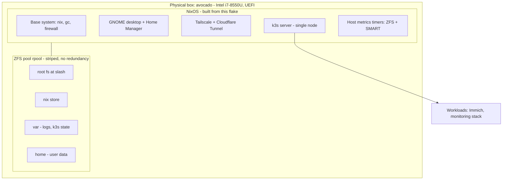
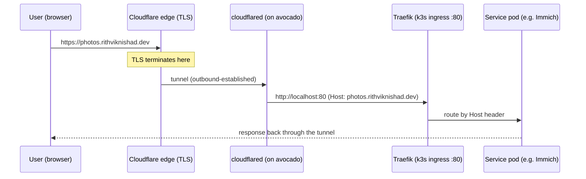
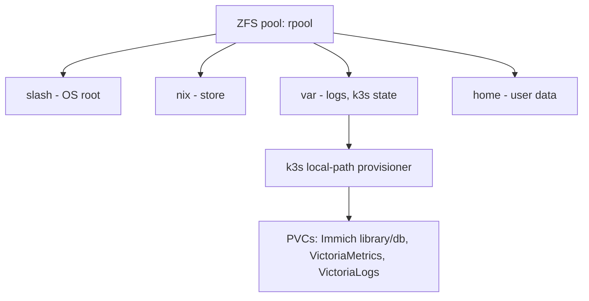
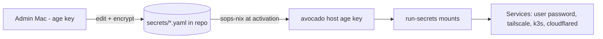

# Architecture

This page is the end-to-end mental model of `avocado`. Everything else is
detail on one of these layers.

## The layers

`avocado` is a single physical machine wearing several hats at once:



Each layer is defined by a NixOS module (see [NixOS & modules](nix-modules.md))
and imported by `hosts/avocado/default.nix`.

## How the flake wires together

```mermaid
flowchart LR
    flake[flake.nix]

    flake --> nixos[nixosConfigurations.avocado]
    flake --> home[homeConfigurations.rithviknishad@avocado]
    flake --> shell[devShells.default]

    nixos --> hw[hosts/avocado/hardware.nix]
    nixos --> disko[hosts/avocado/disko.nix]
    nixos --> mods[modules/*.nix]
    nixos --> user[users/rithviknishad.nix]

    mods --> hm[modules/home-manager.nix]
    hm --> homeprofile[home/rithviknishad]
    home --> homeprofile

    shell --> tools[just, sops, age, kubectl, helm, helmfile, nixos-anywhere]
```

Two ways the same Home Manager profile is used:

- **System-wide** via `modules/home-manager.nix` during a full `nixos-rebuild`
  (`nh os switch`).
- **Standalone** via `homeConfigurations."rithviknishad@avocado"` so you can
  iterate on just your dotfiles with `nh home switch` — no full rebuild.

## How a public request reaches a service

This is the single most important flow to understand. There are **no inbound
ports** open to the internet — `cloudflared` dials *out* to Cloudflare and the
tunnel carries traffic back in.



Key points:

- **TLS terminates at Cloudflare's edge** — no cert-manager needed on the box.
- `cloudflared` forwards *every* mapped hostname to `localhost:80`, where
  **Traefik routes by `Host` header** to the right k8s Ingress.
- The same services are reachable privately over Tailscale by sending the
  `Host` header to `http://avocado` directly (bypassing Cloudflare).

See [Networking](networking.md) for the full routing table.

## Where data lives



k3s's built-in **local-path** provisioner carves PersistentVolumes out of the
host filesystem (under `/var`), which sits on the ZFS `rpool`. That means
**every PVC ultimately lives on the no-redundancy stripe** — losing either
disk loses it all. This is exactly why the [monitoring](monitoring.md) stack
puts so much weight on ZFS pool health and SMART alerts.

## Secrets flow (build + boot time)



Everything sensitive is committed **encrypted**. The box decrypts at activation
using its own age key at `/var/lib/sops-nix/key.txt` (never in the repo). Full
details on the [Secrets](secrets.md) page.

## Design decisions worth knowing

- **One striped ZFS pool, no redundancy.** Chosen for maximum capacity
  (~342 GB) from two mismatched disks. The tradeoff: any single disk failure
  destroys the whole pool including the OS. Off-box `zfs send` backups are the
  safety net.
- **Desktop + server on one box.** The machine never sleeps (sleep targets are
  masked and GNOME idle actions disabled) so services stay reachable.
- **k3s with bundled add-ons on.** Traefik, ServiceLB, and local-path are left
  enabled for an easy first workload rather than swapping in heavier
  alternatives.
- **Push-based public access.** Cloudflare Tunnel avoids the need for a static
  IP, port forwarding, or a public firewall hole.
- **Secrets in-repo, encrypted.** sops-nix keeps the config fully declarative
  without leaking plaintext — even the CI mirror token never appears in the
  clear.
