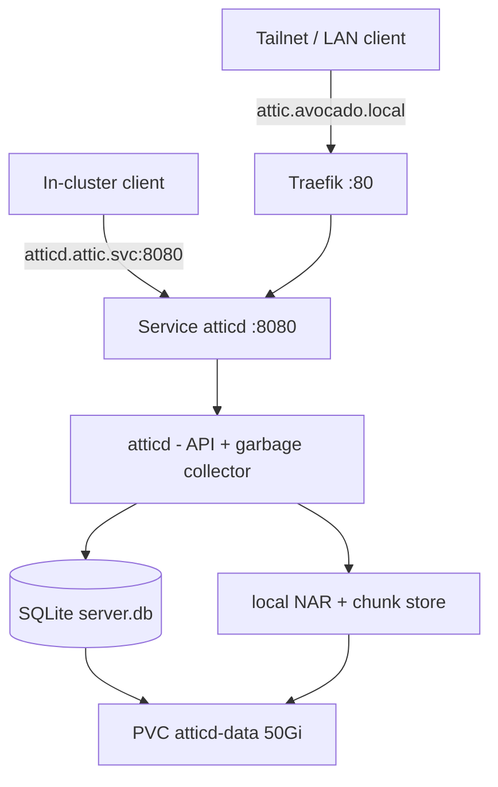

# Attic — self-hostable Nix binary cache

[Attic](https://github.com/zhaofengli/attic) is a self-hostable Nix binary
cache server with **global deduplication** (content-defined chunking), **zstd**
compression, and **garbage collection**. It runs on the k3s cluster under
`k8s/attic/` and lets every machine push/pull build outputs to one shared cache
instead of rebuilding the same derivations everywhere.

> **Not public.** Attic is exposed **only** to Tailscale devices and the local
> network (via Traefik's `attic.avocado.local` host route) — there is **no**
> Cloudflare Tunnel entry. This keeps the cache off the public internet and
> also sidesteps Cloudflare's free-plan ~100 MB request-body cap, which would
> otherwise break pushes of large NARs (the client streams a whole NAR per PUT).

## Architecture



A single `atticd` process is the whole cache — there is **no separate database
or object store**:

| Piece | Choice | Why |
|---|---|---|
| Database | **SQLite** on the data PVC | Single node, single writer. Upstream recommends Postgres only for multi-replica, which we don't run. |
| Storage | **`local`** backend on the same PVC | Avoids standing up MinIO/S3 for a personal cache. Dedup + compression are server-side regardless of backend. |
| Process | one Deployment (`Recreate`) | The API server and GC run in one `atticd`; the RWO volume must never have two writers. |

Both the SQLite DB and the NAR/chunk store live on the `atticd-data` PVC, which
lands on the k3s local-path storageClass under `/var` on the `rpool`
**stripe** — no redundancy (see [Storage](storage.md)). A binary cache is
reproducible (re-push from source), so that trade is acceptable here.

## Access

| Path | URL | Auth |
|---|---|---|
| Tailscale / LAN | `http://avocado` (Host: `attic.avocado.local`) | tailnet/LAN reach + JWT token |
| In-cluster | `http://atticd.attic.svc:8080` | JWT token |

Every cache operation is gated by a JWT signed with the HS256 secret. There is
no public edge and no Cloudflare Access — reachability is the tailnet/LAN, and
the token is the authorization. Clients that pull as a Nix substituter must be
able to **resolve `attic.avocado.local` to the box** (via LAN DNS, Tailscale
MagicDNS search domain, or `/etc/hosts`), the same as the other
`*.avocado.local` internal services (see
[Networking](networking.md#reaching-internal-services-over-tailscale)).

## Image

Uses the upstream image `ghcr.io/zhaofengli/attic` directly — no build-on-box
step (unlike CARE/OTS). Tags are commit hashes; the manifest pins the `toml-1.x`
tag (`9eda345…`). Bump the `image:` in `k8s/attic/attic.yaml` to update.

## Deploying

1. **Create the secret** (first time). The only secret is the base64 HS256 key
   atticd uses to sign and verify every token:

   ```sh
   just attic-secrets          # opens secrets/attic.enc.yaml in sops
   ```

   Set `ATTIC_SERVER_TOKEN_HS256_SECRET_BASE64` to a strong key
   (`openssl rand 64 | base64 -w0`); see `k8s/attic/secret.example.yaml`.

2. **Deploy** the manifests and the secret:

   ```sh
   just attic-deploy           # kubectl apply -k k8s/attic  +  sops-decrypted Secret
   just attic-status
   ```

That's it — no DNS route or `just deploy` needed, since there is no public edge.

## Using it

### 1. Mint a token

Tokens are signed by `atticadm` inside the pod (it reads the same HS256 secret
from the env; `-f` points it at the mounted config). `sub` names the holder; the
recipe grants full rights on all caches — narrow the globs for least privilege:

```sh
just attic-token laptop            # full-access token valid 1y, sub=laptop
just attic-token ci 90d            # 90-day token
```

Copy the printed token (do not commit it).

### 2. Log in and create a cache

Log in against the tailnet/LAN host (must resolve to the box):

```sh
attic login avocado http://attic.avocado.local <token>
attic cache create mine            # create a cache named "mine"
```

### 3. Push and pull

```sh
attic push mine ./result           # push a build output (and its closure)
attic use mine                     # configure Nix to substitute from this cache
```

`attic use` writes the substituter + trusted public key into your Nix config;
the substituter URL comes from atticd's `api-endpoint`
(`http://attic.avocado.local/`), so any machine that can resolve that host can
pull.

## Monitoring

Gatus (`k8s/monitoring/gatus.yaml`) probes the token-less in-cluster root route
(`GET http://atticd.attic.svc:8080/` returns a 200 placeholder), which proves
the axum app + SQLite are up (group `internal`). There is no public-edge probe
because the service is not exposed publicly.

Remember to bump the gatus Deployment's `checksum/config` annotation when the
ConfigMap changes, or the pod won't pick it up.

## Secrets

`atticd-secret` (sops-encrypted in `secrets/attic.enc.yaml`, applied by
`just attic-deploy`) holds only `ATTIC_SERVER_TOKEN_HS256_SECRET_BASE64`. Edit
with `just attic-secrets`; rekey with `just attic-secrets-rekey` after changing
recipients in `.sops.yaml`. **Rotating this key invalidates every token already
minted** — re-issue client tokens after a rotation. Everything non-secret
(listen address, allowed hosts, api-endpoint, DB path, chunking, GC) lives in
the `atticd-server-toml` ConfigMap in `k8s/attic/attic.yaml`.

## Garbage collection

atticd runs LRU garbage collection every 12 hours (`[garbage-collection]` in
the ConfigMap). Time-based retention is **opt-in per cache** (default: keep
everything) — set a retention period on a cache with
`attic cache configure <cache> --retention-period <duration>` if you want old
paths reaped automatically.

## Recipes

| Recipe | Does |
|---|---|
| `just attic-deploy` | apply manifests + sops secret |
| `just attic-status` | pods/svc/ingress/pvc in the `attic` namespace |
| `just attic-logs` | tail the atticd logs |
| `just attic-token <sub> [validity]` | mint a JWT access token via atticadm |
| `just attic-secrets` / `-rekey` | edit / rekey the sops secret |
