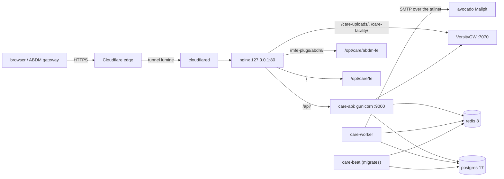

# CARE in a box: `care-box.rithviknishad.dev` on lumine

**lumine** is a Raspberry Pi 5 (2 GB RAM, 4 cores) running
[CARE](care.md) on its own: the same backend and care_fe branches and the
same configuration as avocado, **minus everything TeleICU**. Unlike the
rest of this repo it is **not NixOS and not k8s**. It runs Raspberry Pi OS
(Debian 13 trixie) with plain systemd units, all configured from
[`lumine/`](https://github.com/rithviknishad/systems.nix/tree/main/lumine).
**avocado (or the Mac) is its control plane**: the `box-*` recipes run
there, from this repo, and drive lumine over SSH + sudo. The Pi itself has no
repo checkout, no sops and no agent tooling; it only runs CARE.

The build-out plan, the decisions behind it and a dated status log live in
`lumine/PLAN.md`. This page documents what actually exists.

| | |
|---|---|
| Public URL | `https://care-box.rithviknishad.dev` (lumine's own Cloudflare tunnel `lumine`) |
| Access | `ssh rithviknishad@lumine` (tailnet, `100.67.15.72`) or `lumine.local` (LAN) |
| OS | Raspberry Pi OS (Debian 13 trixie, arm64), on the SD card (SSD deferred) |
| Control plane | this repo on avocado or the Mac (in the devshell): `just box-*` ssh to `rithviknishad@lumine`. Scripts and config are shipped to a root-owned `/usr/local/lib/care-box` on the box (`just box-sync`, run by every recipe that needs it) |



Bring-up on a fresh box, in order, from avocado (everything is idempotent):

```sh
just box-provision         # packages, users, units, nginx site, tunnel config
just box-secrets-render    # decrypt here, render there; starts versitygw + the tunnel
just box-deploy            # build the backend, migrate, start care.target
just box-buckets           # buckets + the care-facility policy
just box-fe                # ON AVOCADO: build + ship the SPA and the ABDM MFE
just box-seed-demo         # demo fixtures, then admin's password from the sops file
just box-register-abdm     # plug_config for the ABDM MFE
```

## Control plane

Nothing about care-box is operated from the Pi itself. The recipes run where
this repo is (avocado or the Mac), and reach the box as `rithviknishad@lumine`
over the tailnet (passwordless sudo there):

- **Scripts and config** (`lumine/` minus `PLAN.md`, plus avocado's
  `k8s/care/additional-plugs.json` and a `SYSTEMS_NIX_REVISION` stamp) are
  rsynced to **`/usr/local/lib/care-box`**, root-owned and read-only to
  everyone else, by `just box-sync`. Every recipe that runs a script there
  syncs first, so the box always runs this checkout's version, like `just
  deploy` does for avocado. It's deliberately not under `/opt/care`: the
  `care` user owns that, and must not be able to rewrite what root runs.
- **Secrets** are decrypted on the control plane with its own age key and
  streamed to the box over SSH stdin, never argv or a temp file
  (`box-secrets-render`, `box-seed-demo`). lumine isn't a sops recipient,
  so the Pi holds only the rendered files it runs on and can't open
  anything in `secrets/`.
- **Host key**: avocado pins lumine's SSH host key system-wide
  (`modules/care-box.nix`). On the Mac it's trust-on-first-use.

| Recipe | What |
|---|---|
| `just box-status` | units, running revisions (backend, SPA, MFE, ops scripts), memory, disk, temperature + throttling |
| `just box-health` | every unit active and none failed, postgres/redis/VersityGW/gunicorn/nginx on the box, then the public URL end to end. Non-zero exit on any failure |
| `just box-start` / `box-stop` / `box-restart` | the backend (`care.target`: beat, API, worker). Start/restart wait for beat's migrations and then for gunicorn to answer. Postgres, redis, VersityGW, nginx and the tunnel keep running |
| `just box-offline` / `box-online` | stop/start the tunnel: the public URL goes down (Cloudflare's 530 page) while the box stays up |
| `just box-logs [unit]` | follow `care-*` (or any unit's) journal |
| `just box-manage <cmd> [args]` | `manage.py` as `care` with the units' env (pty when interactive) |
| `just box-deploy [ref] [repo]` | build + roll out the backend |
| `just box-fe [ref] [repo]` | build + ship the SPA and the ABDM MFE (on avocado) |
| `just box-provision` / `box-upgrade` | converge the base system / `apt full-upgrade` |
| `just box-secrets` / `box-secrets-render` | edit the sops file / render it onto the box |
| `just box-ssh` | a shell on lumine |

Stops and `box-offline` aren't persistent: the units are enabled, so a
reboot brings everything back.

## Base system

`just box-provision` (`lumine/provision.sh`) converges the box. It's
idempotent: every step compares against the current state, so re-running
it is a no-op unless something under `lumine/` changed, and that's how such
changes get applied.

- **Packages**: `postgresql-17`, `redis-server` (8.0), `nginx`, `cloudflared`
  (from Cloudflare's apt repo; the signing-key fingerprint is pinned in the
  script), `awscli`, plus CARE's build deps (the same set as the
  builder stage of upstream's `docker/prod.Dockerfile`, plus Debian's
  split-out `python3-venv`/`python3-dev`) and runtime libs (gettext,
  libmagic, pango/harfbuzz for weasyprint PDFs).
- **Pinned release binary** in `/usr/local/bin`: VersityGW 1.8.0 (the image
  tag in `k8s/care/care.yaml`). Its sha256 is pinned in the script, not
  fetched next to the download. (sops and `just` were used while the box
  ran its own recipes; provisioning now removes them.)
- **Users and paths**: system user `care` (home `/opt/care`). Code and
  venv go in `/opt/care`, data in `/var/lib/care`, and the rendered env
  file with decrypted secrets in `/etc/care` (root, `0700`).
- **Postgres** is tuned for 2 GB in `lumine/postgresql/care-box.conf`
  (`shared_buffers=128MB`, `max_connections=30`, `jit=off`, ...). The role
  `care` owns the database `care` and connects with **peer auth over the
  unix socket**, so no database password exists anywhere. It is not a
  superuser; as the owner it can still create `pg_trgm`, the only (trusted)
  extension CARE's migrations need.
- **systemd units** from `lumine/systemd/`. A changed unit is installed,
  daemon-reloaded and restarted if it was running.
- Nothing listens beyond loopback except sshd and tailscaled: Debian's
  catch-all nginx welcome site is disabled (lumine has no firewall).

`just box-upgrade` runs `apt full-upgrade`. It's deliberately separate from
provisioning. Kernel and firmware updates take effect on the next reboot,
and `rpi-eeprom-update.service` only auto-flashes the bootloader when it's
older than the package's critical minimum. Check before rebooting with
`sudo rpi-eeprom-update`.

## Backend

Three systemd units run one release of the backend, grouped by
`care.target` so they're always restarted together:

| Unit | What | Mirrors upstream's |
|---|---|---|
| `care-beat` | `migrate` → `sync_permissions_roles` → `sync_valueset` (as `ExecStartPre=`), then `celery beat` | `scripts/celery_beat.sh` |
| `care-api` | gunicorn on `127.0.0.1:9000`, 2 workers, `--preload` | `scripts/start.sh` |
| `care-worker` | `celery worker`, concurrency 1, `--max-tasks-per-child=6` | `scripts/celery_worker.sh` |

**Beat owns migrations**, as on avocado. The API and worker are ordered
after beat's *start job*, which only completes once its `ExecStartPre=`
steps are done. So unlike on k8s, the API never serves an unmigrated schema,
and `systemctl restart care.target` blocks until the migrations finish. A
failing migration makes beat crash-loop (`Restart=always`) the way a pod
would. `collectstatic` and `compilemessages` run **once per build**, not on
every start: `STATIC_ROOT` lives inside the release.

### Releases

```
/opt/care/backend/<sha12>-<cfg8>/   checkout + .venv + staticfiles + REVISION + build.env
/opt/care/backend/current           -> the release the units run
```

`just box-deploy` (`lumine/care/deploy-backend.sh`) resolves the **head of
the tracked branch** (`rithviknishad/care@rithviknishad/bodhi/ENG-737-test-fixtures`;
pass `[ref] [repo]` to deploy something else). It then builds a release the
way upstream's `docker/prod.Dockerfile` builds the image: a venv,
`pipenv install --deploy --categories packages` (pipenv 2025.1.1, as
upstream pins it), `install_plugins.py`. It flips `current` and restarts
`care.target`. If `current` already is that build, it does nothing. A build
is only marked complete at its very end, so an interrupted deploy is simply
redone on the next run while the old release keeps serving. The two newest
non-current releases are kept (~330 MB each).

- **What's running**: `/opt/care/backend/current/REVISION` (repo, ref, sha,
  plugs, build time, and the systems.nix commit it was built from), or
  `just box-status`.
- **Rollback**: `ssh lumine sudo ln -sfn <older-release> /opt/care/backend/current`,
  then `just box-restart`. Migrations don't roll back, so the old code meets the
  newer schema, the same as rolling back an image on avocado.
- **Plugs**: `ADDITIONAL_PLUGS` = avocado's `k8s/care/additional-plugs.json`
  **minus the three TeleICU plugs**, i.e. just `abdm` at avocado's pinned
  sha, derived at deploy time so the two boxes can't drift. Each release's
  `build.env` records the exact list that was pip-installed, and the units
  load that file, so the build-time and runtime values match by
  construction. `<cfg8>` hashes the plug list and the settings module:
  changing either makes a new release, the same as a new commit.
- **Measured** (2026-10-07): a build takes ~2 min with a warm pip cache
  (~4 min cold). The first migrate + `sync_valueset` on an empty DB took
  ~2.5 min. Idle footprint (PSS): API ~210 MB, worker ~170 MB, beat
  ~120 MB, postgres ~30 MB. The worst moment is the *build* itself (pip
  compiling C extensions: ~360 MB available, ~560 MB swap), not the
  migrations (~810 MB available).

### Configuration and secrets

The units load two env files: `/etc/care/care.env` and the release's
`build.env`.

`just box-secrets-render` (`lumine/render-secrets.sh`) decrypts
`secrets/care-box.enc.env` and `secrets/lumine-cloudflared.json` **on the
control plane** and streams them over SSH into **one root-only (`0600`) file
per consumer**, so each service sees only its own secrets:

| File | Contents | Consumer |
|---|---|---|
| `/etc/care/care.env` | the non-secret template `lumine/care/care.env` (avocado's `care-backend-env` ConfigMap with the care-box origin) + the app secrets from `secrets/care-box.enc.env` | `care-*` |
| `/etc/care/versitygw.env` | `ROOT_ACCESS_KEY_ID`/`ROOT_SECRET_ACCESS_KEY` = `BUCKET_KEY`/`BUCKET_SECRET`, nothing else (avocado uses `secretKeyRef` for the same reason) | `versitygw` |
| `/etc/cloudflared/<tunnel-id>.json` | `secrets/lumine-cloudflared.json` (sops binary), checked against the tunnel id | `cloudflared-lumine` (via `LoadCredential=`) |

Keys starting with `BOX_` (e.g. `BOX_ADMIN_PASSWORD`) are for humans and
recipes only and are left out. On the box, plaintext is staged next to its
destination (atomic rename, root-only directory), never in `/tmp` or on stdout,
and the script refuses a truncated stream. Both
env files are read back **through systemd's own `EnvironmentFile=` parser**
to check that every value round-trips; only key names are reported. That
check matters because systemd's syntax isn't shell: unquoted double quotes
are stripped, so JSON values must be single-quoted. A file is only
rewritten when it changed, and then its consumer is restarted
(`care.target` if it was running; `versitygw`/`cloudflared-lumine`
whenever they're enabled, including their first start).

`just box-secrets` edits the sops file with the control plane's age key.
Follow it with `just box-secrets-render`.

Two settings differ from upstream's `config.settings.deployment`. They live
in `lumine/care/care_box_settings.py`, which every build copies to
`config/settings/care_box.py` (`DJANGO_SETTINGS_MODULE=config.settings.care_box`):

- **`EMAIL_USE_TLS` comes from the env.** `deployment.py` hard-codes it to
  `True`, but mail goes through avocado's [Mailpit](mailpit.md) over the
  tailnet (`avocado:1025`, user `csaas`, plain SMTP), so STARTTLS would
  fail every send. Mail is sent as `CARE box <care-box@rithviknishad.dev>`
  to tell it apart in the shared inbox. Test it with
  `just box-manage sendtestemail you@example.com`.
- **gunicorn's loggers are kept enabled.** With `--preload`, Django
  configures logging inside the gunicorn master, and
  `disable_existing_loggers: True` would silence gunicorn entirely: no
  access log, and no `WORKER TIMEOUT` warnings.

### Operating it

```sh
just box-status                      # units, running REVISION, memory, disk, temperature
just box-health                      # everything up? (non-zero exit if not)
just box-logs                        # follow all care-* units (or: just box-logs care-beat)
just box-manage <command> [args]     # manage.py as care, with the units' exact env
just box-restart                     # restart beat (migrates) -> API + worker, wait until ready
```

Peer auth means `DATABASE_URL=postgres:///care` works only as the `care` OS
user, which is why `box-manage` goes through `lumine/care/manage.sh`
(`systemd-run` with the units' env files, a pty when interactive). The
recipe shell-quotes its arguments for the remote side, so
`just box-manage shell -c 'print(1)'` arrives intact. Scripts
can add one-off, non-secret variables with leading `--setenv=K=V` options.
Never pass secrets that way: a transient unit's environment is readable by
every local user through `systemctl show`. Celery's
own "ready" / "beat: Starting" lines never reach the log, because
upstream's `LOGGING` disables those loggers (avocado has the same quirk).
Check the worker with:
`sudo systemd-run --pipe --wait -q --uid=care -p EnvironmentFile=/etc/care/care.env -p EnvironmentFile=/opt/care/backend/current/build.env -p WorkingDirectory=/opt/care/backend/current /opt/care/backend/current/.venv/bin/celery -A config.celery_app inspect ping`.

## Frontend

The SPA and the ABDM MFE are **built on avocado, not on the Pi**. care_fe's
Vite build needs ~4 GB of RAM and lumine has 2 GB, while the output is
architecture-independent static files. `just box-fe [ref] [repo]` runs **on
avocado** (it needs docker and the RAM):

- builds care_fe at the head of `bodhi/questionnaire-actions` with the same
  `.env.local` as `care-fe-image`, but with
  `REACT_CARE_API_URL=https://care-box.rithviknishad.dev`
  (+ `REACT_MFE_REGISTERED_COMPONENTS=AddFacilitySheet`);
- builds the ABDM MFE from `k8s/care/abdm-fe` at the sha pinned in
  `additional-plugs.json`. The files are identical to avocado's MFE (it
  bakes in no origin, only its `/mfe-plugs/abdm/` base);
- copies the files out of the images (`docker create` + `docker cp`, nothing
  runs) and rsyncs them to lumine via `sudo rsync` as root-owned read-only
  files, then flips the `current` symlink.

```
/opt/care/fe/<sha12>-<cfg8>/{html/,REVISION}        # care_fe; <cfg8> = hash of .env.local
/opt/care/abdm-fe/<sha12>-<cfg8>/{html/,REVISION}   # ABDM MFE; <cfg8> = hash of k8s/care/abdm-fe/
/opt/care/{fe,abdm-fe}/current                       # what nginx serves
```

`REVISION` sits next to `html/`, not inside it, so build metadata isn't
served. A half whose `<id>` is already live is skipped. The two previous
builds of each are kept, so a rollback is
`ssh lumine sudo ln -sfn <id> /opt/care/fe/current`. It takes effect on the
next request, with no reload.

## Storage, routing and the tunnel

### Object storage (VersityGW)

`versitygw.service` runs VersityGW 1.8.0 (the same version as avocado),
configured the same way, on `127.0.0.1:7070` as the static system user
`versitygw`. Its posix backend sits over `/var/lib/care/s3` (`0750`): one
directory per bucket, one plain file per object, S3 metadata in `user.*`
xattrs (ext4 supports them). Its root credentials are CARE's
`BUCKET_KEY`/`BUCKET_SECRET` from `/etc/care/versitygw.env` and nothing else.
`VGW_REGION=ap-south-1` must equal `BUCKET_REGION`. A SigV2-capable region
like `us-east-1` would make botocore presign with SigV2, which VersityGW
rejects (see [CARE](care.md#object-storage-versitygw)).

`just box-buckets` (`lumine/care/buckets.sh`) is avocado's
`versitygw-buckets` Job minus TeleICU's bucket, and is idempotent:
`care-uploads` stays private (presigned URLs only), and `care-facility` gets
an anonymous `s3:GetObject` policy, because CARE serves covers and profile
pictures as plain unsigned URLs. Listing stays denied on both. The
gateway's own bookkeeping (`.vgwlocks/`, `<bucket>/.sgwtmp/`) lives in the
same tree; those files aren't objects.

### nginx: one origin, path-routed

`lumine/nginx/care-box.conf` (installed to `/etc/nginx/conf.d/` by
`box-provision`, which runs `nginx -t` and restores the previous site if
the test fails) mirrors avocado's `care` Ingress. Paths are forwarded
unmodified, and it listens on **127.0.0.1:80 only**: cloudflared is its
sole client.

| Path | Goes to | Notes |
|---|---|---|
| `/api/` | gunicorn `127.0.0.1:9000` | SPA API + ABDM callbacks. Requests are buffered, which keeps slow clients off the sync workers. `X-Forwarded-Proto` is passed through from cloudflared (`https`) |
| `/care-uploads`, `/care-facility` (+ `/…`) | VersityGW `127.0.0.1:7070` | **`Host` preserved** (SigV4 signs it). Request/response bodies are streamed, not spooled to the SD card. Also matches bucket-level paths, so an anonymous LIST gets the gateway's 403 rather than the SPA |
| `/mfe-plugs/abdm/` | `/opt/care/abdm-fe/current/html` | rules of `k8s/care/abdm-fe/nginx.conf`: `remoteEntry.js` `no-cache`, hashed assets immutable, `.js`/`.mjs` as `text/javascript`, misses 404 |
| `/` | `/opt/care/fe/current/html` | rules of care_fe's own `nginx/nginx.conf`: its security headers (HSTS, `X-Frame-Options`, CSP report-only, ...), 7d caching (6h for `index.html`), SPA fallback to `index.html` |

`client_max_body_size 100m` matches Cloudflare's free-plan request cap. The
SPA's security headers are scoped to `/`, so API and MFE responses don't
get them, the same as on avocado, where they come from care_fe's own nginx.

**Django admin is not reachable at all** (decision 2026-10-07). Only `/api/`
reaches the backend, so `/admin/*` on the public origin is the SPA's own
admin UI. Plain `http://lumine:<port>` wouldn't work anyway, because the
deployment settings mark the session and CSRF cookies `Secure`. If it's ever
needed, the zero-exposure way in is an SSH tunnel to gunicorn,
`ssh -L 8000:127.0.0.1:9000 lumine`, then `http://localhost:8000/admin/`.
Browsers accept Secure cookies on localhost, and Django's CSRF origin check
passes for the tunnel's own origin, so no config change is needed.

### Cloudflare Tunnel `lumine`

`cloudflared-lumine.service` runs tunnel `lumine`
(`1e284975-9221-4b79-8242-0722c96294ed`), which is independent of avocado's,
so care-box stays up when avocado is down. It runs as a `DynamicUser=`, gets
the root-only credentials file through `LoadCredential=`, and uses
`--no-autoupdate`, because apt (Cloudflare's repo) owns updates. Ingress in
`lumine/cloudflared/config.yml`: `care-box.rithviknishad.dev` →
`http://127.0.0.1:80`, everything else `http_status:404`. It has the same
**retry-forever** policy as avocado's tunnel (`StartLimitIntervalSec=0`,
`RestartSec=10`; `modules/cloudflared.nix` explains the outage that
motivated it). The DNS route (CNAME → tunnel) was created once from avocado,
which holds the Cloudflare login cert. TLS terminates at Cloudflare's edge
under the `*.rithviknishad.dev` Universal SSL cert.

A healthy tunnel logs `Registered tunnel connection` four times
(`just box-logs cloudflared-lumine`).

### Verified (2026-10-07, from outside through Cloudflare)

SPA, client-side routes and assets 200; `/api/v1/plug_config/` and
`/api/abdm/health` 200; MFE `remoteEntry.js` 200 `no-cache`; `/admin/` is
the SPA. Using **CARE's own S3 client config** (`get_client_config(...,
external=True)`): presigned PUT/GET 200 on both buckets through the public
origin, URLs carry `X-Amz-Algorithm=AWS4-HMAC-SHA256`, stored Content-Type
round-trips (xattrs work), anonymous GET 403 on `care-uploads` / 200 on
`care-facility`, anonymous LIST 403 on both. The same checks avocado passed
after its VersityGW switch.

## Data and ABDM

### Demo data

care-box runs CARE's **demo fixtures** (lumine/PLAN.md decision 5), not a
production geo-organization import. `just box-seed-demo`
(`lumine/care/seed-demo.sh`) mirrors avocado's `care-seed-demo`:

1. Installs Faker (a dev-only dependency) at the version upstream's
   `Pipfile.lock` pins, with its dependencies constrained to the lock, into a
   **throwaway directory** on `PYTHONPATH`, leaving the release venv clean.
2. Runs `load_fixtures` with `DJANGO_DEBUG=true` **for that one process
   only**, because the fixture context refuses to run without `settings.DEBUG`.
   The services keep DEBUG off.
3. Sets `admin`'s password to `BOX_ADMIN_PASSWORD` from the sops file. The
   password reaches Python only through a pipe (`manage.py shell -c` reads
   it from stdin), never through argv, the environment or logs.

It's idempotent. The fixtures load only when the demo user `care-admin`
doesn't exist yet, because a second load would duplicate the data **and**
`load_fixtures` always resets `admin` to `admin/admin`. The password step
runs every time and is a no-op once set. Seeded 2026-10-07 in ~30 s:
2 facilities, 10 patients, 10 encounters, 10 users, a 31 MB DB.

> **The demo users are public.** `care-doctor`, `care-nurse`, `care-admin`,
> ... all have the well-known password `Ohcn@123` on a public host, with
> `ABDM_DEVELOPER_MODE=true` (the `/abdm/developer` explorer is open to any
> logged-in user). That's the same deliberate trade-off as avocado. Rotate
> or disable them before anything real goes in. Only `admin` is rotated.

### ABDM

`just box-register-abdm` upserts the `abdm` plug_config:
`meta.url = <CURRENT_DOMAIN>/mfe-plugs/abdm/assets/remoteEntry.js`,
`name = care_abdm_fe`. It goes through the ORM on the box rather than the
admin API (so no admin credentials are involved) and clears the cached
public plug list, as the API would. Like the demo data, plug_configs live
in the DB: after a DB reset, re-run `box-seed-demo` and `box-register-abdm`.

care-box's sandbox credentials (`ABDM_CLIENT_ID`/`ABDM_CLIENT_SECRET` in
`secrets/care-box.enc.env`) get a gateway session: `/api/abdm/gateway/status`
returns `ok: true` (verified 2026-10-07). **The bridge URL has not been
registered for care-box.** ABDM keeps one bridge URL per client id, and
per lumine/PLAN.md decision 3 that client is shared with avocado, which
holds the bridge. So ABDM callbacks (`/api/abdm/...`) go to
`care.rithviknishad.dev`: outbound calls work from care-box, but anything
that waits on a callback doesn't. Moving the callbacks here takes them away
from avocado, so it's a deliberate step:

```sh
just box-manage abdm_register_bridge_url --dry-run   # shows the URL + the live bridge state
just box-manage abdm_register_bridge_url             # takes callbacks over from avocado
```

Switching back = the same command on avocado (`just care-manage
abdm_register_bridge_url`). See [CARE → ABDM](care.md#abdm-care-abdm-plug)
for per-facility setup (HFR link, HRP service registration).

## Gotchas

- **The memory cgroup is off by default** on Raspberry Pi OS. The firmware
  *prepends* `cgroup_disable=memory` to the kernel command line (it shows in
  `/proc/cmdline`, not in `/boot/firmware/cmdline.txt`), so systemd's
  `MemoryHigh=`/`MemoryMax=` are silently ignored. Appending
  `cgroup_enable=memory` to `cmdline.txt` (it's a single line, and the later
  argument wins) plus a reboot turns it on. The care units already carry
  limits sized from measurements: API 450M/650M, worker 400M/600M, beat
  350M/600M (High/Max). Beat gets extra room because its migrations run in
  its own cgroup, and an OOM-killed migration would just retry forever.
- **lumine can't decrypt its own secrets, on purpose.** It isn't a sops
  recipient (`.sops.yaml`); the control plane decrypts and streams. To read
  a value, use `sops -d secrets/care-box.enc.env` on avocado or the Mac.
  Decrypted copies on the box only ever go to root-owned `0600` files.
- **Keep the box free of agent sessions.** A Cursor/Zed remote server plus
  agents took ~850 MB RSS during the build-out, close to half the RAM. Work
  on it from avocado instead.
- **`systemctl stop care.target` returns before the services are down.** The
  target stops first (it's ordered after its services) and the services
  after it, so a quick `start` can cancel a still-queued stop. `box-stop`
  names the services explicitly, and start/restart wait for gunicorn.
- **Login rate limiting is effectively global.** CARE's `ratelimit()` keys
  on `REMOTE_ADDR`, which behind nginx is always `127.0.0.1` (gunicorn takes
  it from the socket peer), so every client shares one per-IP bucket. A burst
  of failed logins from anyone can then demand a captcha from everyone.
  avocado has the same behaviour (there it's Traefik's pod IP), so it's left
  as is.
- **Scripts behind Cloudflare need a User-Agent.** Python's `urllib`
  default (`Python-urllib/3.x`) gets `403 error code: 1010` at the edge
  (`python-requests` and curl pass).
