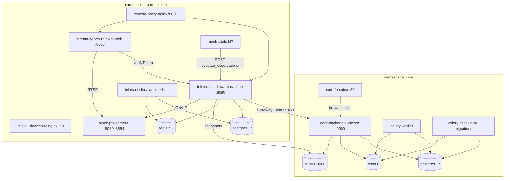

# CARE — Open Healthcare Network HMIS + TeleICU

[CARE](https://github.com/ohcnetwork/care) is Open Healthcare Network's
hospital management system. avocado runs the full stack — backend, frontend,
object storage — plus the [10bedicu](https://github.com/10bedicu) TeleICU
layer (gateway middleware, device plugs, devices micro-frontend) and mock
devices to exercise it, across two namespaces: `care` (`k8s/care/`) and
`care-teleicu` (`k8s/care-teleicu/`).

## Public hostnames

Flattened to a single label on purpose: Cloudflare's free Universal SSL cert
covers `*.rithviknishad.dev` but **not** `*.care.rithviknishad.dev`, so nested
subdomains would fail TLS at the edge.

| Hostname | Serves |
|---|---|
| `care.rithviknishad.dev` | care_fe SPA |
| `care-api.rithviknishad.dev` | Django API (gunicorn `:9000`) |
| `care-s3.rithviknishad.dev` | MinIO — presigned upload/download URLs |
| `care-teleicu-gateway.rithviknishad.dev` | TeleICU gateway (nginx `:8001`) |
| `care-teleicu-devices.rithviknishad.dev` | devices micro-frontend (module-federation remote) |

All five are public by design — CARE brings its own auth. Uploads are capped
at ~100 MB by Cloudflare's free-plan request-body limit.

## Architecture



- **care backend** runs as three Deployments from one image: API
  (`start.sh` → gunicorn), celery worker, and celery beat —
  **beat runs DB migrations** on start, mirroring upstream's compose
  ordering. The API 500s harmlessly until first migrations finish.
- **TeleICU gateway** authenticates to CARE with JWTs signed by its own
  `JWKS_BASE64` key set; CARE fetches the public half from the gateway's
  OpenID endpoint. There is no shared secret between the two.
- The upstream gateway **nginx image hardcodes** its upstreams, so the
  Services must be named `teleicu-middleware` and `stream-server`.
- **RTSPtoWeb** verifies per-stream tokens against the middleware's
  `/verifyToken`; its config is seeded from a ConfigMap into an emptyDir
  (it wants to write stream state back, so a read-only mount would break it).

## Custom images (built on the box, no registry)

Four images can't be consumed from upstream registries as-is:

| Image | Why custom |
|---|---|
| `care-backend:local` | plugins install at **build** time (`ADDITIONAL_PLUGS` → pip in the Dockerfile builder stage) — bakes in [care_teleicu_devices](https://github.com/10bedicu/care_teleicu_devices) per `k8s/care/additional-plugs.json` |
| `care-fe:local` | the API URL is compiled into the Vite bundle (`REACT_CARE_API_URL` via `.env.local`) |
| `care-teleicu-devices-fe:local` | upstream publishes no image |
| `mock-ptz-camera:local` | upstream publishes no image |

`just care-images` and `just care-teleicu-images` shallow-clone upstream into
the gitignored `.build/`, `docker build` (docker exists solely for this — see
[`docker.nix`](nix-modules.md#dockernix--local-image-builds)), and pipe
`docker save` into `k3s ctr images import`. Manifests use
`imagePullPolicy: Never`, so a missed import fails loudly
(`ErrImageNeverPull`) instead of pulling something else. The `ADDITIONAL_PLUGS`
JSON must stay semantically identical between the build arg and the runtime
ConfigMap (build installs the packages; runtime adds them to
`INSTALLED_APPS`). The care_fe build needs ~4 GB RAM (Vite).

Upgrading = re-run the image recipe (optionally `just care-images ref=<tag>`)
and `kubectl -n care rollout restart deploy` for the affected Deployments.

## Deploying

```sh
just care-images            # build + import care-backend:local, care-fe:local
just care-teleicu-images    # build + import MFE + mock camera
just care-secrets           # create secrets/care.enc.yaml   (see k8s/care/secret.example.yaml)
just care-teleicu-secrets   # create secrets/care-teleicu.enc.yaml
just care-deploy            # namespace care: manifests + sops secret
just care-teleicu-deploy    # namespace care-teleicu: manifests + sops secret
just care-dns               # one-time: route the 5 hostnames to the tunnel
just care-manage createsuperuser   # first admin account
```

Secrets follow the Formance pattern: a full k8s `Secret` manifest lives
sops-encrypted in `secrets/*.enc.yaml` and is piped straight from `sops -d`
into `kubectl apply` — plaintext never touches disk. The `secret.example.yaml`
files document every key, including how to generate stable `JWKS_BASE64` key
sets (care and the gateway each need their **own**).

### Post-deploy manual wiring (one-time, in the CARE UI)

1. **Register the devices MFE**: Admin → Apps → *CARE TeleICU Devices* →
   set the remote URL to `https://care-teleicu-devices.rithviknishad.dev`.
   (The MFE's nginx already serves the required CORS headers.)
2. **Create a facility**, then a **Gateway device** pointing at
   `https://care-teleicu-gateway.rithviknishad.dev`.
3. Copy the gateway device's ID into `GATEWAY_DEVICE_ID` in the `teleicu-env`
   ConfigMap (`k8s/care-teleicu/care-teleicu.yaml`), redeploy, and restart
   the middleware — this also enables automated vitals observations.
4. **Add a Camera device** using the mock camera's in-cluster address
   (`mock-ptz-camera.care-teleicu.svc.cluster.local`, ONVIF port `8080`,
   user/pass `admin`/`admin`) and a **Vitals observation device** for the
   mock HL7 monitor. WS-Discovery multicast doesn't cross the pod network,
   so onboarding is always by explicit address — which is how CARE does it
   anyway. (A ventilator mock Deployment also exists but is parked at
   `replicas: 0`: the current gateway image's observation schema rejects
   ventilator metrics like PEEP, so it can only crash-loop.)

## Object storage (MinIO)

One MinIO instance (namespace `care`, 50 Gi PVC) with three buckets, created
idempotently by the `minio-buckets` Job: `care-uploads` (patient files),
`care-facility` (cover images), `teleicu-gateway` (camera snapshots).

CARE talks to MinIO in-cluster (`BUCKET_ENDPOINT=http://minio:9000`) but
generates **presigned URLs** against the public
`BUCKET_EXTERNAL_ENDPOINT=https://care-s3.rithviknishad.dev` — the browser
uploads/downloads directly against MinIO through the tunnel. Bucket
credentials reuse the MinIO root user; a dedicated service account would add
ceremony, not security, on a single-admin box.

## Backups

Nightly `pg_dump` CronJobs (`care-db-backup` 02:30, `teleicu-db-backup`
02:45) write compressed custom-format dumps to dedicated PVCs, pruned after
14 days. This is an **app-level** safety net (bad migration, accidental
delete) — restore with:

```sh
kubectl -n care exec -it deploy/postgres -- sh   # then, with the backup PVC contents at hand:
pg_restore -d "$DATABASE_URL" --clean --if-exists care-<date>.dump
```

> **Not disaster recovery.** The backup PVCs, the databases, and the MinIO
> objects all live on the same striped, non-redundant rpool
> ([Storage](storage.md)). An offsite copy (restic/rclone to B2/R2 or
> `zfs send` to another box) is deliberately deferred — planned as a
> follow-up.

## Monitoring

Gatus probes everything under the **`ohcnetwork/care`** group on
[status.rithviknishad.dev](https://status.rithviknishad.dev): the public
edges (`care-api /ping/`, the SPA, the gateway root, the MFE's
`/health`, all with TLS-expiry checks) and the in-cluster components (MinIO
health, middleware, RTSPtoWeb, mock camera). The mock vitals devices are
outbound-only and unprobeable; their failure shows up as stale observations.
Alerts go to the usual `avocado-alerts` ntfy topic
([Monitoring](monitoring.md)).
