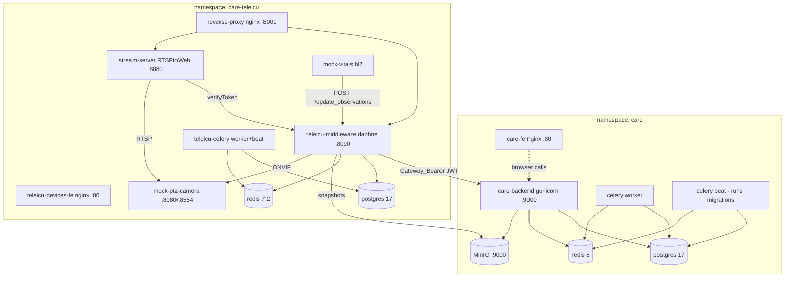

# CARE — Open Healthcare Network HMIS + TeleICU

[CARE](https://github.com/ohcnetwork/care) is Open Healthcare Network's
hospital management system. avocado runs the full stack — backend, frontend,
object storage — plus the [10bedicu](https://github.com/10bedicu) TeleICU
layer (gateway middleware, device plugs, devices micro-frontend) and mock
devices to exercise it, across two namespaces: `care` (`k8s/care/`) and
`care-teleicu` (`k8s/care-teleicu/`).

## Public hostnames

Flattened to a single label on purpose: Cloudflare's free Universal SSL cert
covers `*.rithviknishad.dev` but **not** `*.care.rithviknishad.dev`, so nested
subdomains would fail TLS at the edge.

| Hostname | Serves |
|---|---|
| `care.rithviknishad.dev` | care_fe SPA |
| `care-api.rithviknishad.dev` | Django API (gunicorn `:9000`) |
| `care-s3.rithviknishad.dev` | MinIO — presigned upload/download URLs |
| `care-teleicu-gateway.rithviknishad.dev` | TeleICU gateway (nginx `:8001`) |
| `care-teleicu-devices.rithviknishad.dev` | devices micro-frontend (module-federation remote) |
| `mock-ptz-camera.rithviknishad.dev` | mock PTZ camera web UI (`:8080`, `admin`/`admin`) |

The CARE hosts are public by design — CARE brings its own auth. Uploads are
capped at ~100 MB by Cloudflare's free-plan request-body limit. The mock
camera is a synthetic test fixture with only baked-in `admin`/`admin` Basic
auth and, unlike the other credential-relaying tools
([ONVIF console](onvif-console.md), [ESPHome](esphome.md),
[Ledger](formance.md)), is **not** behind Cloudflare Access — it holds nothing
sensitive and only ever serves a synthetic feed.

## Architecture



- **care backend** runs as three Deployments from one image: API
  (`start.sh` → gunicorn), celery worker, and celery beat —
  **beat runs DB migrations** on start, mirroring upstream's compose
  ordering. The API 500s harmlessly until first migrations finish.
- **TeleICU gateway** authenticates to CARE with JWTs signed by its own
  `JWKS_BASE64` key set; CARE fetches the public half from the gateway's
  OpenID endpoint. There is no shared secret between the two.
- The upstream gateway **nginx image hardcodes** its upstreams, so the
  Services must be named `teleicu-middleware` and `stream-server`.
- **RTSPtoWeb** verifies per-stream tokens against the middleware's
  `/verifyToken`; its full `config.json` (server block + camera streams) is
  **declarative** — seeded on every start from the `RTSPTOWEB_CONFIG_JSON` key
  of the sops `teleicu-secret` into an emptyDir (it writes stream state back, so
  a read-only mount would break it; the secret, not a plaintext ConfigMap,
  because each stream's RTSP URL embeds camera credentials). A pod/node restart
  therefore **restores all known cameras automatically**. Streams added ad-hoc
  via `just care-register-camera` still live only in the emptyDir (lost on
  restart) — persist a camera by adding it to the secret (see
  [Declarative camera streams](#declarative-camera-streams)).

## Custom images (built on the box, no registry)

Four images can't be consumed from upstream registries as-is:

| Image | Why custom |
|---|---|
| `care-backend:local` | plugins install at **build** time (`ADDITIONAL_PLUGS` → pip in the Dockerfile builder stage) — bakes in [care_teleicu_devices](https://github.com/10bedicu/care_teleicu_devices) per `k8s/care/additional-plugs.json` |
| `care-fe:local` | the API URL is compiled into the Vite bundle (`REACT_CARE_API_URL` via `.env.local`) |
| `care-teleicu-devices-fe:local` | upstream publishes no image |
| `mock-ptz-camera:local` | upstream publishes no image |

`just care-images` and `just care-teleicu-images` shallow-clone upstream into
the gitignored `.build/`, `docker build` (docker exists solely for this — see
[`docker.nix`](nix-modules.md#dockernix--local-image-builds)), and pipe
`docker save` into `k3s ctr images import`. Manifests use
`imagePullPolicy: Never`, so a missed import fails loudly
(`ErrImageNeverPull`) instead of pulling something else. The `ADDITIONAL_PLUGS`
JSON must stay semantically identical between the build arg and the runtime
ConfigMap (build installs the packages; runtime adds them to
`INSTALLED_APPS`). The care_fe build needs ~4 GB RAM (Vite).

Upgrading = re-run the image recipe (optionally `just care-images ref=<tag>`)
and `kubectl -n care rollout restart deploy` for the affected Deployments.

## Deploying

```sh
just care-images            # build + import care-backend:local, care-fe:local
just care-teleicu-images    # build + import MFE + mock camera
just care-secrets           # create secrets/care.enc.yaml   (see k8s/care/secret.example.yaml)
just care-teleicu-secrets   # create secrets/care-teleicu.enc.yaml
just care-deploy            # namespace care: manifests + sops secret
just care-teleicu-deploy    # namespace care-teleicu: manifests + sops secret
just care-dns               # one-time: route the 5 hostnames to the tunnel
just care-manage createsuperuser   # first admin account
just care-register-mfe      # register the TeleICU devices MFE (plug_config API)
```

Secrets follow the Formance pattern: a full k8s `Secret` manifest lives
sops-encrypted in `secrets/*.enc.yaml` and is piped straight from `sops -d`
into `kubectl apply` — plaintext never touches disk. The `secret.example.yaml`
files document every key, including how to generate stable `JWKS_BASE64` key
sets (care and the gateway each need their **own**).

### Post-deploy wiring (one-time)

1. **Register the devices MFE** — done over the `plug_config` API, no UI
   clicks:

   ```sh
   just care-register-mfe            # admin/admin (from load_fixtures); pass
                                     # real creds on a hardened instance
   ```

   This upserts a `PlugConfig` (`POST`/`PUT /api/v1/plug_config/`, admin
   token) with slug `teleicu-devices` and
   `meta.url = https://care-teleicu-devices.rithviknishad.dev/assets/remoteEntry.js`.
   The SPA reads the (public) plug list on load and pulls the remote; the
   MFE's nginx already serves the required CORS headers. Verify with
   `curl -s https://care-api.rithviknishad.dev/api/v1/plug_config/`.
2. **Create a facility**, then a **Gateway device** — both drivable over the
   API with an admin token. The gateway device is a `POST` to
   `/api/v1/facility/<facility_id>/device/` with `care_type: gateway` and
   `care_metadata.endpoint_address` set to the gateway host, e.g.:

   ```sh
   curl -X POST "https://care-api.rithviknishad.dev/api/v1/facility/<facility_id>/device/" \
     -H "Authorization: Bearer $TOKEN" -H 'Content-Type: application/json' \
     -d '{"care_type":"gateway","status":"active","availability_status":"available",
          "endpoint_address":"care-teleicu-gateway.rithviknishad.dev","insecure":false,
          "registered_name":"TeleICU Gateway - avocado/linux",
          "user_friendly_name":"Avocado Gateway"}'
   ```

   The response's `id` (a UUID) is the gateway device ID.
3. Put that ID into `GATEWAY_DEVICE_ID` in the `teleicu-env` ConfigMap
   (`k8s/care-teleicu/care-teleicu.yaml`), `just care-teleicu-deploy`, and
   restart the middleware (`kubectl -n care-teleicu rollout restart
   deploy/teleicu-middleware deploy/teleicu-celery`) — this also enables
   automated vitals observations. The middleware then signs JWTs with its
   JWKS and sends this ID as `X-Gateway-Id` on its CARE calls.
4. **Add a Camera device (ONVIF).** A camera device needs a **`stream_id`** —
   a stream registered in RTSPtoWeb — before it's useful, and the gateway
   doesn't derive that for you (its camera API only does PTZ/status; nothing
   syncs CARE cameras into RTSPtoWeb). So onboarding is two steps:

   1. **Register the RTSP feed → get a stream_id.** ONVIF only exposes the
      RTSP URL (vendor-specific — never guess the path), so
      `just care-register-camera` asks the camera via ONVIF `GetStreamUri`
      from inside the middleware pod, then registers the feed (creds baked
      into the URL) with RTSPtoWeb and prints the id:

      ```sh
      # real camera: onvif_port 80 (default)
      just care-register-camera 192.168.1.50 admin 's3cr3t'
      # mock camera: in-cluster address, ONVIF on 8080
      just care-register-camera mock-ptz-camera.care-teleicu.svc.cluster.local admin admin 0 8080
      ```
   2. **Create the device** — `POST /api/v1/facility/<facility_id>/device/`
      (admin token) with `care_type: "camera"`, `type: "ONVIF"`, the
      `gateway` device id, the camera's `endpoint_address`/`username`/
      `password`, and the `stream_id` from step 1.
   3. **Persist the stream** so it survives restarts — see
      [Declarative camera streams](#declarative-camera-streams) below.

   Also add a **Vitals observation device** for the mock HL7 monitor.
   WS-Discovery multicast doesn't cross the pod network, so onboarding is
   always by explicit address — which is how CARE does it anyway. (A
   ventilator mock Deployment also exists but is parked at `replicas: 0`: the
   current gateway image's observation schema rejects ventilator metrics like
   PEEP, so it can only crash-loop.)

   > **PTZ control hardcodes port 80.** CARE's `care_teleicu_devices` plug
   > (`camera_device/viewsets/actions.py::get_gateway_request_data`) sends
   > `{"hostname": endpoint_address, "port": 80, ...}` to the gateway for
   > *every* PTZ call (status/presets/gotoPreset/absoluteMove/relativeMove) —
   > it never reads a port from device metadata. Real ONVIF cameras answer on
   > 80 by default, so this is invisible for them, but the **mock** camera's
   > ONVIF/API server only listens on `:8080`. The fix lives in the k8s layer:
   > the `mock-ptz-camera` Service has an `onvif-compat` port aliasing Service
   > `80 → containerPort 8080`, so the hardcoded port 80 still lands on the
   > mock's real listener. If a future real camera's ONVIF is ever on a
   > non-80 port, it needs the same Service-level alias (or an upstream fix).

### Declarative camera streams

`just care-register-camera` writes a stream to RTSPtoWeb's API at **runtime**,
so it lives only in the pod's emptyDir — a stream-server or node restart drops
every such feed. To make a camera **survive restarts**, put its stream in the
seed config (`RTSPTOWEB_CONFIG_JSON` in the sops `teleicu-secret`), which the
stream-server re-seeds on every start:

```sh
# 1. Resolve the camera's RTSP URL (creds baked in) into a `streams` fragment.
#    stream_id MUST equal the CARE device's stream_id (read the device detail
#    API). onvif_port: 80 real, 8080 mock.
just care-resolve-camera 192.168.1.50 admin 's3cr3t' <stream-id>

# 2. Merge that fragment under "streams" in the secret's RTSPTOWEB_CONFIG_JSON.
just care-teleicu-secrets

# 3. Apply + roll the stream-server so it re-seeds.
just care-teleicu-deploy
kubectl -n care-teleicu rollout restart deploy/stream-server
```

The stream keys are stored **only in sops** (each channel URL embeds the
camera's `username:password`), never in a plaintext ConfigMap. The three
cameras onboarded on avocado (mock, MATRIX, PRAMA) are already baked in, so
they come back automatically after a reboot.

## Object storage (MinIO)

One MinIO instance (namespace `care`, 50 Gi PVC) with three buckets, created
idempotently by the `minio-buckets` Job: `care-uploads` (patient files),
`care-facility` (cover images), `teleicu-gateway` (camera snapshots).

CARE talks to MinIO in-cluster (`BUCKET_ENDPOINT=http://minio:9000`) but
generates **presigned URLs** against the public
`BUCKET_EXTERNAL_ENDPOINT=https://care-s3.rithviknishad.dev` — the browser
uploads/downloads directly against MinIO through the tunnel. Bucket
credentials reuse the MinIO root user; a dedicated service account would add
ceremony, not security, on a single-admin box.

## Backups

Nightly `pg_dump` CronJobs (`care-db-backup` 02:30, `teleicu-db-backup`
02:45) write compressed custom-format dumps to dedicated PVCs, pruned after
14 days. This is an **app-level** safety net (bad migration, accidental
delete) — restore with:

```sh
kubectl -n care exec -it deploy/postgres -- sh   # then, with the backup PVC contents at hand:
pg_restore -d "$DATABASE_URL" --clean --if-exists care-<date>.dump
```

> **Not disaster recovery.** The backup PVCs, the databases, and the MinIO
> objects all live on the same striped, non-redundant rpool
> ([Storage](storage.md)). An offsite copy (restic/rclone to B2/R2 or
> `zfs send` to another box) is deliberately deferred — planned as a
> follow-up.

## Monitoring

Gatus probes everything under the **`ohcnetwork/care-avocado`** group on
[status.rithviknishad.dev](https://status.rithviknishad.dev): the public
edges (`care-api /ping/`, the SPA, the gateway root, the MFE's
`/health`, all with TLS-expiry checks) and the in-cluster components (MinIO
health, middleware, RTSPtoWeb). Cameras live in their own
**`ohcnetwork/teleicu/cameras`** subgroup (mock + physical), kept separate so
camera flakiness doesn't dilute the main rollup. The mock camera is probed
both in-cluster (liveness) and at its public edge
`mock-ptz-camera.rithviknishad.dev` (+ TLS-expiry); physical ONVIF cameras are
probed with a raw **TCP connect to their RTSP port (554)**, since a
power/network drop is the failure that matters and the on-demand token-gated
video pipeline isn't probeable without a live viewer; add one line per camera
you onboard. The mock vitals devices are outbound-only and unprobeable; their
failure shows up as stale observations. Alerts go to the usual
`avocado-alerts` ntfy topic ([Monitoring](monitoring.md)).
