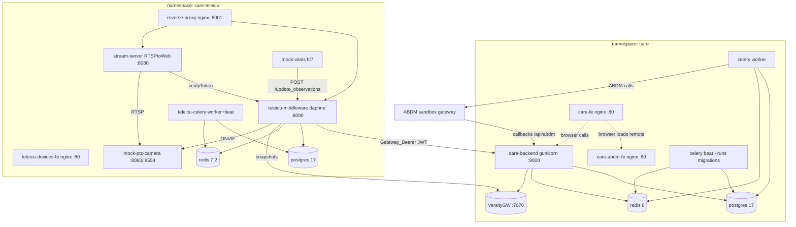

# CARE — Open Healthcare Network HMIS + TeleICU

[CARE](https://github.com/ohcnetwork/care) is Open Healthcare Network's
hospital management system. avocado runs the full stack — backend, frontend,
object storage, the [care-abdm](https://github.com/ohcnetwork/care-abdm) plug
(ABDM sandbox) — plus the [10bedicu](https://github.com/10bedicu) TeleICU
layer (gateway middleware, device plugs, devices micro-frontend) and mock
devices to exercise it, across two namespaces: `care` (`k8s/care/`) and
`care-teleicu` (`k8s/care-teleicu/`).

## Public hostnames

Flattened to a single label on purpose: Cloudflare's free Universal SSL cert
covers `*.rithviknishad.dev` but **not** `*.care.rithviknishad.dev`, so nested
subdomains would fail TLS at the edge.

| Hostname | Serves |
|---|---|
| `care.rithviknishad.dev` | **the app origin**, path-routed by Traefik (below) |
| `care-api.rithviknishad.dev` | Django API (gunicorn `:9000`) — kept for the TeleICU gateway's `CARE_API`, the JWKS trust, and Django admin |
| `care-teleicu-gateway.rithviknishad.dev` | TeleICU gateway (nginx `:8001`) |
| `care-teleicu-devices.rithviknishad.dev` | devices micro-frontend (module-federation remote) |
| `mock-ptz-camera.rithviknishad.dev` | mock PTZ camera web UI (`:8080`, `admin`/`admin`) |

### One origin, path-routed

`care.rithviknishad.dev` follows the layout of the
[care_create reference](https://github.com/ohcnetwork/care_create/tree/reference)
(which does it with an nginx gateway); here the `care` Ingress does it with
Traefik path rules, longest prefix first, paths forwarded **unmodified**:

| Path | Service | Why |
|---|---|---|
| `/api/*` | `care-backend:9000` | the SPA's API (`REACT_CARE_API_URL` = the origin itself) **and** ABDM callbacks (`/api/abdm/...`) |
| `/mfe-plugs/abdm/*` | `care-abdm-fe:80` | the ABDM MFE, built with `--base=/mfe-plugs/abdm/` (the plug's own SPA routes are `/abdm/...`, so its files can't live there) |
| `/care-uploads/*`, `/care-facility/*` | `versitygw:7070` | presigned uploads/downloads and facility cover URLs, path-style (`BUCKET_EXTERNAL_ENDPOINT` = the origin) |
| `/*` | `care-fe:80` | the SPA (nginx falls back to `index.html`) |

Same origin means no CORS for the SPA, the ABDM plug, or browser uploads, and
the SPA's CSP `'self'` already covers the buckets. SigV4 signs the `Host`
header, so presigned URLs work only because Traefik passes the original host
through to VersityGW. The old `care-s3.rithviknishad.dev` host is gone.
Adding another MFE plug = one more `/mfe-plugs/<slug>` path rule + image.

The CARE hosts are public by design — CARE brings its own auth. Uploads are
capped at ~100 MB by Cloudflare's free-plan request-body limit. The mock
camera is a synthetic test fixture with only baked-in `admin`/`admin` Basic
auth and, unlike the credential-relaying
[ONVIF console](onvif-console.md), is **not** behind Cloudflare Access — it holds nothing
sensitive and only ever serves a synthetic feed.

## Architecture


```mermaid
flowchart TB
    subgraph care[namespace: care]
        fe[care-fe nginx :80]
        abdmfe[care-abdm-fe nginx :80]
        api[care-backend gunicorn :9000]
        worker[celery worker]
        beat[celery beat - runs migrations]
        pg1[(postgres 17)]
        rds1[(redis 8)]
        s3[(VersityGW :7070)]
    end
    subgraph teleicu[namespace: care-teleicu]
        mw[teleicu-middleware daphne :8090]
        cel[teleicu-celery worker+beat]
        rtsp[stream-server RTSPtoWeb :8080]
        rp[reverse-proxy nginx :8001]
        mfe[teleicu-devices-fe nginx :80]
        cam[mock-ptz-camera :8080/:8554]
        vit[mock-vitals hl7]
        pg2[(postgres 17)]
        rds2[(redis 7.2)]
    end

    fe -.->|browser loads remote| abdmfe
    fe -.->|browser calls| api
    api --> pg1 & rds1 & s3
    worker & beat --> pg1 & rds1
    abdm[ABDM sandbox gateway] -->|callbacks /api/abdm| api
    worker -->|ABDM calls| abdm
    mw -->|Gateway_Bearer JWT| api
    mw --> pg2 & rds2
    mw -->|snapshots| s3
    cel --> pg2 & rds2
    rp --> mw & rtsp
    rtsp -->|verifyToken| mw
    rtsp -->|RTSP| cam
    mw -->|ONVIF| cam
    vit -->|POST /update_observations| mw
```

- **care backend** runs as three Deployments from one image: API
  (`start.sh` → gunicorn), celery worker, and celery beat —
  **beat runs DB migrations** on start, mirroring upstream's compose
  ordering. The API 500s harmlessly until first migrations finish.
- The API container's **requests/limits (500m/1Gi → 1 CPU/2Gi) and probe
  timings** (`/ping/`, delay 70s, timeout 20s, period 10s, 5 failures) are
  copied verbatim from the upstream **production** `care-be-api` deployment,
  so throttling- and probe-sensitive behaviour reproduces here rather than
  being masked by a more generous local budget. Don't "tune" them for this
  box — divergence defeats the point. The worker and beat are left
  unconstrained (this is a single-node box; only the API is being mirrored).
- **`collectstatic` runs on every API pod start** (it's in upstream's
  `start.sh`), because `STATIC_ROOT` is `/app/staticfiles` on the container's
  ephemeral filesystem — nothing persists it between restarts. With
  whitenoise's `CompressedManifestStaticFilesStorage` each start re-hashes and
  re-compresses (brotli + gzip) every static file. **This is the stack's most
  fragile moment.** Measured 2026-09-02 with the prod `cpu: 1` limit and the
  (since removed) `token_display` plug enabled: **collectstatic ~103s,
  container start → gunicorn listening ~114s** — against a liveness kill at
  120s. ~6s of headroom; one rollout's first container attempt genuinely lost
  that race and was killed mid-collectstatic. Enabling a plug that ships
  static assets directly lengthens this critical path (`token_display` alone:
  268 files copied / 1272 post-processed, vs 193 / 905 without it; `abdm`
  ships none — its UI is the separate MFE). The fix is a `startupProbe`; it's
  deliberately not applied so prod behaviour reproduces — see the comment in
  `k8s/care/care.yaml`.
- **TeleICU gateway** authenticates to CARE with JWTs signed by its own
  `JWKS_BASE64` key set; CARE fetches the public half from the gateway's
  OpenID endpoint. There is no shared secret between the two.
- The upstream gateway **nginx image hardcodes** its upstreams, so the
  Services must be named `teleicu-middleware` and `stream-server`.
- **RTSPtoWeb** verifies per-stream tokens against the middleware's
  `/verifyToken`; its full `config.json` (server block + camera streams) is
  **declarative** — seeded on every start from the `RTSPTOWEB_CONFIG_JSON` key
  of the sops `teleicu-secret` into an emptyDir (it writes stream state back, so
  a read-only mount would break it; the secret, not a plaintext ConfigMap,
  because each stream's RTSP URL embeds camera credentials). A pod/node restart
  therefore **restores all known cameras automatically**. Streams added ad-hoc
  via `just care-register-camera` still live only in the emptyDir (lost on
  restart) — persist a camera by adding it to the secret (see
  [Declarative camera streams](#declarative-camera-streams)).

## Custom images (built on the box, no registry)

Five images can't be consumed from upstream registries as-is:

| Image | Why custom |
|---|---|
| `care-backend:local` | plugins install at **build** time (`ADDITIONAL_PLUGS` → pip in the Dockerfile builder stage) — bakes in the plugs listed in `k8s/care/additional-plugs.json` (see [Plugs](#plugs)) |
| `care-fe:local` | the API URL (`REACT_CARE_API_URL` = the app origin) and the plug-overridable components (`REACT_MFE_REGISTERED_COMPONENTS=AddFacilitySheet`, care-abdm's) are compiled into the Vite bundle via `.env.local` |
| `care-abdm-fe:local` | the ABDM MFE, built from `k8s/care/abdm-fe/` (Dockerfile + nginx.conf adapted from care_create's reference) at the **same commit** the backend pins |
| `care-teleicu-devices-fe:local` | upstream publishes no image |
| `mock-ptz-camera:local` | upstream publishes no image |

`just care-images` and `just care-teleicu-images` shallow-clone upstream into
the gitignored `.build/`, `docker build` (docker exists solely for this — see
[`docker.nix`](nix-modules.md#dockernix--local-image-builds)), and pipe
`docker save` into `k3s ctr images import`. (`care-abdm-fe-image` needs no
clone: BuildKit's `ADD <git-url>#<sha>` fetches the pinned commit itself.)
Manifests use `imagePullPolicy: Never`, so a missed import fails loudly
(`ErrImageNeverPull`) instead of pulling something else. The `ADDITIONAL_PLUGS`
JSON must stay semantically identical between the build arg and the runtime
ConfigMap (build installs the packages; runtime adds them to
`INSTALLED_APPS`). The care_fe build needs ~4 GB RAM (Vite).

Each image has its own recipe — `care-backend-image <ref> [repo]`,
`care-fe-image <ref> [repo]`, `care-abdm-fe-image` — and `care-images` runs
all three. `care` and `care_fe` have **independent branches** (and may come
from forks), so each takes its own ref.

Currently deployed (2026-09-29):

| Image | Source |
|---|---|
| backend | `rithviknishad/care@rithviknishad/bodhi/ENG-737-test-fixtures` (fork; includes the report-model registration fix) |
| SPA | `ohcnetwork/care_fe@bodhi/questionnaire-actions` |
| ABDM MFE | `ohcnetwork/care-abdm@969a278` (from `additional-plugs.json`) |

Upgrading = re-run the image recipe and restart the affected Deployments:

```sh
just care-backend-image ENG-998                          # backend (default develop)
just care-backend-image my-branch rithviknishad/care     # backend from a fork
just care-fe-image bodhi/questionnaire-actions           # SPA only
just care-abdm-fe-image                                  # ABDM MFE (sha from additional-plugs.json)
just care-images <be_ref> <fe_ref> [be_repo] [fe_repo]   # all three
kubectl -n care rollout restart deploy/care-backend deploy/care-celery-worker deploy/care-celery-beat
kubectl -n care rollout restart deploy/care-fe deploy/care-abdm-fe   # if rebuilt
```

The `:local` tag is shared, so a branch build overwrites whatever ref was built
last — roll back by rebuilding from `develop` and restarting again. Restart all
three backend Deployments together: they run the same image, and celery beat is
the one that applies migrations (see [Architecture](#architecture)).

## Deploying

```sh
just care-images <be_ref> <fe_ref>   # build + import backend, SPA, ABDM MFE
just care-teleicu-images    # build + import MFE + mock camera
just care-secrets           # create secrets/care.enc.yaml   (see k8s/care/secret.example.yaml)
just care-teleicu-secrets   # create secrets/care-teleicu.enc.yaml
just care-deploy            # namespace care: manifests + sops secret
just care-teleicu-deploy    # namespace care-teleicu: manifests + sops secret
just care-dns               # one-time: route the hostnames to the tunnel
just care-seed-demo         # demo fixtures (admin/admin + demo users) — OR createsuperuser
just care-register-mfe      # register the TeleICU devices MFE (plug_config API)
just care-register-abdm     # register the ABDM MFE (plug_config API)
just care-wire-devices <facility-uuid>   # TeleICU gateway/cameras/vitals devices (then set GATEWAY_DEVICE_ID)
```

Secrets follow the usual pattern: a full k8s `Secret` manifest lives
sops-encrypted in `secrets/*.enc.yaml` and is piped straight from `sops -d`
into `kubectl apply` — plaintext never touches disk. The `secret.example.yaml`
files document every key, including how to generate stable `JWKS_BASE64` key
sets (care and the gateway each need their **own**).

### Post-deploy wiring (one-time)

1. **Register the devices MFE** — done over the `plug_config` API, no UI
   clicks:

   ```sh
   just care-register-mfe            # admin/admin (from load_fixtures); pass
                                     # real creds on a hardened instance
   ```

   This upserts a `PlugConfig` (`POST`/`PUT /api/v1/plug_config/`, admin
   token) with slug `teleicu-devices` and
   `meta.url = https://care-teleicu-devices.rithviknishad.dev/assets/remoteEntry.js`.
   The SPA reads the (public) plug list on load and pulls the remote; the
   MFE's nginx already serves the required CORS headers. Verify with
   `curl -s https://care.rithviknishad.dev/api/v1/plug_config/`. Both
   registrations go through the generic `just care-register-plug <slug>
   '<meta-json>'`.
2. **Create the TeleICU devices** — one recipe, on any facility (demo:
   "FACILITY WITH PATIENTS"):

   ```sh
   just care-wire-devices <facility-uuid>          # admin/admin; pass real creds later
   ```

   It (re)creates the **gateway** device (`endpoint_address` = the gateway's
   public host), one **ONVIF camera per stream** in the sops
   `RTSPTOWEB_CONFIG_JSON` (the stream key becomes the device's `stream_id`,
   host + creds come from its RTSP URL, so the declarative streams below keep
   working unchanged), and the **mock HL7 monitor** vitals device
   (`endpoint_address` = one of the mock's `device_id`s, `192.168.1.13`).
   Idempotent by `registered_name` (existing devices are PUT); secrets are
   never printed. It prints the gateway device ID. This is what a DB
   reset/restore needs afterwards — devices live in the CARE DB.

   > **Device metadata goes at the TOP LEVEL of the request body**, not in
   > `care_metadata`: the device plugs' `handle_create`/`handle_update` read
   > `request.data` directly and a `care_metadata` object is silently
   > ignored (you get a device with empty metadata). By hand, e.g.:
   > `POST /api/v1/facility/<id>/device/` with
   > `{"care_type":"gateway","status":"active","availability_status":"available","registered_name":"...","endpoint_address":"care-teleicu-gateway.rithviknishad.dev","insecure":false}`.
3. Put that ID into `GATEWAY_DEVICE_ID` in the `teleicu-env` ConfigMap
   (`k8s/care-teleicu/care-teleicu.yaml`), `just care-teleicu-deploy`, and
   restart the middleware (`kubectl -n care-teleicu rollout restart
   deploy/teleicu-middleware deploy/teleicu-celery`) — this also enables
   automated vitals observations. The middleware then signs JWTs with its
   JWKS and sends this ID as `X-Gateway-Id` on its CARE calls.
4. **Onboarding a NEW camera (ONVIF)** — the cameras already in the sops
   stream config are handled by step 2; this is for adding one. A camera
   device needs a **`stream_id`** —
   a stream registered in RTSPtoWeb — before it's useful, and the gateway
   doesn't derive that for you (its camera API only does PTZ/status; nothing
   syncs CARE cameras into RTSPtoWeb). So onboarding is:

   1. **Register the RTSP feed → get a stream_id.** ONVIF only exposes the
      RTSP URL (vendor-specific — never guess the path), so
      `just care-register-camera` asks the camera via ONVIF `GetStreamUri`
      from inside the middleware pod, then registers the feed (creds baked
      into the URL) with RTSPtoWeb and prints the id:

      ```sh
      # real camera: onvif_port 80 (default)
      just care-register-camera 192.168.1.50 admin 's3cr3t'
      # mock camera: in-cluster address, ONVIF on 8080
      just care-register-camera mock-ptz-camera.care-teleicu.svc.cluster.local admin admin 0 8080
      ```
   2. **Persist the stream** in the sops seed config — see
      [Declarative camera streams](#declarative-camera-streams) below.
   3. **Create the device**: `just care-wire-devices <facility-uuid>` picks
      up every persisted stream (or POST it by hand: `care_type: "camera"`,
      `type: "ONVIF"`, `gateway`, `endpoint_address`/`username`/`password`,
      `stream_id` — all top-level, see the note in step 2).

   The **Vitals observation device** for the mock HL7 monitor is also
   created by `care-wire-devices`.
   WS-Discovery multicast doesn't cross the pod network, so onboarding is
   always by explicit address — which is how CARE does it anyway. (A
   ventilator mock Deployment also exists but is parked at `replicas: 0`: the
   current gateway image's observation schema rejects ventilator metrics like
   PEEP, so it can only crash-loop.)

   > **PTZ control hardcodes port 80.** CARE's `care_teleicu_devices` plug
   > (`camera_device/viewsets/actions.py::get_gateway_request_data`) sends
   > `{"hostname": endpoint_address, "port": 80, ...}` to the gateway for
   > *every* PTZ call (status/presets/gotoPreset/absoluteMove/relativeMove) —
   > it never reads a port from device metadata. Real ONVIF cameras answer on
   > 80 by default, so this is invisible for them, but the **mock** camera's
   > ONVIF/API server only listens on `:8080`. The fix lives in the k8s layer:
   > the `mock-ptz-camera` Service has an `onvif-compat` port aliasing Service
   > `80 → containerPort 8080`, so the hardcoded port 80 still lands on the
   > mock's real listener. If a future real camera's ONVIF is ever on a
   > non-80 port, it needs the same Service-level alias (or an upstream fix).

### Declarative camera streams

`just care-register-camera` writes a stream to RTSPtoWeb's API at **runtime**,
so it lives only in the pod's emptyDir — a stream-server or node restart drops
every such feed. To make a camera **survive restarts**, put its stream in the
seed config (`RTSPTOWEB_CONFIG_JSON` in the sops `teleicu-secret`), which the
stream-server re-seeds on every start:

```sh
# 1. Resolve the camera's RTSP URL (creds baked in) into a `streams` fragment.
#    stream_id MUST equal the CARE device's stream_id (read the device detail
#    API). onvif_port: 80 real, 8080 mock.
just care-resolve-camera 192.168.1.50 admin 's3cr3t' <stream-id>

# 2. Merge that fragment under "streams" in the secret's RTSPTOWEB_CONFIG_JSON.
just care-teleicu-secrets

# 3. Apply + roll the stream-server so it re-seeds.
just care-teleicu-deploy
kubectl -n care-teleicu rollout restart deploy/stream-server
```

The stream keys are stored **only in sops** (each channel URL embeds the
camera's `username:password`), never in a plaintext ConfigMap. The four
cameras onboarded on avocado (mock, MATRIX, PRAMA, CP Plus) are already baked
in, so they come back automatically after a reboot.

> **Every vendor's RTSP path differs** — the three physical cameras resolve to
> `/unicaststream/1` (MATRIX), `/Streaming/Channels/101` (PRAMA) and
> `/video/live?channel=1&…` (CP Plus). Never hand-write the path; always let
> `care-resolve-camera` ask the camera over ONVIF.

## Plugs

Baked into `care-backend:local` at build time via `k8s/care/additional-plugs.json`
(kept in sync with the `ADDITIONAL_PLUGS` runtime ConfigMap value — the build
installs the pip packages, the runtime value adds them to `INSTALLED_APPS`):

| Plug | Source | Purpose |
|---|---|---|
| `gateway_device`, `camera_device`, `vitals_observation_device` | [10bedicu/care_teleicu_devices](https://github.com/10bedicu/care_teleicu_devices) | TeleICU gateway/camera/vitals devices (see above) |
| `abdm` | [ohcnetwork/care-abdm](https://github.com/ohcnetwork/care-abdm) `backend/` @ pinned sha | ABDM (India's digital health stack) HIP/HIU/NHPR integration; see [ABDM](#abdm-care-abdm-plug). Its frontend half is the `care-abdm-fe` MFE |

`token_display` ([ohcnetwork/care_token_display](https://github.com/ohcnetwork/care_token_display))
was dropped on 2026-09-29: it crashed the backend on the ENG-737 branch, and
its ~75 sound files were the biggest single cost in the collectstatic race
above.

The abdm entry pins a **commit** (`...care-abdm.git@<sha>#subdirectory=backend`)
because `care-abdm-fe-image` reads the same sha, which keeps the two halves of
the plug in lockstep. Bump the plug = edit the sha in **both**
`additional-plugs.json` and the `ADDITIONAL_PLUGS` ConfigMap value, rebuild the
backend + ABDM MFE, `just care-deploy`, and roll the Deployments; beat applies
any new `abdm` migrations.

Upgrading a plug's pinned ref = re-run `just care-images` and roll the
affected Deployments (see [Custom images](#custom-images-built-on-the-box-no-registry)).

## ABDM (care-abdm plug)

[care-abdm](https://github.com/ohcnetwork/care-abdm) integrates CARE with
India's Ayushman Bharat Digital Mission, pointed at the **sandbox**. The
plug's own `docs/` (roadmap, dev setup, verification, ADRs) is the
authoritative reference; this section only covers how avocado wires it.

**Config.** Non-secret settings live in the `care-backend-env` ConfigMap (the
plug reads the `ABDM_` prefix); only the client credentials are in sops
(`ABDM_CLIENT_ID`/`ABDM_CLIENT_SECRET` in `secrets/care.enc.yaml`):

| Var | Value | Note |
|---|---|---|
| `ABDM_GATEWAY_URL` | `https://dev.abdm.gov.in` | no `/api/hiecm` suffix |
| `ABDM_HSP_URL` | `https://apihspsbx.abdm.gov.in` | HRP service registration + all M4 (NHPR) calls |
| `ABDM_ABHA_URL` | `https://abhasbx.abdm.gov.in/abha/api` | **no** `/v3` (the plug appends it) |
| `ABDM_CM_ID` | `sbx` | consent manager id |
| `ABDM_CALLBACK_BASE_URL` | `https://care.rithviknishad.dev` | bridge URL = this; callbacks land on `/api/abdm/...` |
| `ABDM_DEVELOPER_MODE` | `true` | sandbox only — see the warning below |

**Everything runs in celery.** Callback handlers, record staging, link
retries and the M3 chain are celery tasks, and the plug's periodic tasks
(`retry_share_items` every 5 min, `hiu_housekeeping` every 15 min) register
with the `care-celery-beat` Deployment. A dead worker shows up as "Celery
worker: blocker" in the developer readiness page.

### Activation (after a deploy on an empty DB)

1. `just care-register-abdm` — upserts plug_config `abdm` with
   `meta.url = https://care.rithviknishad.dev/mfe-plugs/abdm/assets/remoteEntry.js`,
   `name = care_abdm_fe` (the federation name). Reload the SPA; the ABDM
   screens and the overridden `AddFacilitySheet` appear.
2. Probes: `GET /api/abdm/health` (no auth, Gatus watches it) and, logged in,
   `GET /api/abdm/gateway/status` — proves the client id/secret get a gateway
   session.
3. **Register the bridge URL.** It is **one per client id**: registering
   avocado takes the sandbox client `SBXID_035123` over from any other
   environment (e.g. the laptop `care-abdm-sbx` cloudflared tunnel), which
   then stops receiving callbacks. Switching back = re-run the command there.

   ```sh
   just care-manage abdm_register_bridge_url --dry-run   # prints the URL + live bridge state
   just care-manage abdm_register_bridge_url
   ```

   A superuser can do the same from `/admin/abdm` in the SPA.
4. **Per facility:** link its HFR id (or create one with the M4 HFR wizard),
   then **"Register HRP service"** on the facility's ABDM setup page. The HIP
   id the registry issues (e.g. `IN1410000232_1`) is stored and sent as
   `X-HIP-ID`; a call sent with the bare HFR id is accepted (202) but its
   callback never arrives.

### Roadmap (milestones, as the plug defines them)

| Milestone | What | How to prove it here |
|---|---|---|
| Gateway session | client-credentials token | `/api/abdm/gateway/status` |
| **M1 Create** | ABHA enrolment / login (Aadhaar or mobile OTP) from the patient page | sandbox ABHA created and linked to a CARE patient |
| **M2 Attach** | HIP: discovery, care-context linking, consent, encrypted data push; Scan & Share | link init → OTP → confirm; a consent GRANTED → health-information pushed. Outside production the user-initiated link OTP is fixed at `123456` |
| **M3 Retrieve** | HIU: consent requests, receive pushed bundles at `/api/abdm/v3/hiu/health-information/transfer` (named in each request, no registration) | a record fetched from another sandbox facility |
| **M4 Enrol** | NHPR: HPR login ("My HPR ID" on the profile), HFR facility wizard | facility registered/linked in HFR from CARE |

Where each milestone actually stands is tracked in the plug's
`docs/03-roadmap.md`.

### Gotchas

- **Callbacks traverse Cloudflare.** ABDM's gateway POSTs to
  `https://care.rithviknishad.dev/api/abdm/...` through the tunnel. If the
  bridge shows the right URL but `/api/abdm/callbacks` (superuser) stays
  empty, check Cloudflare's security events. A bot/WAF challenge on a
  server-to-server POST fails silently; add a WAF skip rule for
  `/api/abdm/` if that's what is happening.
- **Developer mode is on and the demo users are public.** `ABDM_DEVELOPER_MODE=true`
  opens `/abdm/developer` and `/api/abdm/dev/*` (every exchange and plug
  table, values redacted) to **any logged-in user**, and the demo fixtures
  create users with a well-known password on a public host. Fine for a
  sandbox; turn it off (and rotate/disable demo users) before real data.
- **Sandbox credentials.** The client secret was shared in a chat to set this
  up; rotate it in the ABDM sandbox portal when convenient and update it with
  `just care-secrets` + a restart of the three backend Deployments.
- The plug **must not** be combined with the legacy `care_abdm` plug: both
  read `ABDM_*`.

## Object storage (VersityGW)

[VersityGW](https://www.versity.com/products/versitygw/) (`versity/versitygw`,
pinned) replaced MinIO on 2026-09-29. It's a stateless S3 gateway over a
plain POSIX directory: each bucket is a directory on the `versitygw-data` PVC
(50 Gi, **`local-path-retain`**), each object an ordinary file, S3 metadata
(Content-Type, ETag, ...) in `user.*` xattrs — which works because rpool has
`xattr=sa`. So objects are inspectable, and back-up-able, with plain file
tools on the host.

The `versitygw-buckets` Job (aws-cli) idempotently creates three buckets:
`care-uploads` (patient files, private: presigned URLs only),
`care-facility` (facility covers + profile pictures, **anonymous
`s3:GetObject`** bucket policy because CARE hands out plain unsigned URLs for
these; listing stays denied), and `teleicu-gateway` (camera snapshots, shared
with `k8s/care-teleicu`).

CARE talks to it in-cluster (`BUCKET_ENDPOINT=http://versitygw:7070`) but
generates URLs against `BUCKET_EXTERNAL_ENDPOINT=https://care.rithviknishad.dev`,
whose `/care-uploads` and `/care-facility` paths route to VersityGW (see
[One origin](#one-origin-path-routed)). `BUCKET_PROVIDER` stays `MINIO`:
to CARE that just means "generic path-style S3 at `BUCKET_ENDPOINT`".

**Region is `ap-south-1`, not `us-east-1`, on purpose.** For regions that
still allow legacy SigV2 (us-east-1 does), botocore presigns S3 URLs with
SigV2 (`AWSAccessKeyId`/`Signature`). MinIO accepted that; VersityGW rejects
it (`400 ... Please use AWS4-HMAC-SHA256`), which breaks every browser upload
and download. A SigV4-only region makes botocore emit `X-Amz-*` SigV4 URLs.
The region must match everywhere, since the gateway checks the credential
scope: `BUCKET_REGION` (care ConfigMap), `VGW_REGION` (VersityGW),
`AWS_DEFAULT_REGION` in the bucket Job and in the TeleICU ConfigMap (its
middleware's boto3 client sets no region).

Credentials: VersityGW's root access key/secret **are** `BUCKET_KEY`/
`BUCKET_SECRET` from the care secret (via `secretKeyRef`, so the gateway
sees nothing else), and the TeleICU secret's `S3_ACCESS_KEY_ID`/
`S3_SECRET_ACCESS_KEY` carry the same pair. A dedicated IAM account would add
ceremony, not security, on a single-admin box. Validated after the switch
(CARE's own client config, through Cloudflare): presigned PUT/GET 200 on both
buckets, anonymous GET 403 on `care-uploads` / 200 on `care-facility`,
anonymous LIST 403 on both.

## Backups

Nightly `pg_dump` CronJobs (`care-db-backup` 02:30, `teleicu-db-backup`
02:45) write compressed custom-format dumps to dedicated PVCs, pruned after
14 days. This is an **app-level** safety net (bad migration, accidental
delete). Uploaded files are **not** in these dumps — they're VersityGW files
on their own retained PVC (covered by ZFS snapshots only).

Check at any time whether a restorable backup actually exists:

```sh
just backups-status   # PVs + reclaim policies, last CronJob success, dumps on disk
```

### Pinned dumps, reset, restore

Ad-hoc dumps go to `pinned/` on the same `care-db-backups` PVC. The nightly
prune only touches the PVC's top level (`find -maxdepth 1`; before
2026-09-29 it recursed and would have eaten pinned dumps after 14 days), so
pinned dumps stay until deleted by hand.

```sh
just care-db-pin before-upgrade        # -> pinned/care-before-upgrade.dump (+ TOC count, sha256)
just care-db-reset                     # [confirm] pin, DROP+CREATE the DB, FLUSHALL redis,
                                       # restart backend; beat re-migrates from scratch
just care-seed-demo                    # then: demo fixtures on the empty DB
just care-register-abdm && just care-register-mfe      # plug_configs live in the DB too
just care-manage abdm_register_bridge_url              # re-assert ABDM bridge (idempotent)
just care-wire-devices <facility-uuid>                 # TeleICU devices; new GATEWAY_DEVICE_ID
just care-db-restore pinned/care-pre-abdm-reset-2026-09-29.dump   # [confirm] pin, then restore
```

Both destructive recipes pin the current state first, so each is undoable
with `care-db-restore`. Restore works for a dump **older** than the running
code (beat migrates it forward on start). A dump that needs migrations the
image doesn't have needs the matching image first. The TeleICU DB is
untouched by either, but CARE-side devices, plug_configs and users go with
the CARE DB: after a reset re-run the steps above and update
`GATEWAY_DEVICE_ID` (see [Post-deploy wiring](#post-deploy-wiring-one-time)).

To just *look* at an old dump without touching the live DB, `pg_restore` it
into a scratch database on the same Postgres (`createdb care_old`, restore
with `DATABASE_URL`'s db swapped to `care_old`, `dropdb care_old` when done).

| Pinned dump | What |
|---|---|
| `pinned/care-pre-abdm-reset-2026-09-29.dump` | the DB before the ABDM/ENG-737 reset (develop-era schema; demo fixtures + users, **no** TeleICU gateway/camera devices — those predate every retained dump). sha256 `ea1aa8c4ad085633b8effc0fb55a41a7008e028d2790bf73938352b45fbf2148`, 1680 TOC entries; test-restored into a scratch DB cleanly |
| `pinned/care-pre-reset-20260929-141606.dump` | same state, taken automatically by `care-db-reset` (sha256 `e8f4e12d…696bd`) |

### The backup PVC must outlive its namespace

The `care-db-backups` PVC uses the **`local-path-retain`** StorageClass
(`reclaimPolicy: Retain`), not the default `local-path` (`Delete`).

This is not a detail. On **2026-08-31** the `care` namespace was deleted to
clean up a runaway scale-up. Deleting a namespace deletes its PVCs, and under
`Delete` that destroys the backing volume and its data directory — so the
CARE database **and all 14 days of its backups went at the same moment**,
because the backups lived in the namespace they were protecting. There was
nothing to restore from. See [Storage](storage.md).

`storageClassName` is immutable on an existing PVC, so a backup volume that
predates this change cannot simply be moved onto the new class. Patch the live
PV's reclaim policy instead — same protection, no data movement:

```sh
just backups-protect   # idempotent; patches *-db-backups PVs to Retain
```

> **Still not disaster recovery.** The backup PVCs, the databases, and the
> VersityGW objects all live on the same striped, non-redundant rpool
> ([Storage](storage.md)). Retain protects against an *operator mistake*, not
> against a disk failure — losing either disk still loses all of it.
>
> The layers today, weakest to strongest:
> 1. **ZFS snapshots** of `rpool/var` — block-level undo, same pool.
> 2. **These `pg_dump`s** on `local-path-retain` — portable, survive the namespace.
> 3. **An offsite copy** (restic/rclone to B2/R2, or `zfs send` to another
>    box) — **still not wired**. This is the only layer that survives losing a
>    disk, and it remains the biggest open gap.

## Monitoring

Gatus probes everything under the **`ohcnetwork/care-avocado`** group on
[status.rithviknishad.dev](https://status.rithviknishad.dev): the public
edges (`care-api /ping/`, the SPA, the gateway root, the MFE's
`/health`, all with TLS-expiry checks; `care-abdm` = `/api/abdm/health` on the
app origin, which also proves the `/api` path route and that the plug loaded;
`care-abdm-fe` = the ABDM MFE's `remoteEntry.js`) and the in-cluster
components (VersityGW `/health`, middleware, RTSPtoWeb). Cameras live in their own
**`ohcnetwork/teleicu/cameras`** subgroup (mock + physical), kept separate so
camera flakiness doesn't dilute the main rollup. The mock camera is probed
both in-cluster (liveness) and at its public edge
`mock-ptz-camera.rithviknishad.dev` (+ TLS-expiry); physical ONVIF cameras are
probed with a raw **TCP connect to their RTSP port (554)**, since a
power/network drop is the failure that matters and the on-demand token-gated
video pipeline isn't probeable without a live viewer; add one line per camera
you onboard. The mock vitals devices are outbound-only and unprobeable; their
failure shows up as stale observations. Alerts go to the usual
`avocado-alerts` ntfy topic ([Monitoring](monitoring.md)).
