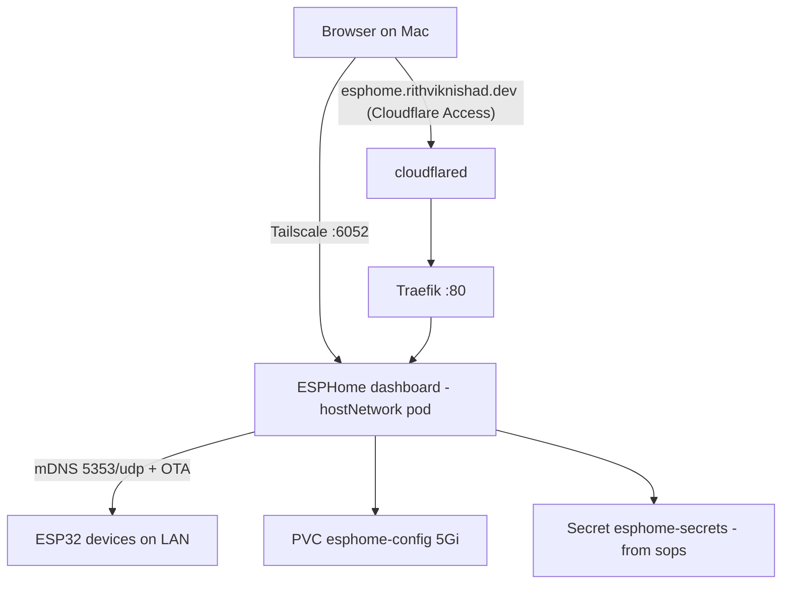

# ESPHome

[ESPHome](https://esphome.io) builds and manages firmware for ESP32/ESP8266
devices. The dashboard runs on the k3s cluster (`k8s/esphome/`), stores device
YAMLs on a PVC, and pushes OTA updates to devices on the LAN.

## Architecture



Key decisions:

- **`hostNetwork: true`** — the dashboard needs mDNS multicast (device
  discovery + online status) and direct LAN reachability (OTA uploads, log
  streaming). Neither works from behind the CNI. `modules/esphome.nix` opens
  inbound `5353/udp` for the mDNS responses.
- **Port 6052 stays closed on the LAN.** The dashboard has **no built-in
  auth**, and it can flash firmware — treat it like root on your IoT fleet.
  Access paths are Tailscale (trusted interface) and the Cloudflare Tunnel
  gated by Cloudflare Access.
- **`secrets.yaml` is read-only in the UI.** It's mounted from a k8s Secret
  built out of the sops-encrypted `secrets/esphome.enc.yaml`, so the repo —
  not the dashboard's editor — is the source of truth. Device YAMLs reference
  values with `!secret wifi_ssid` etc.

## Deploy

```sh
just esphome-secrets    # put real wifi_ssid / wifi_password in
just esphome-deploy     # kustomize apply + Secret from sops + rollout restart
just esphome-status
```

`esphome-deploy` pipes `sops --decrypt` straight into `kubectl` — the
plaintext never touches disk. Because the Secret is subPath-mounted (subPath
mounts don't live-update), the recipe restarts the deployment to pick up
changes.

## Access

| Path | URL | Auth |
|---|---|---|
| Tailscale | `http://avocado:6052` | tailnet membership |
| Public | `https://esphome.rithviknishad.dev` | Cloudflare Access |

### Public access setup (one-time, order matters)

The dashboard is unauthenticated, so the Access application must exist
**before** the DNS route — otherwise the tunnel serves it wide open:

1. **Zero Trust → Access → Applications → Add → Self-hosted.** Domain
   `esphome.rithviknishad.dev`; policy: Allow → Emails → your address.
2. Only then: `cloudflared tunnel route dns avocado esphome.rithviknishad.dev`.

The tunnel entry itself is already declared in `modules/cloudflared.nix`
(deployed with `just deploy`). Note the standing caveat from the
[networking](networking.md) page: anyone on the LAN can bypass Access by
hitting Traefik with a spoofed `Host` header — acceptable on a trusted home
LAN, same tradeoff as Grafana.

## First flash (new devices)

Brand-new ESP32s can't be flashed over the network — the first firmware goes
in over USB, from **your Mac's browser** (the server needs no USB access):

1. In the dashboard: **New Device**, give it a name, let it generate the YAML
   (uses `!secret wifi_ssid` / `!secret wifi_password`).
2. Plug the ESP32 into the Mac, open <https://web.esphome.io> in Chrome, and
   install the compiled firmware over WebSerial (download the `.bin`/factory
   image from the dashboard's ⋮ → *Install* → *Manual download*).
3. The device joins WiFi; from then on the dashboard sees it via mDNS and all
   updates are OTA — no more cables.

## Gotchas

- **mDNS across VLANs doesn't work** without a repeater. If devices live on a
  separate IoT VLAN, uncomment `ESPHOME_DASHBOARD_USE_PING=true` in
  `k8s/esphome/esphome.yaml` (online status via ICMP) and use static
  IPs/hostnames in device configs.
- Build artifacts live under `/config/.esphome` on the PVC; compile toolchains
  are baked into the image, so pod restarts don't force big re-downloads.
- The PVC sits on the **no-redundancy** ZFS stripe like everything else —
  device YAMLs are small; consider keeping copies in a private repo if they
  grow precious.
