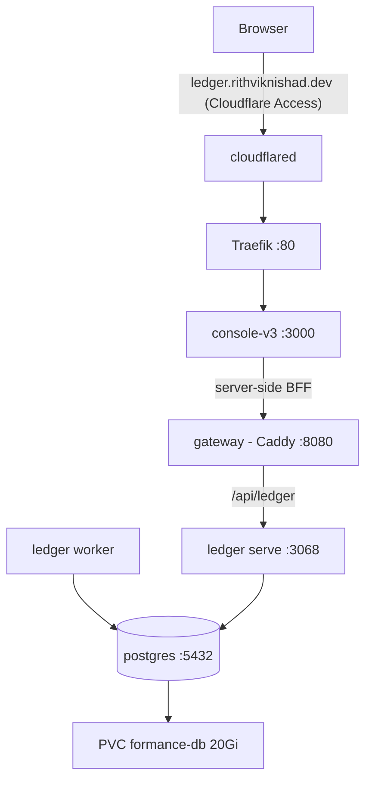

# Formance Ledger

[Formance Ledger](https://www.formance.com/) is a programmable, double-entry
financial core ledger (transactions modelled in the
[Numscript](https://docs.formance.com/) DSL, Postgres as the source of truth).
It runs on the k3s cluster under `k8s/formance/` as the **standalone** topology
— Path A: Ledger only, no operator / Kafka / NATS.

## Architecture



| Component | Image | Role |
|---|---|---|
| `postgres` | `postgres:16-alpine` | Dedicated DB, `formance-db` PVC (20 Gi) at `/data/postgres` |
| `ledger` | `ghcr.io/formancehq/ledger:v2.4.0` (`serve`) | HTTP API, `:3068`, runs migrations (`AUTO_UPGRADE`) |
| `worker` | `ghcr.io/formancehq/ledger:v2.4.0` (`worker`) | Async processing, no HTTP port |
| `gateway` | `ghcr.io/formancehq/gateway:v2.0.31` | Caddy reverse proxy `/api/ledger/*` → `ledger:3068` (+ CORS) |
| `console` | `ghcr.io/formancehq/console-v3:v2.2.1` | Web UI; Next.js BFF proxies to the gateway |

Key decisions:

- **Only the Console is exposed.** The console runs in `MICRO_STACK=1` mode; its
  server-side BFF talks to the gateway over the in-cluster URL
  (`API_STACK_URL=http://gateway:8080/api`), so the browser only ever hits the
  console origin. The Ledger API and gateway stay ClusterIP — reach them
  directly over Tailscale with a port-forward if needed.
- **The gateway Caddyfile lives in a ConfigMap** (mirrors
  `examples/standalone/Caddyfile`, minus the `:8443` TLS-internal block — TLS
  terminates at Cloudflare's edge). Bump `checksum/caddyfile` on the `gateway`
  Deployment to roll the pod when it changes.
- **Single-writer.** Postgres uses a `Recreate` strategy on one RWO PVC (on the
  no-redundancy [ZFS stripe](storage.md) like everything else), and `ledger`
  runs migrations in-process via `AUTO_UPGRADE`.

## Secrets

The DB password, `POSTGRES_URI` (same password embedded), and the console
`COOKIE_SECRET` come from the `formance-secret` k8s Secret. It is **not** part
of the kustomize build — it's stored sops-encrypted at
`secrets/formance.enc.yaml` (a full Secret manifest) and applied at deploy time.
See `k8s/formance/secret.example.yaml` for its shape.

```sh
just formance-secrets    # create/edit secrets/formance.enc.yaml in sops
# paste a Secret manifest (see secret.example.yaml) with real values:
#   POSTGRES_PASSWORD, POSTGRES_URI (embeds the same password), COOKIE_SECRET
```

Rotating the password later needs a `kubectl -n formance rollout restart` of the
consumers (env-from-secret pods don't auto-reload) — and changing the Postgres
password after first init also requires reinitialising the DB, since
`POSTGRES_PASSWORD` only applies on an empty data dir.

## Deploy

```sh
just kubeconfig          # once, if you haven't
just formance-secrets    # fill in real values (see above)
just formance-deploy     # kustomize apply + Secret from sops
just formance-status
kubectl -n formance get pods -w
```

`formance-deploy` pipes `sops --decrypt` straight into `kubectl` — the plaintext
never touches disk.

### Smoke test (over Tailscale, no Access in the path)

```sh
# API via the gateway (port-forward, since it's ClusterIP):
kubectl -n formance port-forward svc/gateway 8080:8080 &
http POST :8080/api/ledger/v2/quickstart
http POST :8080/api/ledger/v2/quickstart/transactions \
  postings:='[{"amount":100,"asset":"USD/2","destination":"users:1234","source":"world"}]'
```

## Access

| Path | URL | Auth |
|---|---|---|
| Tailscale | `http://avocado` (Host: `ledger.avocado.local`) | tailnet membership |
| Public | `https://ledger.rithviknishad.dev` | Cloudflare Access |

### Public access setup (one-time, order matters)

Micro-stack mode has **no login of its own**, so the Access application must
exist **before** the DNS route — otherwise the tunnel serves the console (and,
through its BFF, the ledger) wide open:

1. **Zero Trust → Access → Applications → Add → Self-hosted.** Domain
   `ledger.rithviknishad.dev`; policy: Allow → Emails → your address.
2. Only then: `cloudflared tunnel route dns avocado ledger.rithviknishad.dev`.

The tunnel entry itself is already declared in `modules/cloudflared.nix`
(deployed with `just deploy`). Same standing caveat as Grafana/ESPHome: anyone
on the LAN can bypass Access by hitting Traefik with a spoofed `Host` header —
acceptable on a trusted home LAN.

## Monitoring

Gatus probes the Ledger API every minute via the in-cluster Service
(`http://ledger.formance.svc:3068/_healthcheck`, `internal` group in
`k8s/monitoring/gatus.yaml`) and pushes failures to the `avocado-alerts` ntfy
topic. The probe deliberately avoids the public URL — Cloudflare Access would
answer with a login redirect and mask a dead backend.

## Roadmap notes

This is deliberately the standalone deployment. Formance's Payments,
Reconciliation, Search, and Auth modules — and production-grade Ledger — are
only supported via the [Formance operator](https://github.com/formancehq/operator)
(Helm charts + Kafka/NATS + OpenSearch). That footprint isn't justified on the
current single node; revisit if a second node joins or those modules are needed.
