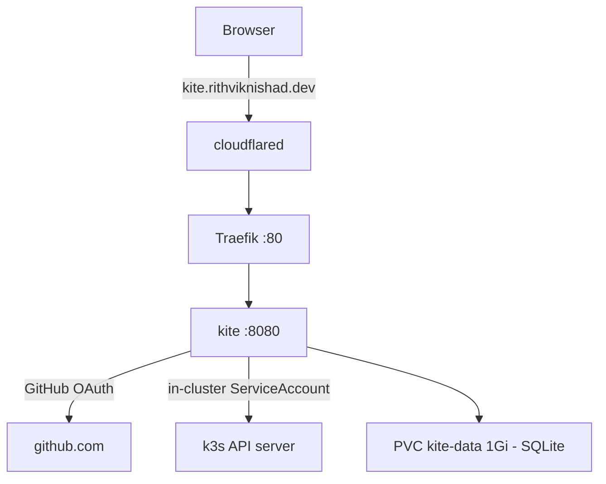

# Kite (Kubernetes dashboard)

[Kite](https://github.com/kite-org/kite) is a modern Kubernetes dashboard. It
gives a web view of the cluster resources, live logs, a web terminal, and a
kubectl console. Kite runs on the k3s cluster under `k8s/kite/`.

Kite has full control of the cluster. Its ServiceAccount uses a `["*"]`
ClusterRole. A user who signs in can create, change, and delete every resource.
For this reason Kite gates itself with GitHub OAuth. Only the mapped GitHub user
gets in. The public host therefore does not need a Cloudflare Access gate in
front, unlike the auth-less tools (`esphome`, `ledger`, `onvif-console`).

## Architecture



| Component | Value | Role |
|---|---|---|
| `kite` Deployment | `ghcr.io/kite-org/kite:latest` | Dashboard server on `:8080` |
| `kite` ServiceAccount | `["*"]` ClusterRole | Full cluster access |
| `kite-config` ConfigMap | `config.yaml` | Declarative OAuth, RBAC, and super user |
| `kite-secret` Secret | sops | Keys, GitHub OAuth app, break-glass password |
| `kite-data` PVC | 1 Gi, local-path | SQLite database (`/data/kite.db`) |

Key decisions:

- **The configuration is declarative.** The `KITE_CONFIG_FILE` environment
  variable points at the mounted `config.yaml`. Kite writes this file into its
  SQLite database on every startup. The OAuth and RBAC sections become
  **read-only** in the user interface. To change them, edit the ConfigMap in
  `k8s/kite/kite.yaml` and deploy again.
- **Secrets stay out of the committed file.** Kite expands `${VAR}` placeholders
  in `config.yaml` from the pod environment. The GitHub client id and secret,
  and the break-glass password, come from the sops-backed `kite-secret`.
- **Single writer.** The Deployment uses a `Recreate` strategy on one
  ReadWriteOnce PVC. Two pods cannot mount the SQLite volume at the same time.
- **One cluster for now.** Kite uses the in-cluster ServiceAccount to reach
  avocado's own k3s. Multi-cluster support comes later.

## Authentication (GitHub OAuth)

Kite uses a GitHub OAuth app for login. A new login has no permissions until
RBAC maps it to a role. The `config.yaml` maps the GitHub user `rithviknishad`
to the built-in `admin` role. GitHub OAuth apps do not return groups, so the map
uses the username.

### Create the GitHub OAuth app

Do these steps one time. They take about two minutes.

1. Open [https://github.com/settings/developers](https://github.com/settings/developers).
2. Select **OAuth Apps**. Then select **New OAuth App**.
3. In **Application name**, type a name. For example, type `Kite avocado`.
4. In **Homepage URL**, type `https://kite.rithviknishad.dev`.
5. In **Authorization callback URL**, type
   `https://kite.rithviknishad.dev/api/auth/callback`.
6. Select **Register application**.
7. Copy the **Client ID**.
8. Select **Generate a new client secret**. Then copy the secret value.

> The callback URL must match exactly. If the URL is wrong, the login fails.

### To change the admin user

Edit the `roleMapping` block in the `kite-config` ConfigMap
(`k8s/kite/kite.yaml`). Add the GitHub username to the `admin` role. Then run
`just kite-deploy`.

## Secrets

The `kite-secret` Secret holds five keys. The real values live sops-encrypted at
`secrets/kite.enc.yaml`. `just kite-deploy` applies them. This Secret is not part
of the kustomize build. See `k8s/kite/secret.example.yaml` for the shape.

| Key | Purpose |
|---|---|
| `JWT_SECRET` | Signs the Kite session tokens |
| `KITE_ENCRYPT_KEY` | Encrypts sensitive database columns. Keep it stable. |
| `GITHUB_CLIENT_ID` | The GitHub OAuth app client id |
| `GITHUB_CLIENT_SECRET` | The GitHub OAuth app client secret |
| `KITE_SUPERUSER_PASSWORD` | The break-glass `admin` password |

To set the secret values:

```sh
just kite-secrets     # opens secrets/kite.enc.yaml in sops
```

Paste a `kite-secret` manifest with real values. Generate each random value with
`openssl rand -hex 32`. Save and close the editor.

> Keep `KITE_ENCRYPT_KEY` stable. If the key changes, Kite cannot read the
> values that it encrypted before.

## Deploy

```sh
just kite-deploy      # kubectl apply -k k8s/kite + the sops secret, then restart
just kite-status      # pods, service, ingress, PVC
just kite-logs        # tail the server logs
```

`just kite-deploy` applies the manifests, applies the decrypted secret, and
restarts the pod. The restart is necessary because the environment from the
Secret does not reload on its own.

## Exposure

The public host is `kite.rithviknishad.dev`. To make it live:

1. Create the GitHub OAuth app (see above).
2. Set the secret values with `just kite-secrets`.
3. Add the route: `cloudflared tunnel route dns avocado kite.rithviknishad.dev`.
4. Deploy the tunnel change: `just deploy`
   (`modules/cloudflared.nix` already lists the host).
5. Deploy Kite: `just kite-deploy`.

The Tailnet also reaches Kite. Send the host header over Tailscale:

```sh
curl -H 'Host: kite.avocado.local' http://avocado/healthz
```

## Monitoring

Gatus probes `https://kite.rithviknishad.dev/healthz` in the `public` group. The
`/healthz` path has no auth, so the probe measures the full public path and the
certificate expiry. The GitHub OAuth login sits on the application routes, not on
`/healthz`, so it does not hide a dead backend. See [monitoring](monitoring.md).

## Break-glass login

The `config.yaml` also creates a super user named `admin`. Kite always gives the
super user the `admin` role. Use this account if the GitHub OAuth login breaks.
The password is `KITE_SUPERUSER_PASSWORD` in the sops secret. Read it back with
`just kite-secrets`.
