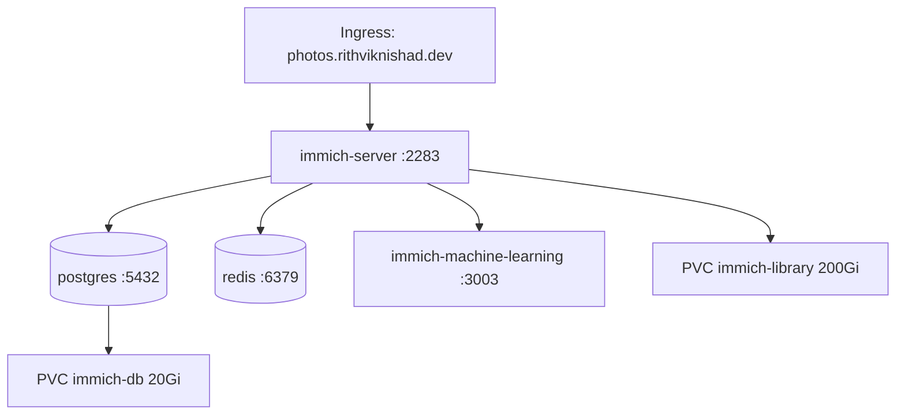

# Kubernetes (k3s)

`avocado` runs a single-node [k3s](https://k3s.io) cluster
(`modules/k3s.nix`). Workloads live under `k8s/`.

## The cluster

- **Role:** `server` with `clusterInit = true` → embedded **etcd**, so more
  servers/agents can join later for HA (today it's one node).
- **Token:** from sops (`k3s/token`) — any long random string; joining nodes
  reuse it.
- **API cert:** issued for the tailnet name via `--tls-san=avocado` (and
  `avocado.local`), so remote `kubectl`/Lens over Tailscale trust it.
- **Kubeconfig mode:** `0640`.
- **Bundled add-ons left ON:** **Traefik** (ingress), **local-path**
  (default StorageClass), and **ServiceLB**.
- **On-box tooling:** `kubectl`, `helm`, `k9s`.

### Getting a kubeconfig

```sh
just kubeconfig   # writes ~/.kube/avocado with the server rewritten to `avocado`
export KUBECONFIG=~/.kube/avocado
kubectl get nodes
```

`just kubeconfig` copies `/etc/rancher/k3s/k3s.yaml` off the box and rewrites
`127.0.0.1` → `avocado` so it works from the Mac (or Lens).

## Storage

Everything uses the built-in **local-path** provisioner, which carves
PersistentVolumes out of the host filesystem under `/var` — i.e. on the ZFS
`rpool`. Consequences worth repeating:

- PVCs are **ReadWriteOnce** and node-local (fine — there's one node).
- All PVC data sits on the **no-redundancy** [ZFS stripe](storage.md). Capacity
  and disk health are alerted on by the [monitoring stack](monitoring.md).

## Ingress model

Traefik is the single ingress controller. Both the [Cloudflare
Tunnel](networking.md#cloudflare-tunnel-public-access) and Tailnet access funnel
to Traefik on `:80`, which routes by `Host` header. Each workload just declares
an `Ingress` with its public host.

## Workloads

### Sample smoke test — `k8s/sample.yaml`

A 2-replica `nginxdemos/hello` Deployment + Service + Ingress
(`hello.avocado.local`, `hello.rithviknishad.dev`) to confirm the cluster and
ingress path work end-to-end.

```sh
kubectl apply -f k8s/sample.yaml
curl -H 'Host: hello.avocado.local' http://avocado/
kubectl delete -f k8s/sample.yaml
```

### Immich (self-hosted photos) — `k8s/immich/`

Deployed with kustomize (`kubectl apply -k k8s/immich`). Reachable at
`https://photos.rithviknishad.dev` once the tunnel route and ingress are live.



| Component | Image | Storage |
|---|---|---|
| `immich-server` | `ghcr.io/immich-app/immich-server:release` | `immich-library` PVC (200 Gi) at `/usr/src/app/upload` |
| `postgres` | `ghcr.io/immich-app/postgres:14-vectorchord…` | `immich-db` PVC (20 Gi) |
| `redis` | `redis:7` | — |
| `immich-machine-learning` | `ghcr.io/immich-app/immich-machine-learning:release` | `emptyDir` cache |

**Secrets:** the DB credentials come from a `Secret` named `immich-secret`
(consumed via `envFrom`). It is **not** committed — copy the template and fill a
real password:

```sh
cp k8s/immich/secret.example.yaml k8s/immich/secret.yaml   # gitignored
# edit DB_PASSWORD / POSTGRES_PASSWORD, then add `- secret.yaml` to kustomization.yaml
kubectl apply -k k8s/immich
kubectl -n immich get pods -w
```

The example secret wires `postgres` and `immich-server` together
(`DB_HOSTNAME=postgres`, `REDIS_HOSTNAME=redis`, matching DB user/name).

## The monitoring workload

The largest thing on the cluster is the observability stack under
`k8s/monitoring/` (VictoriaMetrics + Grafana + logs + uptime). It has its own
deploy flow (helmfile + kustomize) and is documented separately on the
[Monitoring](monitoring.md) page.
