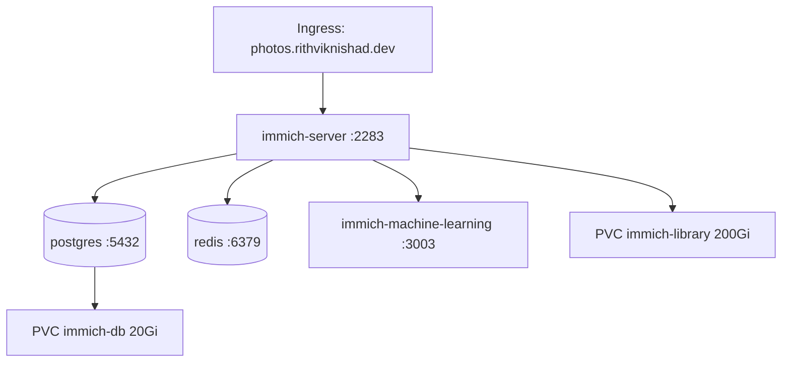
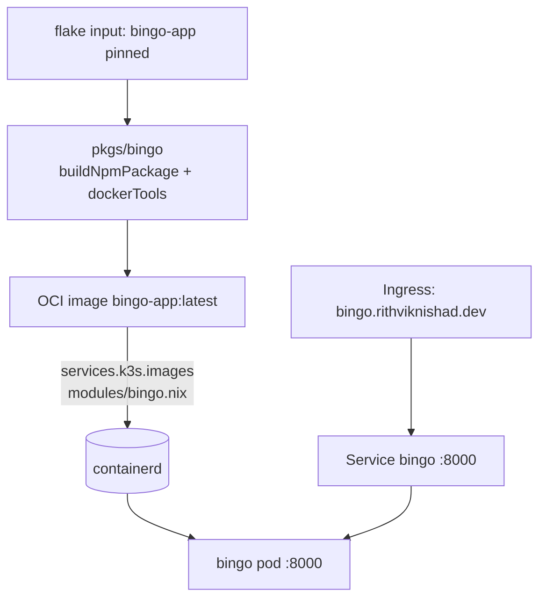

# Kubernetes (k3s)

`avocado` runs a single-node [k3s](https://k3s.io) cluster
(`modules/k3s.nix`). Workloads live under `k8s/`.

## The cluster

- **Role:** `server` with `clusterInit = true` → embedded **etcd**, so more
  servers/agents can join later for HA (today it's one node).
- **Token:** from sops (`k3s/token`) — any long random string; joining nodes
  reuse it.
- **API cert:** issued for the tailnet name via `--tls-san=avocado` (and
  `avocado.local`), so remote `kubectl`/Lens over Tailscale trust it.
- **Kubeconfig mode:** `0640`.
- **Bundled add-ons left ON:** **Traefik** (ingress), **local-path**
  (default StorageClass), and **ServiceLB**.
- **On-box tooling:** `kubectl`, `helm`, `k9s`.

### Getting a kubeconfig

```sh
just kubeconfig   # writes ~/.kube/avocado with the server rewritten to `avocado`
export KUBECONFIG=~/.kube/avocado
kubectl get nodes
```

`just kubeconfig` copies `/etc/rancher/k3s/k3s.yaml` off the box and rewrites
`127.0.0.1` → `avocado` so it works from the Mac (or Lens).

## Storage

Everything uses the built-in **local-path** provisioner, which carves
PersistentVolumes out of the host filesystem under `/var` — i.e. on the ZFS
`rpool`. Consequences worth repeating:

- PVCs are **ReadWriteOnce** and node-local (fine — there's one node).
- All PVC data sits on the **no-redundancy** [ZFS stripe](storage.md). Capacity
  and disk health are alerted on by the [monitoring stack](monitoring.md).

## Ingress model

Traefik is the single ingress controller. Both the [Cloudflare
Tunnel](networking.md#cloudflare-tunnel-public-access) and Tailnet access funnel
to Traefik on `:80`, which routes by `Host` header. Each workload just declares
an `Ingress` with its public host.

## Workloads

### Sample smoke test — `k8s/sample.yaml`

A 2-replica `nginxdemos/hello` Deployment + Service + Ingress
(`hello.avocado.local`, `hello.rithviknishad.dev`) to confirm the cluster and
ingress path work end-to-end.

```sh
kubectl apply -f k8s/sample.yaml
curl -H 'Host: hello.avocado.local' http://avocado/
kubectl delete -f k8s/sample.yaml
```

### Immich (self-hosted photos) — `k8s/immich/`

Deployed with kustomize (`kubectl apply -k k8s/immich`). Reachable at
`https://photos.rithviknishad.dev` once the tunnel route and ingress are live.


```mermaid
flowchart TB
    ing[Ingress: photos.rithviknishad.dev]
    ing --> server[immich-server :2283]
    server --> pg[(postgres :5432)]
    server --> redis[(redis :6379)]
    server --> ml[immich-machine-learning :3003]
    server --> lib[PVC immich-library 200Gi]
    pg --> db[PVC immich-db 20Gi]
```

| Component | Image | Storage |
|---|---|---|
| `immich-server` | `ghcr.io/immich-app/immich-server:release` | `immich-library` PVC (200 Gi) at `/usr/src/app/upload` |
| `postgres` | `ghcr.io/immich-app/postgres:14-vectorchord…` | `immich-db` PVC (20 Gi) |
| `redis` | `redis:7` | — |
| `immich-machine-learning` | `ghcr.io/immich-app/immich-machine-learning:release` | `emptyDir` cache |

**Secrets:** the DB credentials come from a `Secret` named `immich-secret`
(consumed via `envFrom`). It is **not** committed — copy the template and fill a
real password:

```sh
cp k8s/immich/secret.example.yaml k8s/immich/secret.yaml   # gitignored
# edit DB_PASSWORD / POSTGRES_PASSWORD, then add `- secret.yaml` to kustomization.yaml
kubectl apply -k k8s/immich
kubectl -n immich get pods -w
```

The example secret wires `postgres` and `immich-server` together
(`DB_HOSTNAME=postgres`, `REDIS_HOSTNAME=redis`, matching DB user/name).

### ESPHome (ESP32 firmware dashboard) — `k8s/esphome/`

Runs with **`hostNetwork: true`** so mDNS discovery and OTA updates reach the
LAN — the exception to the usual ClusterIP pattern. Deployed via
`just esphome-deploy`; documented on its own [ESPHome](esphome.md) page.

### Formance Ledger (standalone) — `k8s/formance/`

Programmable double-entry ledger + Console UI, deployed with kustomize plus a
sops-encrypted Secret (`just formance-deploy`). Only the Console is exposed, at
`https://ledger.rithviknishad.dev` (behind Cloudflare Access) — the Ledger API
and Caddy gateway stay in-cluster. Documented on its own
[Formance Ledger](formance.md) page.

### Bingo (multiplayer game) — `k8s/bingo/`

Classic 1–25 multiplayer bingo ([sonzsara/bingo-app](https://github.com/sonzsara/bingo-app),
boardgame.io). Deployed with kustomize (`just bingo-deploy`); public at
`https://bingo.rithviknishad.dev`.

Unlike the other workloads, there is **no upstream or registry image** — the
image is **built by Nix in this repo and preloaded into k3s**, so the whole
thing stays declarative and pinned:


```mermaid
flowchart TB
    input[flake input: bingo-app pinned] --> pkg[pkgs/bingo<br/>buildNpmPackage + dockerTools]
    pkg --> img[OCI image bingo-app:latest]
    img -->|services.k3s.images<br/>modules/bingo.nix| ctr[(containerd)]
    ctr --> pod[bingo pod :8000]
    ing[Ingress: bingo.rithviknishad.dev] --> svc[Service bingo :8000] --> pod
```

- **Single origin.** `server.cjs` (Koa) serves the built SPA *and* the
  boardgame.io multiplayer API + websocket on one port (8000). The public
  `VITE_SERVER_URL` is baked at build time so the browser's socket connects
  same-origin over 443 — the tunnel only forwards `:443 → localhost:80`, never
  `:8000`, so the app's default `<host>:8000` fallback would fail. Websockets
  ride the tunnel + Traefik unmodified.
- **`replicas: 1` is deliberate** — matches live in in-memory boardgame.io
  storage, so all players in a match must share one process. Scaling out needs
  a shared storage adapter.
- **Public by intent, Access-gated today.** It's a party game meant to be
  public, but `bingo.rithviknishad.dev` currently sits behind Cloudflare Access
  (a `*.rithviknishad.dev` policy) and answers unauthenticated requests with a
  login `302`. Exclude the host from that policy to make it truly public. For
  this reason its [uptime probe](monitoring.md) hits the in-cluster Service
  (`bingo.bingo.svc:8000`), not the public URL — same as esphome/formance — so
  a login redirect can't mask a dead backend.

| Component | Image | Notes |
|---|---|---|
| `bingo` | `bingo-app:latest` (Nix-built, k3s-preloaded) | SPA + boardgame.io server on `:8000` |

**Deploy / update:**

```sh
just bingo-deploy                 # apply namespace/deployment/service/ingress
cloudflared tunnel route dns avocado bingo.rithviknishad.dev   # one-time

# Bump the app to a newer upstream commit:
just update bingo-app             # then recompute npmDepsHash in pkgs/bingo
just deploy                       # rebuilds + re-imports the image (restarts k3s)
kubectl -n bingo rollout restart deploy/bingo
```

The image reaches the box through the normal `just deploy` (k3s preloads it via
`services.k3s.images`) — `just bingo-deploy` only applies the manifests.

### CARE HMIS + TeleICU — `k8s/care/` + `k8s/care-teleicu/`

[Open Healthcare Network](https://ohc.network) CARE (Django API + React SPA +
MinIO object storage) plus the 10bedicu TeleICU layer (gateway middleware,
RTSPtoWeb stream server, devices micro-frontend, mock ONVIF camera + vitals
devices). Deployed with kustomize + sops secrets (`just care-deploy`,
`just care-teleicu-deploy`); public at `https://care.rithviknishad.dev` (+ 4
sibling hosts). Four images are **built on the box with docker**
(`just care-images`, `just care-teleicu-images`) and imported into k3s's
containerd — upstream either publishes no image or bakes config/plugins in at
build time. Nightly `pg_dump` CronJobs back up both databases. Documented on
its own [CARE](care.md) page.

### ONVIF Console — `k8s/onvif-console/`

10bedicu's [onvif-console](https://github.com/10bedicu/onvif-console), a browser
tool for probing/PTZ-testing ONVIF cameras (Next.js UI + FastAPI sidecar on one
port). Deployed with kustomize (`just onvif-console-deploy`); public at
`https://onvif-console.rithviknishad.dev`. The image is **built on the box with
docker** (`just onvif-console-images`) and imported into k3s's containerd —
upstream publishes no image. Because the console has no auth and relays the
camera credentials you type in, its public host **must** sit behind Cloudflare
Access (create the Access app *before* the DNS route), so its
[uptime probe](monitoring.md) hits the in-cluster Service, not the login-gated
edge — same as esphome/formance/bingo. WebRTC live video (go2rtc) is omitted on
purpose (the tunnel can't carry its UDP media); the console falls back to ONVIF
snapshot polling, which is all the conformance/PTZ testing needs. Run history
is persisted server-side to a SQLite DB on the `onvif-console-data` PVC (the
backend keeps it per camera). Documented on its own
[ONVIF Console](onvif-console.md) page.

## The monitoring workload

The largest thing on the cluster is the observability stack under
`k8s/monitoring/` (VictoriaMetrics + Grafana + logs + uptime). It has its own
deploy flow (helmfile + kustomize) and is documented separately on the
[Monitoring](monitoring.md) page.
