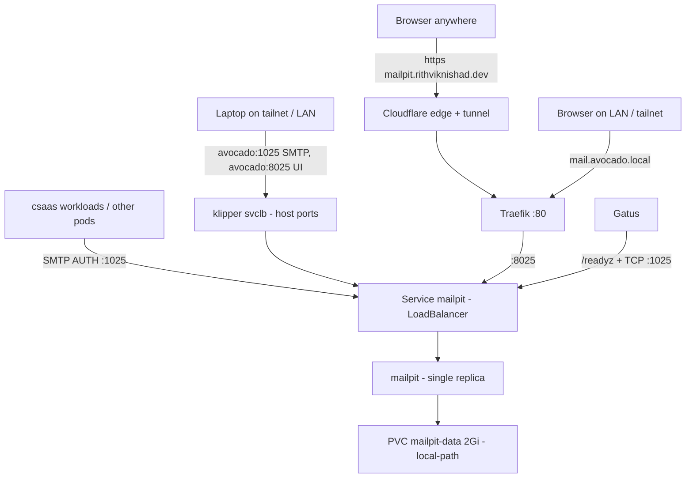

# Mailpit — Mailtrap-style SMTP sink

[Mailpit](https://mailpit.axllent.org) (open source, sponsored by Mailtrap) is a
self-hosted mail **catcher**: it accepts every message sent to it over SMTP and
shows it in a web inbox. **Nothing is ever delivered to a real mailbox.** It is
the dev/staging mail server for the Care SaaS (`csaas-*`) stack, the
self-hosted stand-in for a Mailtrap sandbox inbox. It runs on the k3s cluster
under `k8s/mailpit/`.



| | |
|---|---|
| SMTP | in-cluster `mailpit.mailpit.svc.cluster.local:1025`; tailnet `avocado:1025`; LAN `192.168.165.202:1025`. AUTH required, no TLS. **Not public.** |
| Web inbox | public `https://mailpit.rithviknishad.dev`; tailnet `http://avocado:8025`; LAN `http://mail.avocado.local`; or `just mailpit-ui` → `http://localhost:8025`. Always behind `ui-auth`. |
| Image | `axllent/mailpit:v1.31.3`, pinned by digest |
| Data | SQLite on a 2 Gi `local-path` PVC; pruned past 5000 messages or 30 days |
| Secret | `secrets/mailpit.enc.yaml` → k8s Secret `mailpit-auth` |

## Credentials

The `mailpit-auth` Secret holds two Mailpit
[password files](https://mailpit.axllent.org/docs/configuration/passwords/):

| Key | User | Used by |
|---|---|---|
| `smtp-auth` | `csaas` | apps sending mail (SMTP `AUTH PLAIN`/`LOGIN`) |
| `ui-auth` | `admin` | you, logging into the web inbox / API |

They are separate on purpose. Captured mail routinely contains live
password-reset and verification links, so an app's SMTP credential must not
also be able to read the inbox.

```sh
just mailpit-secrets           # edit (sops); then:
just mailpit-deploy            # re-applies + restarts (passwords are read at startup)
sops -d secrets/mailpit.enc.yaml   # read the current values
```

After rotating `smtp-auth`, update every app that holds the old password,
including `~/csaas-bootstrap/mailtrap-smtp.env` on avocado.

## Pointing an app at it

The Care SaaS bootstrap reads `~/csaas-bootstrap/mailtrap-smtp.env` on avocado.
It is outside this repo, mode `0600`, and filled from the sops secret:

```sh
SMTP_HOST=mailpit.mailpit.svc.cluster.local
SMTP_PORT=1025
SMTP_USERNAME=csaas
SMTP_PASSWORD=<smtp-auth password>
SMTP_FROM_ADDRESS=no-reply@192.168.165.202.nip.io
SMTP_FROM_NAME=Care SaaS
```

Off-cluster senders (an app on your laptop, a script) use `SMTP_HOST=avocado`
(tailnet) or `192.168.165.202` (LAN) with the same port and credentials.

Any other in-cluster app works the same way. For Django (CARE),
`EMAIL_HOST`/`EMAIL_PORT`/`EMAIL_HOST_USER`/`EMAIL_HOST_PASSWORD` take the same
values, with `EMAIL_USE_TLS`/`EMAIL_USE_SSL` off.

{: .warning }
> **No TLS, by design.** Mailpit runs with `MP_SMTP_AUTH_ALLOW_INSECURE=true`.
> In-cluster traffic never leaves the node and tailnet traffic is inside
> WireGuard, but **LAN senders send the SMTP password in clear**. That is
> acceptable only because it is a throwaway test credential. Offering STARTTLS with
> a self-signed cert would break clients that upgrade opportunistically and
> verify the cert. One known gap: Go's `net/smtp` `PlainAuth` refuses to send
> credentials over plaintext to any host other than `localhost`, failing with
> `unencrypted connection`. A Go client that insists on AUTH (possibly
> Zitadel) needs TLS added first. The fix is to set
> `MP_SMTP_TLS_CERT`/`MP_SMTP_TLS_KEY` from a cert the client trusts.

Senders may use any `From` domain, because Mailpit accepts everything. Some apps
validate the sender themselves. For example, Zitadel can require the sender
domain to match one of its instance domains (`auth.192.168.165.202.nip.io`).

## Exposure

Exposure is deliberately wide, because Mailpit only ever holds **test** mail.
Both auth layers apply on every path.

- **Tailnet + LAN:** the Service is `type: LoadBalancer`. k3s's klipper
  ServiceLB runs an `svclb-mailpit-*` pod that binds host ports **1025**
  (SMTP) and **8025** (UI/API) on every node IP. Those are `tailscale0`
  (`avocado:1025`, `http://avocado:8025`) and the LAN NIC (`192.168.165.202`).
  The hostPort DNAT happens before the NixOS firewall's INPUT chain, exactly
  like Traefik's `:80`/`:443`, so no `allowedTCPPorts` entry is needed. This
  was chosen over NodePort + `tailscale serve` because serve's three HTTPS
  ports are all used (see [Networking](networking.md#tailnet-only-https-tailscale-serve)),
  and serve cannot carry SMTP anyway.
- **Public inbox:** `https://mailpit.rithviknishad.dev` goes through the
  Cloudflare tunnel (`modules/cloudflared.nix`) to Traefik and the Ingress. TLS
  terminates at Cloudflare's edge. There is **no Cloudflare Access** gate:
  Mailpit's `ui-auth` basic auth is the only gate, so keep that password
  strong. Captured mail contains live reset/verify links for the *test*
  stacks. One-time DNS setup is `just mailpit-dns`.
- **SMTP is not public.** Cloudflare Tunnel only carries HTTP for anonymous
  clients. Raw TCP would need Spectrum (paid) or a router port-forward. If an
  off-network sender is ever needed, Mailpit's HTTP
  [send API](https://mailpit.axllent.org/docs/api-v1/) (`POST /api/v1/send`)
  could be enabled behind its own credential (`MP_SEND_API_AUTH_FILE`)
  instead.
- **LAN by name:** `mail.avocado.local` through Traefik. As with the other
  `*.avocado.local` hosts, your client must resolve that name to the box.
  Alternatively, use `curl -H "Host: mail.avocado.local" http://avocado`.

## Deploy / operate

```sh
just mailpit-deploy    # manifests + sops secret + rollout restart
just mailpit-status
just mailpit-logs
just mailpit-ui        # port-forward the inbox to http://localhost:8025
```

Upgrades: bump the tag + digest in `k8s/mailpit/mailpit.yaml`, then
`just mailpit-deploy`. Captured mail is disposable test data, so the PVC is
plain `local-path` (Delete), not `local-path-retain`.

## Monitoring

Gatus (`avocado-alerts`) probes both sockets in group `internal`. It checks
`http://mailpit.mailpit.svc:8025/readyz`, which sits outside the UI auth, and
makes a raw TCP connect to `mailpit.mailpit.svc:1025` for the SMTP listener.
In group `public` it checks `https://mailpit.rithviknishad.dev/readyz`,
including TLS expiry. See [Monitoring](monitoring.md).

## Files

| Path | Purpose |
|---|---|
| `k8s/mailpit/` | namespace, PVC, Deployment, LoadBalancer Service, Ingress, secret example |
| `secrets/mailpit.enc.yaml` | sops-encrypted SMTP + UI password files |
| `modules/cloudflared.nix` | tunnel route for `mailpit.rithviknishad.dev` |
| `k8s/monitoring/gatus.yaml` | `mailpit` + `mailpit-smtp` (internal) and public `mailpit.rithviknishad.dev` probes |
| `justfile` | `mailpit-deploy` / `-status` / `-logs` / `-ui` / `-secrets` / `-dns` recipes |
