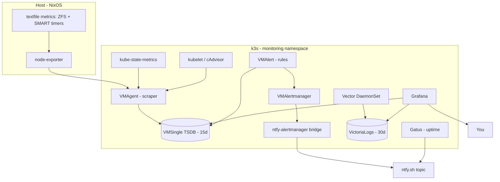

# Monitoring

An in-cluster observability stack watches the host, the disks, and the cluster.
It's built on **VictoriaMetrics** (a Prometheus-compatible TSDB), **Grafana**,
**VictoriaLogs + Vector** for logs, **Gatus** for uptime, and **ntfy.sh** for
push notifications. It lives in `k8s/monitoring/` and mirrors
[`tellmeY18/retire.nix`](https://github.com/tellmeY18/retire.nix), trimmed to
this single-node box.

## Big picture



Two deploy layers:

1. **Helm** (`helmfile.yaml` + `values.yaml`) installs the
   [`victoria-metrics-k8s-stack`](https://github.com/VictoriaMetrics/helm-charts)
   chart (pinned **0.78.0**): the VM Operator + CRDs, VMSingle, VMAgent,
   VMAlert, VMAlertmanager, Grafana, node-exporter, and kube-state-metrics.
2. **Kustomize** (`kustomization.yaml`) adds the avocado-specific extras the
   chart doesn't own (below).

## What Helm installs (`values.yaml`)

| Component | Role | Notable config |
|---|---|---|
| **VM Operator + CRDs** | manages `VMRule`/`VMServiceScrape`/`VMNodeScrape`/… | Prometheus CRD converter **disabled** (native VM CRs only) |
| **VMSingle** | time-series DB | **15d** retention on `local-path`, 10 Gi PVC |
| **VMAgent** | scrapes all `VM*Scrape` targets in every namespace | `selectAllByDefault: true` |
| **VMAlert** | evaluates `VMRule` alerting rules | — |
| **VMAlertmanager** | routes alerts → the ntfy bridge | see routing below |
| **Grafana** | dashboards | ClusterIP (via Ingress), VictoriaLogs datasource plugin, JWT SSO templated |
| **node-exporter** | host CPU/mem/disk/net/ZFS | mounts the host **textfile** dir read-only |
| **kube-state-metrics** | k8s object state | — |

Because k3s doesn't expose etcd/scheduler/controller-manager/kube-proxy as
separate scrape targets, those default rule groups and scrape jobs are
**disabled**. `kubelet`, `kubeApiServer`, and `coreDns` scraping stay on.

### Alert routing

VMAlertmanager forwards alerts to the `ntfy-alertmanager` bridge, which pushes
to an ntfy.sh topic. The always-firing **`Watchdog`** and any `severity="none"`
alerts are dropped to a blackhole receiver. Grouping: by `alertname` +
`instance`, `repeat_interval: 4h`.

## What Kustomize adds

| Manifest | Purpose |
|---|---|
| `namespace.yaml` | `monitoring` ns with **PodSecurity** labels (`privileged` — node-exporter needs hostNetwork/hostPath) |
| `grafana-ingress.yaml` | Traefik Ingress for Grafana (`grafana.rithviknishad.dev`, `grafana.avocado.local`) |
| `ntfy-alertmanager.yaml` | Alertmanager → ntfy.sh bridge (`xenrox/ntfy-alertmanager`) |
| `zfs-vmrules.yaml` | ZFS pool-health, ARC, and ZIL alerts |
| `zfs-grafana-dashboard.yaml` | ZFS Grafana dashboard |
| `smart-vmrules.yaml` | SMART disk-health alerts |
| `pvc-storage-vmrules.yaml` | PVC capacity + inode alerts |
| `cadvisor-vmnodescrape.yaml` | per-container metrics from kubelet's cAdvisor |
| `gatus.yaml` | synthetic uptime probing → ntfy |
| `victorialogs.yaml` | VictoriaLogs log database (30d, 10 Gi PVC) |
| `vector.yaml` | Vector DaemonSet shipping pod logs → VictoriaLogs |
| `victorialogs-datasource.yaml` | Grafana datasource for VictoriaLogs |
| `networkpolicies.yaml` | default-deny ingress + minimal allow-list |

## The alerts

### ZFS (`zfs-vmrules.yaml`)

Highest value on this no-redundancy box. Pool-state alerts read
`node_zfs_zpool_state` (from the [host timer](nix-modules.md#monitoringnix--host-side-metrics-glue));
ARC/ZIL use node-exporter's built-in ZFS collector.

| Alert | Severity | Fires when |
|---|---|---|
| `ZFSPoolNotOnline` | critical | a pool leaves the `online` state (1m) |
| `ZFSPoolDegraded` | warning | pool `degraded` |
| `ZFSPoolFaulted` | critical | pool `faulted` (immediate) |
| `ZFSARCHitRatioLow` | warning | ARC hit ratio < 80% for 15m |
| `ZFSARCShrunk` | warning | ARC < 50% of max target for 30m |
| `ZFSHighZILCommitRate` | warning | ZIL commits > 1000/s for 10m |

### SMART (`smart-vmrules.yaml`)

Reads `smartmon_*` from the host SMART timer.

| Alert | Severity | Fires when |
|---|---|---|
| `SmartDeviceUnhealthy` | critical | SMART self-assessment FAILED — back up now |
| `SmartDeviceHealthUnknown` | warning | couldn't read a SMART assessment for 15m |
| `SmartTextfileStale` | warning | metrics not refreshed in >30m (timer broken) |
| `SmartDriveHot` | warning | drive > 60 °C for 10m |

### PVC storage (`pvc-storage-vmrules.yaml`)

Cluster-wide, from `kubelet_volume_stats_*`.

| Alert | Severity | Fires when |
|---|---|---|
| `PVCFillingUp` | warning | > 80% full for 10m |
| `PVCCriticallyFull` | critical | > 90% full for 5m |
| `PVCAlmostOutOfInodes` | warning | > 80% inodes used for 10m |

Standard node/Kubernetes alerts come from the chart's `defaultRules`.

## Logs (VictoriaLogs + Vector)

`vector.yaml` runs a **Vector DaemonSet** that tails every pod's logs
(`/var/log/pods` → k3s containerd), enriches them with namespace/pod/container
labels, and ships them to **VictoriaLogs** via its Elasticsearch bulk endpoint.
Query them in Grafana's **Explore** using the provisioned *VictoriaLogs*
datasource, or `just mon-logs` (→ `http://localhost:9428/select/vmui`). Both
Vector's and VictoriaLogs' own metrics are scraped back into VMSingle.

## Uptime (Gatus)

`gatus.yaml` runs [Gatus](https://github.com/TwiN/gatus), which probes internal
service health (Grafana, VMSingle, VictoriaLogs) and public endpoints
(`https://rithviknishad.dev`, including a **TLS-expiry** check) and pushes
failures/recoveries straight to ntfy.sh via its **native ntfy provider** — a
separate pipeline from the metrics-based alerts, on the same topic. Dashboard at
`https://status.rithviknishad.dev` or `just mon-gatus`.

## Notifications (ntfy.sh)

Two independent pipelines converge on one ntfy topic (default
`avocado-alerts`):

- **Metrics alerts:** VMAlert → VMAlertmanager → `ntfy-alertmanager` bridge →
  ntfy. Severity maps to priority/emoji (critical 🚨, warning ⚠️, resolved ✅).
- **Uptime:** Gatus → ntfy directly.

> Pick a **private, hard-to-guess topic** (public topic names are readable by
> anyone) and change it in both `ntfy-alertmanager.yaml` and `gatus.yaml`. For
> an authenticated topic, put the token in `secrets/monitoring.enc.yaml` and
> reference it from a Secret.

## Network policies

`networkpolicies.yaml` applies **default-deny ingress** to the namespace, then a
minimal allow-list: all intra-namespace traffic, the ingress controller
(Traefik in `kube-system`) → Grafana/Gatus, and the kube-apiserver → the VM
operator's validating webhook on `:9443`. Egress is left open so scraping and
ntfy/Gatus outbound calls keep working. (k3s enforces NetworkPolicy via
kube-router, so these take effect.)

## Deploying

Prereqs: `nix develop` and a kubeconfig (`just kubeconfig`). The Grafana admin
password is sops-decrypted from `secrets/monitoring.enc.yaml` into the
gitignored `values-secret.yaml` just before `helmfile sync`.

```sh
just kubeconfig     # once
just mon-deploy     # namespace -> helmfile sync -> kubectl apply -k .
just mon-status     # pods, svc, ingress, vmrule
```

`mon-deploy` runs in order: apply `namespace.yaml` → `helmfile sync` (CRDs +
operator + stack) → `kubectl apply -k` (the CRs, which need the CRDs first).

Handy port-forwards (see the full [`just` reference](deployment.md)):

```sh
just mon-grafana    # http://localhost:3000  (admin / sops password)
just mon-gatus      # http://localhost:8080
just mon-logs       # http://localhost:9428  (try /select/vmui)
just mon-ntfy-test  # send a test push to the topic
```

## Access Grafana

Three ways in, in order of preference:

1. **Public tunnel (with SSO):** `https://grafana.rithviknishad.dev` — via the
   [Cloudflare Tunnel](networking.md), optionally gated by Cloudflare Access.
2. **Tailnet via Traefik:**
   `curl -H "Host: grafana.rithviknishad.dev" http://avocado`.
3. **Port-forward:** `just mon-grafana` → `http://localhost:3000`.

### Grafana SSO (Cloudflare Access) {#grafana-sso-cloudflare-access}

To put single-sign-on in front of Grafana, create a Zero-Trust **self-hosted
Access application** for `grafana.rithviknishad.dev`, then uncomment/fill the
`auth.jwt` block in `values.yaml`:

- `jwk_set_url: https://<TEAM>.cloudflareaccess.com/cdn-cgi/access/certs`
- `expect_claims: '{"aud":"<ACCESS_APP_AUD>"}'`

Access validates the login at the edge and injects a signed
`Cf-Access-Jwt-Assertion` header; Grafana verifies it against Cloudflare's JWKS
and auto-provisions the user (Viewer by default). The built-in login form stays
as a break-glass fallback. Until Access is live, keep the sops admin password
strong. The `README.md` in `k8s/monitoring/` has the full runbook.

## Version pinning

Chart and image versions are pinned explicitly (chart `0.78.0`, VictoriaLogs
`v1.51.0`, Vector `0.50.0-alpine`, Gatus `v5.36.0`, ntfy-alertmanager `1.0.0`).
Read the relevant CHANGELOG before bumping.
