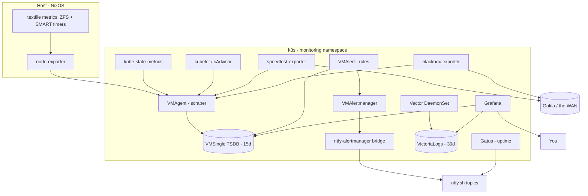

# Monitoring

An in-cluster observability stack watches the host, the disks, and the cluster.
It's built on **VictoriaMetrics** (a Prometheus-compatible TSDB), **Grafana**,
**VictoriaLogs + Vector** for logs, **Gatus** for uptime, and **ntfy.sh** for
push notifications. It lives in `k8s/monitoring/` and mirrors
[`tellmeY18/retire.nix`](https://github.com/tellmeY18/retire.nix), trimmed to
this single-node box.

{: .note }
> This page is about **infrastructure** telemetry — is the box healthy? For
> **application** telemetry (traces/spans from instrumented services) there is a
> separate [SigNoz](signoz.md) stack in `k8s/signoz/`. This stack watches that
> one, not the reverse: Gatus probes both SigNoz halves and VMAgent scrapes its
> collector, so a ClickHouse outage still has a watchdog outside itself.

## Big picture


```mermaid
flowchart TB
    subgraph host[Host - NixOS]
        ne[node-exporter]
        tf[textfile metrics: ZFS + SMART timers]
        tf --> ne
    end

    subgraph cluster[k3s - monitoring namespace]
        vmagent[VMAgent - scraper] --> vmsingle[(VMSingle TSDB - 15d)]
        ne --> vmagent
        ksm[kube-state-metrics] --> vmagent
        cadvisor[kubelet / cAdvisor] --> vmagent
        speedtest[speedtest-exporter] --> vmagent
        blackbox[blackbox-exporter] --> vmagent

        vmalert[VMAlert - rules] --> vmsingle
        vmalert --> vmam[VMAlertmanager]
        vmam --> bridge[ntfy-alertmanager bridge]

        vector[Vector DaemonSet] --> vlogs[(VictoriaLogs - 30d)]

        grafana[Grafana] --> vmsingle
        grafana --> vlogs

        gatus[Gatus - uptime]
    end

    bridge --> ntfy[ntfy.sh topics]
    gatus --> ntfy
    grafana --> user[You]
    speedtest --> isp[(Ookla / the WAN)]
    blackbox --> isp
```

Two deploy layers:

1. **Helm** (`helmfile.yaml` + `values.yaml`) installs the
   [`victoria-metrics-k8s-stack`](https://github.com/VictoriaMetrics/helm-charts)
   chart (pinned **0.78.0**): the VM Operator + CRDs, VMSingle, VMAgent,
   VMAlert, VMAlertmanager, Grafana, node-exporter, and kube-state-metrics.
2. **Kustomize** (`kustomization.yaml`) adds the avocado-specific extras the
   chart doesn't own (below).

## What Helm installs (`values.yaml`)

| Component | Role | Notable config |
|---|---|---|
| **VM Operator + CRDs** | manages `VMRule`/`VMServiceScrape`/`VMNodeScrape`/… | Prometheus CRD converter **disabled** (native VM CRs only) |
| **VMSingle** | time-series DB | **15d** retention on `local-path`, 10 Gi PVC |
| **VMAgent** | scrapes all `VM*Scrape` targets in every namespace | `selectAllByDefault: true` |
| **VMAlert** | evaluates `VMRule` alerting rules | — |
| **VMAlertmanager** | routes alerts → the ntfy bridge | see routing below |
| **Grafana** | dashboards | ClusterIP (via Ingress), VictoriaLogs datasource plugin, JWT SSO templated |
| **node-exporter** | host CPU/mem/disk/net/ZFS | mounts the host **textfile** dir read-only |
| **kube-state-metrics** | k8s object state | — |

Because k3s doesn't expose etcd/scheduler/controller-manager/kube-proxy as
separate scrape targets, those default rule groups and scrape jobs are
**disabled**. `kubelet`, `kubeApiServer`, and `coreDns` scraping stay on.

### Alert routing

VMAlertmanager forwards alerts to the `ntfy-alertmanager` bridge, which pushes
to an ntfy.sh topic. The always-firing **`Watchdog`** and any `severity="none"`
alerts are dropped to a blackhole receiver. Grouping: by `alertname` +
`instance`, `repeat_interval: 4h`.

## What Kustomize adds

| Manifest | Purpose |
|---|---|
| `namespace.yaml` | `monitoring` ns with **PodSecurity** labels (`privileged` — node-exporter needs hostNetwork/hostPath) |
| `grafana-ingress.yaml` | Traefik Ingress for Grafana (`grafana.rithviknishad.dev`, `grafana.avocado.local`) |
| `ntfy-alertmanager.yaml` | Alertmanager → ntfy.sh bridge (`xenrox/ntfy-alertmanager`) |
| `zfs-vmrules.yaml` | ZFS pool-health, ARC, and ZIL alerts |
| `zfs-grafana-dashboard.yaml` | ZFS Grafana dashboard |
| `smart-vmrules.yaml` | SMART disk-health alerts |
| `pvc-storage-vmrules.yaml` | PVC capacity + inode alerts |
| `cadvisor-vmnodescrape.yaml` | per-container metrics from kubelet's cAdvisor |
| `gatus.yaml` | synthetic uptime probing → ntfy |
| `speedtest-exporter.yaml` | Ookla speed test every 15m → `speedtest_*` metrics |
| `blackbox-exporter.yaml` | external HTTP/DNS probes (`VMProbe`) → `probe_*` metrics |
| `internet-vmrules.yaml` | internet down / degraded alerts |
| `internet-grafana-dashboard.yaml` | "Internet Connection" dashboard |
| `victorialogs.yaml` | VictoriaLogs log database (30d, 10 Gi PVC) |
| `vector.yaml` | Vector DaemonSet shipping pod logs → VictoriaLogs |
| `victorialogs-datasource.yaml` | Grafana datasource for VictoriaLogs |
| `networkpolicies.yaml` | default-deny ingress + minimal allow-list |

## The alerts

### ZFS (`zfs-vmrules.yaml`)

Highest value on this no-redundancy box. Pool-state alerts read
`node_zfs_zpool_state` (from the [host timer](nix-modules.md#monitoringnix--host-side-metrics-glue));
ARC/ZIL use node-exporter's built-in ZFS collector.

| Alert | Severity | Fires when |
|---|---|---|
| `ZFSPoolNotOnline` | critical | a pool leaves the `online` state (1m) |
| `ZFSPoolDegraded` | warning | pool `degraded` |
| `ZFSPoolFaulted` | critical | pool `faulted` (immediate) |
| `ZFSPoolFillingUp` | warning | pool > 80% allocated for 30m |
| `ZFSPoolCriticallyFull` | critical | pool > 90% allocated for 5m |
| `ZFSSnapshotsMissing` | critical | a dataset tagged `auto-snapshot=true` has **zero** snapshots for 1h |
| `ZFSSnapshotsStale` | warning | newest snapshot of a tagged dataset is > 2h old |
| `ZFSARCHitRatioLow` | warning | ARC hit ratio < 80% for 15m |
| `ZFSARCShrunk` | warning | ARC < 50% of max target for 30m |
| `ZFSHighZILCommitRate` | warning | ZIL commits > 1000/s for 10m |

The capacity pair exists because [rolling snapshots](storage.md#snapshots)
retain freed blocks: deleting a large PVC no longer frees space immediately,
so the pool can fill quietly.

`ZFSSnapshotsMissing` guards the failure that cost us the CARE database. The
snapshot timers ran green every 15 minutes for 73 days while creating **zero**
snapshots, because the datasets were tagged `com.sun:auto-snapshot=false`. A
unit exiting 0 proved nothing, so this alerts on the *artifact* — snapshots
existing and being fresh — rather than on the job succeeding.

### Backups (`backup-vmrules.yaml`)

From `kube_cronjob_status_last_successful_time` / `kube_job_status_failed`
(kube-state-metrics).

| Alert | Severity | Fires when |
|---|---|---|
| `BackupCronJobStale` | critical | a `*-db-backup` CronJob hasn't succeeded in > 36h |
| `BackupCronJobMissing` | warning | no successful-run series exists for `care-db-backup` for 6h |
| `BackupJobFailed` | warning | a backup Job has a failed pod for 15m |

Backups fail silently by nature — nothing breaks when a dump doesn't happen,
so you find out when you need it. The `teleicu-db-backup` CronJob silently
produced no dump on 2026-08-29 and 2026-08-30 and nothing noticed; 36h lets a
single run slip for a reboot while still catching two consecutive misses.

### SMART (`smart-vmrules.yaml`)

Reads `smartmon_*` from the host SMART timer.

| Alert | Severity | Fires when |
|---|---|---|
| `SmartDeviceUnhealthy` | critical | SMART self-assessment FAILED — back up now |
| `SmartDeviceHealthUnknown` | warning | couldn't read a SMART assessment for 15m |
| `SmartTextfileStale` | warning | metrics not refreshed in >30m (timer broken) |
| `SmartDriveHot` | warning | drive > 60 °C for 10m |

### PVC storage (`pvc-storage-vmrules.yaml`)

Cluster-wide, from `kubelet_volume_stats_*`.

| Alert | Severity | Fires when |
|---|---|---|
| `PVCFillingUp` | warning | > 80% full for 10m |
| `PVCCriticallyFull` | critical | > 90% full for 5m |
| `PVCAlmostOutOfInodes` | warning | > 80% inodes used for 10m |

Standard node/Kubernetes alerts come from the chart's `defaultRules`.

## Internet connection (speedtest + blackbox)

The k8s port of [geerlingguy/internet-pi](https://github.com/geerlingguy/internet-pi),
from Jeff Geerling's ["Monitor your Internet with a Raspberry
Pi"](https://www.jeffgeerling.com/blog/2021/monitor-your-internet-raspberry-pi/) —
minus the Pi. Upstream dedicates a Raspberry Pi to a docker-compose stack with
its *own* Prometheus and Grafana; here it collapses to two exporters in the
`monitoring` namespace, scraped by the VMAgent that already exists. (Pi-hole,
Starlink and Shelly power monitoring from that project are hardware-specific
and deliberately left out.)

| Piece | What it measures |
|---|---|
| **speedtest-exporter** (`ghcr.io/miguelndecarvalho/speedtest-exporter`) | `speedtest_download_bits_per_second`, `_upload_`, `_ping_latency_milliseconds`, `_jitter_`, `speedtest_up`, `speedtest_server_id` |
| **blackbox-exporter** (`quay.io/prometheus/blackbox-exporter`) | `probe_success`, `probe_duration_seconds`, `probe_http_duration_seconds{phase}` for HTTP + DNS targets |

Two `VMProbe` objects drive blackbox: `internet-http` hits
`google.com`/`cloudflare.com`/`github.com` every **30s**, and `internet-dns`
resolves a name against `1.1.1.1`/`8.8.8.8` every **1m**. Three unrelated
networks so one provider's bad day doesn't read as "internet down", and the
DNS layer separates "names don't resolve" from "the link is dead".

Grafana dashboard: **Internet Connection** (avocado folder, uid
`internet-connection`) — throughput, latency/jitter, reachability, the HTTP
timing breakdown by phase, and availability over the selected range.

### Why it's shaped this way

- **The scrape interval *is* the test schedule.** Every hit on the speedtest
  exporter's `/metrics` shells out to the Ookla CLI and runs a real test, so
  its `VMServiceScrape` uses `interval: 15m` with a `60s` timeout (and
  `SPEEDTEST_TIMEOUT=55` so a hung CLI dies *before* vmagent gives up). Each
  test moves hundreds of MB — that's ~96 tests/day, so raise the interval on a
  metered link (and drop `SPEEDTEST_CACHE_FOR` below it, since that's what
  stops a stray `curl` from kicking off a competing test).
- **15m samples vs. a 5m lookbehind.** Instant queries return nothing
  between tests, so every dashboard panel and alert wraps `speedtest_*` in
  `last_over_time()` / `avg_over_time()`. Preserve that when editing, or rules
  silently never fire.
- **No ICMP probing.** blackbox's `icmp` prober needs `CAP_NET_RAW`, which
  PodSecurity `baseline` (audited in this namespace) flags. HTTP + DNS need no
  capabilities and isolate the failure anyway — internet-pi's "ping" job is
  itself an `http_2xx` module.
- **Gatus doesn't cover this.** Gatus asks "is *my* service up?" against
  in-cluster Services — those stay green through a total WAN outage. Gatus
  does probe blackbox-exporter's own `/-/healthy`, because if the prober dies
  `probe_success` stops existing rather than dropping to 0. speedtest-exporter
  is intentionally *not* Gatus-probed: an HTTP check on it would trigger a
  speed test every minute.

### Internet alerts (`internet-vmrules.yaml`)

| Alert | Severity | Fires when |
|---|---|---|
| `InternetDown` | critical | **all** external HTTP probes failing for 3m |
| `InternetDNSDown` | critical | neither public resolver answers for 5m |
| `InternetTargetUnreachable` | warning | one anchor down 15m while others are up |
| `InternetHighLatency` | warning | HTTP probe time averages > 2s over 15m |
| `SpeedtestNotReporting` | warning | no `speedtest_up` sample in 1h (exporter/scrape broken) |
| `SpeedtestFailing` | warning | every test in the last hour errored |
| `InternetDownloadSlow` | warning | 6h average download < **50 Mbit/s** |
| `InternetUploadSlow` | warning | 6h average upload < **20 Mbit/s** |
| `InternetLatencyHigh` | warning | 6h average idle ping > 100ms |

{: .warning }
> The two speed thresholds are **placeholders**, not measurements of the actual
> plan. To retune: edit `InternetDownloadSlow` / `InternetUploadSlow` in
> `k8s/monitoring/internet-vmrules.yaml` — values are in bits/s (`50e6` =
> 50 Mbit/s) — then `just mon-deploy`. Roughly **70% of the advertised tier**
> is a reasonable target: low enough to ignore normal variance, high enough to
> catch a genuinely degraded link. Both are gated on `speedtest_up`, so a run
> of failed tests reports as `SpeedtestFailing` rather than "the internet got
> slow".

When the WAN really is down the ntfy push can't leave the box either;
Alertmanager retries, so these land as a burst once connectivity returns. The
value is the timeline, not a live page.

## Logs (VictoriaLogs + Vector)

`vector.yaml` runs a **Vector DaemonSet** that tails every pod's logs
(`/var/log/pods` → k3s containerd), enriches them with namespace/pod/container
labels, and ships them to **VictoriaLogs** via its Elasticsearch bulk endpoint.
Query them in Grafana's **Explore** using the provisioned *VictoriaLogs*
datasource, or `just mon-logs` (→ `http://localhost:9428/select/vmui`). Both
Vector's and VictoriaLogs' own metrics are scraped back into VMSingle.

## Uptime (Gatus)

`gatus.yaml` runs [Gatus](https://github.com/TwiN/gatus), which synthetically
probes endpoints and pushes failures/recoveries to ntfy.sh via its **native ntfy
provider** — a separate pipeline from the metrics-based alerts. There's no admin
UI; checks are declared in the `gatus-config` ConfigMap. The dashboard sorts by
group (`ui.default-sort-by: group`):

| Group | Endpoints | "Up" means | ntfy topic |
|---|---|---|---|
| `internal` | Grafana / VMSingle / VictoriaLogs `/health`, blackbox-exporter `/-/healthy`, ESPHome `/`, ntfy `/v1/health`, Pookalam vote `/`, the MCP servers (Kite `/`, Settle Up `/health`), [SigNoz](signoz.md) query `/api/v1/health` + collector `health_check` | `[STATUS] == 200` | `avocado-alerts` |
| `public` | `rithviknishad.dev`, `photos.rithviknishad.dev` (Immich `/api/server/ping`), `kite.rithviknishad.dev` (`/healthz`), `ntfy.rithviknishad.dev` (`/v1/health`), `ohc-pookalam.rithviknishad.dev` (`/`) | 200 + body + TLS-expiry | `avocado-alerts` |
| `ohcnetwork/care` | CARE public edges (`care-api /ping/`, SPA, gateway `/`, MFE `/health`) + in-cluster (MinIO, middleware, RTSPtoWeb) | 200 (+ TLS-expiry on public) | `avocado-alerts` |
| `ohcnetwork/teleicu/cameras` | Mock PTZ camera (in-cluster + public edge) and the physical ONVIF cameras (`matrix-cctv`, `prama-cctv`, `cpplus-cctv`) as raw TCP connects to RTSP `:554` | mock: reachable + non-5xx; physical: `[CONNECTED] == true` | `avocado-alerts` |
| `ohcnetwork/ots` | Open Terminology Server: public edge + in-cluster `/health` | 200 (+ TLS-expiry on public) | `avocado-alerts` |
| `ABDM-SBX` | ABDM **sandbox**: NHPR (`/v4/`) / ABHA / HIECM | reachable + non-5xx | `avocado-abdm` (prio 4) |
| `ABDM-LIVE` | ABDM **live**: NHPR (`/v4/`) / ABHA / HIECM | reachable + non-5xx | `avocado-abdm` (prio 5) |

The ABDM entries are third-party APIs we don't own, so their checks assert only
`[CONNECTED] == true` **and** `[STATUS] < 500` (reachable and not server-erroring;
2xx/3xx/4xx incl. auth-required all count as serving) and route to a **separate**
`avocado-abdm` topic via ntfy `overrides`. Dashboard at
`https://status.rithviknishad.dev`, on the tailnet via
`curl -H "Host: status.rithviknishad.dev" http://avocado`, or `just mon-gatus`.

## Notifications (ntfy.sh)

Two independent pipelines push to ntfy across two topics:

- **Metrics alerts:** VMAlert → VMAlertmanager → `ntfy-alertmanager` bridge →
  ntfy. Severity maps to priority/emoji (critical 🚨, warning ⚠️, resolved ✅).
- **Uptime:** Gatus → ntfy directly.

| Topic | Fed by |
|---|---|
| `avocado-alerts` | Alertmanager bridge + Gatus `internal`/`public`/`ohcnetwork/care`/`ohcnetwork/ots` groups |
| `avocado-abdm` | Gatus `ABDM-SBX`/`ABDM-LIVE` groups (third-party, kept separate) |

> Topic names are set in `ntfy-alertmanager.yaml` and `gatus.yaml` (top-level
> `topic` + per-group `overrides`). Pick **hard-to-guess** names — public topic
> names are readable by anyone. For an authenticated topic, put the token in
> `secrets/monitoring.enc.yaml` and reference it from a Secret.

> **Why not the self-hosted server?** avocado also runs its own ntfy at
> `ntfy.rithviknishad.dev` ([ntfy](ntfy.md)), but both alert pipelines still
> target **ntfy.sh** on purpose: an alerting channel that lives on the box it
> watches goes silent exactly when the box breaks. Keep that split — or, if you
> do migrate, keep at least the host-level alerts on ntfy.sh.

## Network policies

`networkpolicies.yaml` applies **default-deny ingress** to the namespace, then a
minimal allow-list: all intra-namespace traffic, the ingress controller
(Traefik in `kube-system`) → Grafana/Gatus, and the kube-apiserver → the VM
operator's validating webhook on `:9443`. Egress is left open so scraping and
ntfy/Gatus outbound calls keep working. (k3s enforces NetworkPolicy via
kube-router, so these take effect.)

## Deploying

Prereqs: `nix develop` and a kubeconfig (`just kubeconfig`). The Grafana admin
password is sops-decrypted from `secrets/monitoring.enc.yaml` into the
gitignored `values-secret.yaml` just before `helmfile sync`.

```sh
just kubeconfig     # once
just mon-deploy     # namespace -> helmfile sync -> kubectl apply -k .
just mon-status     # pods, svc, ingress, vmrule
```

`mon-deploy` runs in order: apply `namespace.yaml` → `helmfile sync` (CRDs +
operator + stack) → `kubectl apply -k` (the CRs, which need the CRDs first).

Handy port-forwards (see the full [`just` reference](deployment.md)):

```sh
just mon-grafana    # http://localhost:3000  (admin / sops password)
just mon-gatus      # http://localhost:8080
just mon-logs       # http://localhost:9428  (try /select/vmui)
just mon-ntfy-test  # send a test push to the topic
just mon-speedtest  # latest speedtest metrics (runs a test if cache expired)
```

## Access Grafana

Three ways in, in order of preference:

1. **Public tunnel (with SSO):** `https://grafana.rithviknishad.dev` — via the
   [Cloudflare Tunnel](networking.md), optionally gated by Cloudflare Access.
2. **Tailnet via Traefik:**
   `curl -H "Host: grafana.rithviknishad.dev" http://avocado`.
3. **Port-forward:** `just mon-grafana` → `http://localhost:3000`.

### Grafana SSO (Cloudflare Access) {#grafana-sso-cloudflare-access}

To put single-sign-on in front of Grafana, create a Zero-Trust **self-hosted
Access application** for `grafana.rithviknishad.dev`, then uncomment/fill the
`auth.jwt` block in `values.yaml`:

- `jwk_set_url: https://<TEAM>.cloudflareaccess.com/cdn-cgi/access/certs`
- `expect_claims: '{"aud":"<ACCESS_APP_AUD>"}'`

Access validates the login at the edge and injects a signed
`Cf-Access-Jwt-Assertion` header; Grafana verifies it against Cloudflare's JWKS
and auto-provisions the user (Viewer by default). The built-in login form stays
as a break-glass fallback. Until Access is live, keep the sops admin password
strong. The `README.md` in `k8s/monitoring/` has the full runbook.

## Version pinning

Chart and image versions are pinned explicitly (chart `0.78.0`, VictoriaLogs
`v1.51.0`, Vector `0.50.0-alpine`, Gatus `v5.36.0`, ntfy-alertmanager `1.0.0`,
speedtest-exporter `v3.5.4`, blackbox-exporter `v0.28.0`). Read the relevant
CHANGELOG before bumping.
