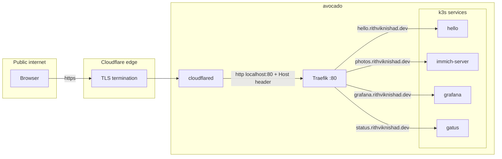

# Networking

`avocado` has **no inbound ports open to the internet**. Two overlays provide
access instead: **Tailscale** for private/admin reach, and a **Cloudflare
Tunnel** for public services. The host firewall stays on throughout.

## The firewall

`networking.firewall.enable = true` in [`base.nix`](nix-modules.md#basenix--shared-system-baseline);
each module opens only the ports it needs:

| Port(s) | Opened by | For |
|---|---|---|
| 22/tcp | `ssh.nix` (`openFirewall`) | SSH (key-only) |
| 6443/tcp | `k3s.nix` | Kubernetes API |
| 2379, 2380/tcp | `k3s.nix` | etcd client / peer (only matters with >1 server) |
| 10250/tcp | `k3s.nix` | kubelet |
| 8472/udp | `k3s.nix` | flannel VXLAN |

Tailscale adds `tailscale0` as a **trusted interface** and sets reverse-path
filtering to `loose`, so tailnet traffic bypasses these rules.

## Tailscale (private mesh)

`modules/tailscale.nix` runs Tailscale fully declaratively:

- Auto-authenticates from the sops-managed `tailscale/auth-key`
  (a reusable/ephemeral key). Until a real key is present, the autoconnect unit
  just fails harmlessly.
- `useRoutingFeatures = "both"` (can advertise and accept routes).
- Trusts `tailscale0` in the firewall; `checkReversePath = "loose"`.

The box is reachable at the MagicDNS name **`avocado`**, which is what the
`justfile` and the k3s `--tls-san` use — stable across DHCP/IP changes. This is
the recommended path for `kubectl`, Lens, SSH, and hitting internal-only
services.

## Cloudflare Tunnel (public access)

`modules/cloudflared.nix` runs a named tunnel
(`41180798-4793-474b-847e-3ad36a30df2f`) with credentials from a sops binary
secret. `cloudflared` dials **out** to Cloudflare, so nothing is exposed on the
box.



### Public routing table

Every hostname below is mapped by the tunnel to `http://localhost:80`, where
Traefik routes by `Host` header to the matching k8s Ingress. Anything not
matched returns `http_status:404`.

| Hostname | Ingress → Service | Page |
|---|---|---|
| `hello.rithviknishad.dev` | sample `hello` | [Kubernetes](kubernetes.md) |
| `photos.rithviknishad.dev` | Immich `immich-server` | [Kubernetes](kubernetes.md) |
| `grafana.rithviknishad.dev` | `grafana` | [Monitoring](monitoring.md) |
| `status.rithviknishad.dev` | Gatus `gatus` | [Monitoring](monitoring.md) |

Notes:

- **TLS terminates at Cloudflare's edge** — no cert-manager on the box.
- Grafana can additionally sit behind **Cloudflare Access** (Zero-Trust SSO);
  the JWT wiring is templated and documented on the
  [Monitoring](monitoring.md#grafana-sso-cloudflare-access) page.
- The metrics/logs databases (VMSingle, VictoriaLogs) are **deliberately not**
  exposed through the tunnel — reach them over Tailscale.

### Adding a public service

1. Add the ingress host to the `ingress` map in `modules/cloudflared.nix` and
   `just deploy`.
2. Create the DNS route once:
   `cloudflared tunnel route dns avocado <host>.rithviknishad.dev`.
3. Add a matching k8s `Ingress` with that `host` (Traefik does the final hop).

## Reaching internal services over Tailscale

Because Traefik routes purely by `Host` header, you can hit any ingress without
Cloudflare by supplying the header directly to the box on the tailnet:

```sh
curl -H "Host: grafana.rithviknishad.dev" http://avocado
```

The manifests also define `*.avocado.local` hosts (e.g. `grafana.avocado.local`)
for the same purpose.
