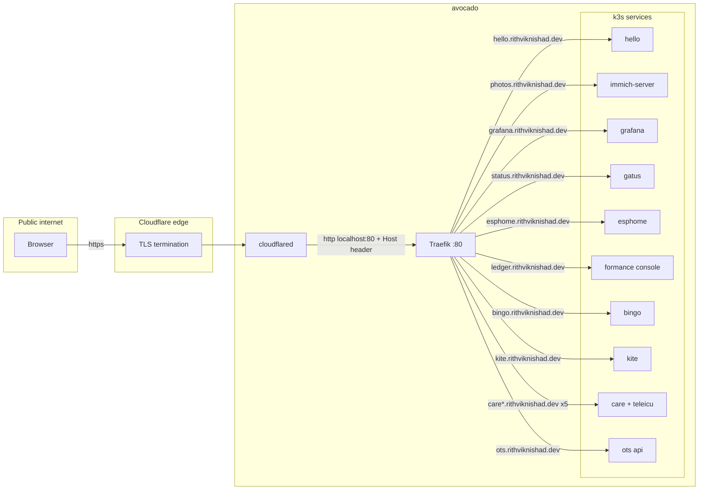

# Networking

`avocado` has **no inbound ports open to the internet**. Two overlays provide
access instead: **Tailscale** for private/admin reach, and a **Cloudflare
Tunnel** for public services. The host firewall stays on throughout.

## The firewall

`networking.firewall.enable = true` in [`base.nix`](nix-modules.md#basenix--shared-system-baseline);
each module opens only the ports it needs:

| Port(s) | Opened by | For |
|---|---|---|
| 22/tcp | `ssh.nix` (`openFirewall`) | SSH (key-only) |
| 6443/tcp | `k3s.nix` | Kubernetes API |
| 2379, 2380/tcp | `k3s.nix` | etcd client / peer (only matters with >1 server) |
| 10250/tcp | `k3s.nix` | kubelet |
| 8472/udp | `k3s.nix` | flannel VXLAN |

Tailscale adds `tailscale0` as a **trusted interface** and sets reverse-path
filtering to `loose`, so tailnet traffic bypasses these rules.

## Tailscale (private mesh)

`modules/tailscale.nix` runs Tailscale fully declaratively:

- Auto-authenticates from the sops-managed `tailscale/auth-key`
  (a reusable/ephemeral key). Until a real key is present, the autoconnect unit
  just fails harmlessly.
- `useRoutingFeatures = "both"` (can advertise and accept routes).
- Trusts `tailscale0` in the firewall; `checkReversePath = "loose"`.

The box is reachable at the MagicDNS name **`avocado`**, which is what the
`justfile` and the k3s `--tls-san` use — stable across DHCP/IP changes. This is
the recommended path for `kubectl`, Lens, SSH, and hitting internal-only
services.

### Tailnet-only HTTPS (`tailscale serve`)

Two services are published to the tailnet with a real Let's Encrypt certificate
instead of through Traefik/the tunnel. Each is a systemd oneshot re-asserting
`tailscale serve --bg`, terminating TLS on the box's MagicDNS name and proxying
to a pinned k8s **NodePort**:

| URL | → NodePort | Service | Module |
|---|---|---|---|
| `https://avocado.<tailnet>.ts.net:8443` | `30080` | [Zerodha Kite MCP](zerodha-kite.md) | `modules/zerodha-kite.nix` |
| `https://avocado.<tailnet>.ts.net:10000` | `30800` | [Settle Up MCP](settle-up-mcp.md) | `modules/settle-up-mcp.nix` |

Both stay private: the MagicDNS name resolves only inside the tailnet, and the
NodePort range is deliberately **not** in `allowedTCPPorts` above, so the
backends are unreachable from the LAN/WAN.

{: .note }
> **These two ports are the whole budget.** `tailscale serve` only allows HTTPS
> on **443**, **8443**, and **10000** — and `:443` is already taken by k3s's
> klipper svclb for Traefik. A third tailnet HTTPS service must share an
> existing port via path-based `serve` routes.

## Cloudflare Tunnel (public access)

`modules/cloudflared.nix` runs a named tunnel
(`41180798-4793-474b-847e-3ad36a30df2f`) with credentials from a sops binary
secret. `cloudflared` dials **out** to Cloudflare, so nothing is exposed on the
box.


```mermaid
flowchart LR
    subgraph internet[Public internet]
        user[Browser]
    end
    subgraph cf[Cloudflare edge]
        tls[TLS termination]
    end
    subgraph box[avocado]
        cd[cloudflared]
        traefik[Traefik :80]
        subgraph k8s[k3s services]
            hello[hello]
            immich[immich-server]
            grafana[grafana]
            gatus[gatus]
            esphome[esphome]
            ledger[formance console]
            bingo[bingo]
            kite[kite]
            care[care + teleicu]
            ots[ots api]
        end
    end

    user -->|https| tls --> cd
    cd -->|http localhost:80 + Host header| traefik
    traefik -->|hello.rithviknishad.dev| hello
    traefik -->|photos.rithviknishad.dev| immich
    traefik -->|grafana.rithviknishad.dev| grafana
    traefik -->|status.rithviknishad.dev| gatus
    traefik -->|esphome.rithviknishad.dev| esphome
    traefik -->|ledger.rithviknishad.dev| ledger
    traefik -->|bingo.rithviknishad.dev| bingo
    traefik -->|kite.rithviknishad.dev| kite
    traefik -->|care*.rithviknishad.dev x5| care
    traefik -->|ots.rithviknishad.dev| ots
```

### Public routing table

Every hostname below is mapped by the tunnel to `http://localhost:80`, where
Traefik routes by `Host` header to the matching k8s Ingress. Anything not
matched returns `http_status:404`.

| Hostname | Ingress → Service | Page |
|---|---|---|
| `hello.rithviknishad.dev` | sample `hello` | [Kubernetes](kubernetes.md) |
| `photos.rithviknishad.dev` | Immich `immich-server` | [Kubernetes](kubernetes.md) |
| `grafana.rithviknishad.dev` | `grafana` | [Monitoring](monitoring.md) |
| `status.rithviknishad.dev` | Gatus `gatus` | [Monitoring](monitoring.md) |
| `esphome.rithviknishad.dev` | ESPHome `esphome` | [ESPHome](esphome.md) |
| `ledger.rithviknishad.dev` | Formance `console` | [Formance Ledger](formance.md) |
| `bingo.rithviknishad.dev` | Bingo `bingo` | [Kubernetes](kubernetes.md) |
| `kite.rithviknishad.dev` | Kite `kite` | [Kite](kite.md) |
| `care.rithviknishad.dev` | CARE `care-fe` | [CARE](care.md) |
| `care-api.rithviknishad.dev` | CARE `care-backend` | [CARE](care.md) |
| `care-s3.rithviknishad.dev` | CARE `minio` (presigned URLs) | [CARE](care.md) |
| `care-teleicu-gateway.rithviknishad.dev` | TeleICU `reverse-proxy` | [CARE](care.md) |
| `care-teleicu-devices.rithviknishad.dev` | TeleICU `teleicu-devices-fe` | [CARE](care.md) |
| `mock-ptz-camera.rithviknishad.dev` | TeleICU `mock-ptz-camera` (mock UI, `admin`/`admin`) | [CARE](care.md) |
| `ots.rithviknishad.dev` | OTS `ots-api` (x-api-key gated) | [Terminology Server](ots.md) |

Notes:

- **TLS terminates at Cloudflare's edge** — no cert-manager on the box.
- Grafana can additionally sit behind **Cloudflare Access** (Zero-Trust SSO);
  the JWT wiring is templated and documented on the
  [Monitoring](monitoring.md#grafana-sso-cloudflare-access) page.
- ESPHome **requires** Cloudflare Access (the dashboard has no auth) — create
  the Access app *before* the DNS route; see [ESPHome](esphome.md).
- Formance Ledger **requires** Cloudflare Access (micro-stack mode has no login
  of its own) — create the Access app *before* the DNS route; see
  [Formance Ledger](formance.md).
- Kite carries its **own GitHub OAuth** login (full cluster-admin console), so
  it is the one public host that does **not** need Cloudflare Access in front;
  see [Kite](kite.md).
- The Open Terminology Server gates **every** path with a shared API key
  (`x-api-key` header) except `/health` and the Swagger assets, and is called
  server-to-server by CARE, so it also does **not** sit behind Cloudflare
  Access (a browser SSO wall would break those calls); see
  [Terminology Server](ots.md).
- The metrics/logs databases (VMSingle, VictoriaLogs) are **deliberately not**
  exposed through the tunnel — reach them over Tailscale.

### Adding a public service

1. Add the ingress host to the `ingress` map in `modules/cloudflared.nix` and
   `just deploy`.
2. Create the DNS route once:
   `cloudflared tunnel route dns avocado <host>.rithviknishad.dev`.
3. Add a matching k8s `Ingress` with that `host` (Traefik does the final hop).

## Reaching internal services over Tailscale

Because Traefik routes purely by `Host` header, you can hit any ingress without
Cloudflare by supplying the header directly to the box on the tailnet:

```sh
curl -H "Host: grafana.rithviknishad.dev" http://avocado
```

The manifests also define `*.avocado.local` hosts (e.g. `grafana.avocado.local`)
for the same purpose.
