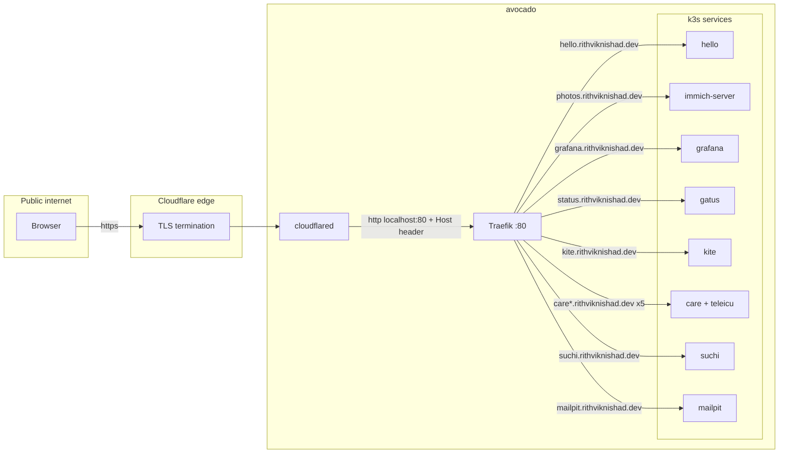

# Networking

`avocado` has **no inbound ports open to the internet**. Two overlays provide
access instead: **Tailscale** for private/admin reach, and a **Cloudflare
Tunnel** for public services. The host firewall stays on throughout.

## The firewall

`networking.firewall.enable = true` in [`base.nix`](nix-modules.md#basenix--shared-system-baseline);
each module opens only the ports it needs:

| Port(s) | Opened by | For |
|---|---|---|
| 22/tcp | `ssh.nix` (`openFirewall`) | SSH (key-only) |
| 5201/tcp + 5201/udp | `iperf.nix` | iperf3 server (LAN + tailnet throughput tests) |
| 5353/udp | `avahi.nix` (`openFirewall`) | mDNS — publishing `avocado.local` |
| 6443/tcp | `k3s.nix` | Kubernetes API |
| 2379, 2380/tcp | `k3s.nix` | etcd client / peer (only matters with >1 server) |
| 10250/tcp | `k3s.nix` | kubelet |
| 8472/udp | `k3s.nix` | flannel VXLAN |

Tailscale adds `tailscale0` as a **trusted interface** and sets reverse-path
filtering to `loose`, so tailnet traffic bypasses these rules.

{: .note }
> **k3s LoadBalancer ports bypass this table.** klipper ServiceLB publishes a
> `type: LoadBalancer` Service as hostPorts. The CNI DNATs those before the
> NixOS INPUT chain, so they are reachable on the LAN and tailnet without an
> `allowedTCPPorts` entry. Current ones: Traefik **80/443** and
> [Mailpit](mailpit.md) **1025** (SMTP) / **8025** (inbox). The box sits
> behind NAT, so none of these reach the internet directly.

## mDNS (`avocado.local`)

`modules/avahi.nix` runs an Avahi responder that publishes the host's addresses
for **`avocado.local`** on the LAN interface (`enp2s0`). This is the only name
that resolves the box from the LAN — `avocado` is MagicDNS and works inside the
tailnet only.

```sh
iperf3 -c avocado.local      # from any Mac/iPhone/Android/Linux box on the LAN
ssh rithviknishad@avocado.local
```

{: .warning }
> **This resolves the host name only.** mDNS has no subdomain delegation, so
> `grafana.avocado.local` and the other `*.avocado.local` ingress hosts are
> **not** covered by Avahi — they still need LAN DNS, a MagicDNS search domain,
> or `/etc/hosts` (see [below](#reaching-internal-services-over-tailscale)).
> Multicast also does not cross Tailscale, so `.local` works on the LAN only;
> from the tailnet use `avocado`.

## Tailscale (private mesh)

`modules/tailscale.nix` runs Tailscale fully declaratively:

- Auto-authenticates from the sops-managed `tailscale/auth-key`
  (a reusable/ephemeral key). Until a real key is present, the autoconnect unit
  just fails harmlessly.
- `useRoutingFeatures = "both"` (can advertise and accept routes).
- Trusts `tailscale0` in the firewall; `checkReversePath = "loose"`.

The box is reachable at the MagicDNS name **`avocado`**, which is what the
`justfile` and the k3s `--tls-san` use — stable across DHCP/IP changes. This is
the recommended path for `kubectl`, Lens, SSH, and hitting internal-only
services.

### Tailnet-only HTTPS (`tailscale serve`)

Two services are published to the tailnet with a real Let's Encrypt certificate
instead of through Traefik/the tunnel. Each is a systemd oneshot re-asserting
`tailscale serve --bg`, terminating TLS on the box's MagicDNS name and proxying
to a pinned k8s **NodePort**:

| URL | → NodePort | Service | Module |
|---|---|---|---|
| `https://avocado.<tailnet>.ts.net:8443` | `30080` | [Zerodha Kite MCP](zerodha-kite.md) | `modules/zerodha-kite.nix` |
| `https://avocado.<tailnet>.ts.net:10000` | `30800` | [Settle Up MCP](settle-up-mcp.md) | `modules/settle-up-mcp.nix` |

Both stay private: the MagicDNS name resolves only inside the tailnet, and the
NodePort range is deliberately **not** in `allowedTCPPorts` above, so the
backends are unreachable from the LAN/WAN.

{: .note }
> **These two ports are the whole budget.** `tailscale serve` only allows HTTPS
> on **443**, **8443**, and **10000** — and `:443` is already taken by k3s's
> klipper svclb for Traefik. A third tailnet HTTPS service must share an
> existing port via path-based `serve` routes.

## Cloudflare Tunnel (public access)

`modules/cloudflared.nix` runs a named tunnel
(`41180798-4793-474b-847e-3ad36a30df2f`) with credentials from a sops binary
secret. `cloudflared` dials **out** to Cloudflare, so nothing is exposed on the
box.


```mermaid
flowchart LR
    subgraph internet[Public internet]
        user[Browser]
    end
    subgraph cf[Cloudflare edge]
        tls[TLS termination]
    end
    subgraph box[avocado]
        cd[cloudflared]
        traefik[Traefik :80]
        subgraph k8s[k3s services]
            hello[hello]
            immich[immich-server]
            grafana[grafana]
            gatus[gatus]
            kite[kite]
            care[care + teleicu]
            suchi[suchi]
            mailpit[mailpit]
        end
    end

    user -->|https| tls --> cd
    cd -->|http localhost:80 + Host header| traefik
    traefik -->|hello.rithviknishad.dev| hello
    traefik -->|photos.rithviknishad.dev| immich
    traefik -->|grafana.rithviknishad.dev| grafana
    traefik -->|status.rithviknishad.dev| gatus
    traefik -->|kite.rithviknishad.dev| kite
    traefik -->|care*.rithviknishad.dev x5| care
    traefik -->|suchi.rithviknishad.dev| suchi
    traefik -->|mailpit.rithviknishad.dev| mailpit
```

### Public routing table

Every hostname below is mapped by the tunnel to `http://localhost:80`, where
Traefik routes by `Host` header to the matching k8s Ingress. Anything not
matched returns `http_status:404`.

| Hostname | Ingress → Service | Page |
|---|---|---|
| `hello.rithviknishad.dev` | sample `hello` | [Kubernetes](kubernetes.md) |
| `photos.rithviknishad.dev` | Immich `immich-server` | [Kubernetes](kubernetes.md) |
| `grafana.rithviknishad.dev` | `grafana` | [Monitoring](monitoring.md) |
| `status.rithviknishad.dev` | Gatus `gatus` | [Monitoring](monitoring.md) |
| `kite.rithviknishad.dev` | Kite `kite` | [Kite](kite.md) |
| `care.rithviknishad.dev` | CARE app origin, path-routed: `/api` -> `care-backend`, `/mfe-plugs/abdm` -> `care-abdm-fe`, `/care-uploads` + `/care-facility` -> `versitygw`, `/` -> `care-fe` | [CARE](care.md#one-origin-path-routed) |
| `care-api.rithviknishad.dev` | CARE `care-backend` | [CARE](care.md) |
| `care-teleicu-gateway.rithviknishad.dev` | TeleICU `reverse-proxy` | [CARE](care.md) |
| `care-teleicu-devices.rithviknishad.dev` | TeleICU `teleicu-devices-fe` | [CARE](care.md) |
| `mock-ptz-camera.rithviknishad.dev` | TeleICU `mock-ptz-camera` (mock UI, `admin`/`admin`) | [CARE](care.md) |
| `suchi.rithviknishad.dev` | suchi `suchi` (own account auth) | [suchi](suchi.md) |
| `mailpit.rithviknishad.dev` | Mailpit `mailpit` web inbox (own basic auth; SMTP not routed) | [Mailpit](mailpit.md) |

Notes:

- **TLS terminates at Cloudflare's edge** — no cert-manager on the box.
- Grafana can additionally sit behind **Cloudflare Access** (Zero-Trust SSO);
  the JWT wiring is templated and documented on the
  [Monitoring](monitoring.md#grafana-sso-cloudflare-access) page.
- Kite carries its **own GitHub OAuth** login (full cluster-admin console), so
  it does **not** need Cloudflare Access in front despite being
  cluster-admin; see [Kite](kite.md).
- suchi gates everything with its **own accounts** (first admin via a one-time
  setup token; `/metrics` admin-only) and is used by the Companion mobile app
  over its API, so it does **not** sit behind Cloudflare Access either. Create
  the admin right after the first deploy; see [suchi](suchi.md).
- Mailpit's inbox is public with **only its own basic auth** (no Cloudflare
  Access) because it holds test mail only. Its SMTP port cannot ride the
  tunnel; it is reachable on the tailnet/LAN via klipper. See
  [Mailpit](mailpit.md#exposure).
- The metrics/logs databases (VMSingle, VictoriaLogs) are **deliberately not**
  exposed through the tunnel — reach them over Tailscale.

### Adding a public service

1. Add the ingress host to the `ingress` map in `modules/cloudflared.nix` and
   `just deploy`.
2. Create the DNS route once:
   `cloudflared tunnel route dns avocado <host>.rithviknishad.dev`.
3. Add a matching k8s `Ingress` with that `host` (Traefik does the final hop).

### Troubleshooting: Cloudflare Error 1033

`Error 1033` on *every* public host means the edge has no connector registered
for the tunnel — i.e. `cloudflared` on the box is not running. Check it first:

```sh
just logs cloudflared-tunnel-41180798-4793-474b-847e-3ad36a30df2f
```

The usual cause is **DNS, not Cloudflare**. `cloudflared` resolves
`argotunnel.com` at startup and exits immediately if that fails:

```
ERR Failed to fetch features ... lookup cfd-features.argotunnel.com on 100.100.100.100:53: no such host
Couldn't resolve SRV record ... region1.v2.argotunnel.com: no such host
```

`100.100.100.100` is Tailscale MagicDNS. The box has **no static nameservers** —
MagicDNS forwards to whatever upstream resolvers DHCP hands out, so if that
lease blips, `tailscaled` logs `no upstream resolvers set, returning SERVFAIL`
and every public lookup on the box fails. k3s image pulls from `ghcr.io` failing
in the same window is a good confirming signal:

```sh
just logs tailscaled
```

The unit is configured to retry forever (`RestartSec=10`,
`startLimitIntervalSec=0` in `modules/cloudflared.nix`), so it should heal
itself once DNS returns. On an older generation that predates that hardening the
unit is instead stuck in `failed (Result: start-limit-hit)` and needs a manual
kick:

```sh
ssh root@avocado systemctl reset-failed cloudflared-tunnel-41180798-4793-474b-847e-3ad36a30df2f
ssh root@avocado systemctl start cloudflared-tunnel-41180798-4793-474b-847e-3ad36a30df2f
```

A healthy tunnel logs `Registered tunnel connection` (usually four of them).

## Reaching internal services over Tailscale

Because Traefik routes purely by `Host` header, you can hit any ingress without
Cloudflare by supplying the header directly to the box on the tailnet:

```sh
curl -H "Host: grafana.rithviknishad.dev" http://avocado
```

The manifests also define `*.avocado.local` hosts (e.g. `grafana.avocado.local`)
for the same purpose.
