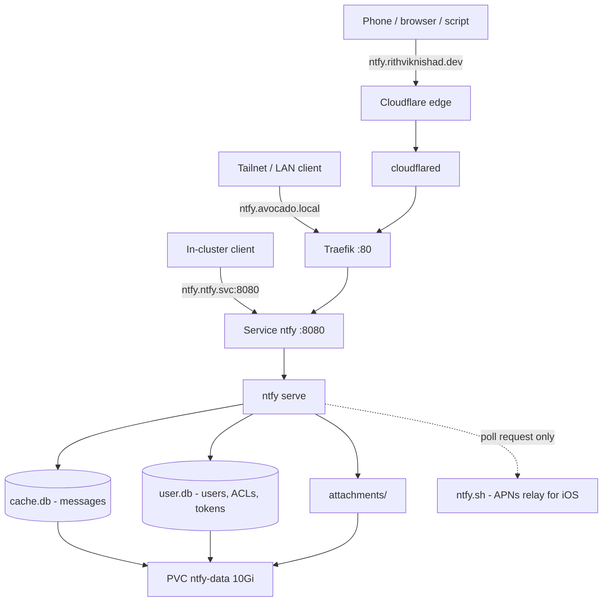

# ntfy — self-hosted push notifications

[ntfy](https://ntfy.sh) is a pub/sub notification service: HTTP `PUT`/`POST` to
a topic URL, and every subscribed phone, browser or script gets a push. It runs
on the k3s cluster under `k8s/ntfy/` and is public at
**`https://ntfy.rithviknishad.dev`**.

> **Public by design.** Phones, browsers and scripts publish and subscribe from
> anywhere, so there is **no Cloudflare Access gate** in front — a browser SSO
> wall would break token-authenticated publishers and the long-lived subscribe
> streams. ntfy's own auth (`auth-default-access: deny-all`) is the whole
> security boundary; see [Auth model](#auth-model).

## Architecture



One `ntfy serve` process is the whole service — **no database server, no
broker, no queue**:

| Piece | Choice | Why |
|---|---|---|
| Message cache | **SQLite** (`cache.db`, WAL) on the PVC | Single node, single writer. Postgres is only needed for multi-replica, which we don't run. |
| Users / ACLs / tokens | **SQLite** (`user.db`) on the same PVC | Same reason; the *contents* are declared in the sops secret (below). |
| Attachments | on-disk cache dir on the same PVC | Avoids standing up S3/MinIO for a personal server. |

Everything persistent lands on the `ntfy-data` PVC, which uses the k3s
local-path storageClass under `/var` on the `rpool` **stripe** — no redundancy
(see [Storage](storage.md)). Messages are ephemeral anyway (12 h cache), but
`user.db` holds the accounts and tokens; back it up if that becomes precious.

## Access

| Path | URL | Auth |
|---|---|---|
| Public | `https://ntfy.rithviknishad.dev` | ntfy user/token (deny-all default) |
| Tailscale / LAN | `http://avocado` (Host: `ntfy.avocado.local`) | same |
| In-cluster | `http://ntfy.ntfy.svc:8080` | same |

The tunnel host is wired in `modules/cloudflared.nix`; the tailnet/LAN host
follows the usual `*.avocado.local` Traefik pattern (see
[Networking](networking.md#reaching-internal-services-over-tailscale)).

## Auth model

`auth-default-access: deny-all` — an anonymous request can neither read nor
write **any** topic. Since the host is on the public internet, that is the only
thing between the world and the topics.

Users, topic ACLs and access tokens are **declared in the sops secret**
(`ntfy-secret`) and applied by ntfy at every startup, so they live in git
(encrypted) instead of only inside `user.db` on the box:

| Secret key | Format | Meaning |
|---|---|---|
| `NTFY_AUTH_USERS` | `<user>:<bcrypt-hash>:<role>` | accounts; role is `admin` or `user` |
| `NTFY_AUTH_ACCESS` | `<user>:<topic-pattern>:<perm>` | ACLs; perm is `rw`/`ro`/`wo`/`deny` |
| `NTFY_AUTH_TOKENS` | `<user>:<token>[:<label>]` | bearer tokens (`tk_…`) |

All three are comma-separated lists (ntfy maps every `server.yml` option to
`NTFY_<OPTION_WITH_UNDERSCORES>`). See `k8s/ntfy/secret.example.yaml`.

Generate the pieces with the CLI in a throwaway pod (works before the first
deploy — both subcommands are offline):

```sh
just ntfy-gen user hash          # prompts for a password, prints $2a$10$...
just ntfy-gen token generate     # prints a tk_... access token
```

> **Removing a user from the secret does not delete it.** The entries are
> applied (upserted) at startup; they are not a full sync. Delete explicitly
> with `just ntfy-cli user del <name>`.

Prefer a plain `user` plus a narrow ACL over an `admin` account for scripts —
`admin` bypasses ACLs entirely. Self-signup is disabled (`enable-signup:
false`), so the secret is the only way in.

## Image

Uses the upstream image `binwiederhier/ntfy` directly — no build-on-box step
(unlike CARE/OTS). Pinned to `v2.27.0` in `k8s/ntfy/ntfy.yaml`; bump the
`image:` (in **both** the initContainer and the container) to update.

## Deploying

1. **Create the secret** (first time). Generate the hashes and tokens first —
   `just ntfy-gen` runs the ntfy CLI in a throwaway pod, so no server is needed
   yet:

   ```sh
   just ntfy-gen user hash       # bcrypt hash for NTFY_AUTH_USERS
   just ntfy-gen token generate  # tk_... for NTFY_AUTH_TOKENS
   just ntfy-secrets             # opens secrets/ntfy.enc.yaml in sops
   ```

   Fill in `NTFY_AUTH_USERS` / `NTFY_AUTH_ACCESS` / `NTFY_AUTH_TOKENS` using
   `k8s/ntfy/secret.example.yaml` as the template.

2. **Deploy** the manifests and the secret:

   ```sh
   just ntfy-deploy            # kubectl apply -k k8s/ntfy + sops Secret + restart
   just ntfy-status
   ```

3. **Route the public hostname** at the tunnel (one time):

   ```sh
   just ntfy-dns               # cloudflared tunnel route dns avocado ntfy...
   just deploy                 # activates the new cloudflared ingress entry
   ```

4. **Smoke test** end to end:

   ```sh
   just ntfy-test mytopic tk_yourtoken "it works"
   ```

## Client setup

Point the ntfy app (Android/iOS/desktop) or CLI at the self-hosted server:

```sh
ntfy subscribe --user rithviknishad https://ntfy.rithviknishad.dev/mytopic
curl -H "Authorization: Bearer tk_..." -d "hello" https://ntfy.rithviknishad.dev/mytopic
```

In the mobile app: *Settings → Default server* →
`https://ntfy.rithviknishad.dev`, then add the username/password or token under
*Manage users*.

**iOS** needs `upstream-base-url: https://ntfy.sh` (already configured) to get
timely notifications: publishing sends a *poll request* upstream containing only
the message ID and a hash of the topic, so APNs can wake the app — the message
body never leaves this box.

**Web push** (background notifications in the browser PWA) is **not** enabled.
It needs a VAPID keypair (`ntfy webpush keys`), `web-push-file`, and
`web-push-email-address`; add those to the ConfigMap + secret if you want it.

## Edge caveats

- Cloudflare's free plan caps request bodies at ~100 MB;
  `attachment-file-size-limit` is set to **15M** to stay well clear.
- Subscribe streams (SSE/WebSocket) are long-lived. `keepalive-interval: 45s`
  keeps them under the Android app's hardcoded 77 s timeout and stops
  Cloudflare from reaping them as idle.
- `behind-proxy: true` with `proxy-trusted-hosts` set to the k3s pod/service
  CIDRs (`10.42.0.0/16,10.43.0.0/16`) — without it every visitor would share
  one rate-limit bucket (Traefik's IP).

## Monitoring

Gatus (`k8s/monitoring/gatus.yaml`) probes both paths — `ntfy` (group
`internal`, `http://ntfy.ntfy.svc:8080/v1/health`) and `ntfy.rithviknishad.dev`
(group `public`, same path over the edge, plus a TLS-expiry check).
`/v1/health` is unauthenticated even under `deny-all`, so no token is needed.

ntfy also exports Prometheus metrics on a **dedicated** `:9090` port (never on
the public `:8080`), scraped via a `VMServiceScrape` in the `ntfy` namespace —
VMAgent runs with `selectAllByDefault`, so nothing in the monitoring stack needs
changing.

> The alert stack still pushes to **ntfy.sh**, not to this server, so a dead
> self-hosted ntfy can still page us. Keep that split if the alerting target is
> ever migrated here (see [Monitoring](monitoring.md#notifications-ntfysh)).

Remember to bump the gatus Deployment's `checksum/config` annotation when its
ConfigMap changes, or the pod won't pick it up.

## Secrets

`ntfy-secret` (sops-encrypted in `secrets/ntfy.enc.yaml`, applied by
`just ntfy-deploy`) holds only the three `NTFY_AUTH_*` lists. Edit with
`just ntfy-secrets`; rekey with `just ntfy-secrets-rekey` after changing
recipients in `.sops.yaml`. Everything non-secret (base URL, cache/auth file
paths, attachment limits, rate limits, iOS upstream, metrics port) lives in the
`ntfy-server-yml` ConfigMap in `k8s/ntfy/ntfy.yaml`.

## Recipes

| Recipe | Does |
|---|---|
| `just ntfy-deploy` | apply manifests + sops secret, then rollout restart |
| `just ntfy-status` | pods/svc/ingress/pvc in the `ntfy` namespace |
| `just ntfy-logs` | tail the ntfy server logs |
| `just ntfy-cli <args>` | run the ntfy CLI in the running pod (`user list`, `access`, `user del`, …) |
| `just ntfy-gen <args>` | run the ntfy CLI in a throwaway pod (`user hash`, `token generate`) |
| `just ntfy-test <topic> <token> [msg]` | publish a test message over the public edge |
| `just ntfy-secrets` / `-rekey` | edit / rekey the sops secret |
| `just ntfy-dns` | route `ntfy.rithviknishad.dev` at the tunnel (one time) |
