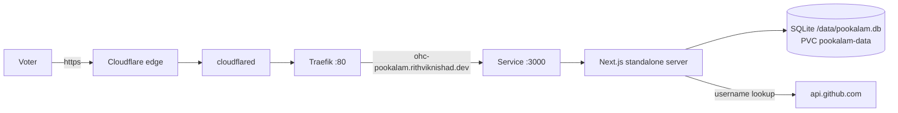

# Onam Pookalam Vote
{: .no_toc }

1. TOC
{:toc}

[`rithviknishad/ohc-pookalam`](https://github.com/rithviknishad/ohc-pookalam) —
a small voting site for the OHC Network's Onam pookalam contest. A voter enters
a GitHub username and likes at most 3 of the 20 designs; `/stats` shows the
leaderboard. Counts are hidden on the vote page to avoid bandwagon bias.

Live at **`https://ohc-pookalam.rithviknishad.dev`**, on the tailnet via
`Host: ohc-pookalam.avocado.local`, in-cluster at
`http://ohc-pookalam.ohc-pookalam.svc:3000`.

Manifests: `k8s/ohc-pookalam/`. Recipes: `just ohc-pookalam-*`.

## Shape

One pod, one process, one file.



| Piece | What it is |
|---|---|
| Image | `ohc-pookalam:local` — built on the box, imported into containerd |
| Runtime | Next.js 16 `output: standalone`, `node server.js` on `:3000` |
| Database | `better-sqlite3` → `/data/pookalam.db` on a 1 Gi `local-path` PVC |
| Secret | `ohc-pookalam-secret` (`GITHUB_TOKEN`), **optional** |

## Why it looks like this

- **`replicas: 1`, `strategy: Recreate`.** SQLite is a single-writer file and
  the PVC is `ReadWriteOnce`. A second pod would either fail to mount or
  corrupt the votes. This is a correctness constraint, not a capacity one — do
  not scale it out.
- **Built on the box, not by Nix.** Unlike [Bingo](kubernetes.md), the upstream
  Dockerfile does a `pnpm install` plus a `node-gyp` compile of
  `better-sqlite3`. Nixifying that buys nothing here; `docker build` +
  `k3s ctr images import` is the same no-registry pattern already used for
  [CARE](care.md).
- **No Cloudflare Access gate.** The point of the site is that anyone in the
  community can open the link and vote. It has its own GitHub-username sign-in
  (trust-based — it verifies the username *exists*, not that the voter owns
  it), which an SSO wall in front would defeat.
- **Single-label hostname.** `ohc-pookalam.rithviknishad.dev`, not
  `pookalam.ohc.rithviknishad.dev` — Cloudflare's free Universal SSL only
  covers `*.rithviknishad.dev`, so a second label would fail TLS at the edge.
  Same reason the CARE hosts are flattened.
- **Probing `/`.** There is no dedicated health route upstream. A 200 on `/`
  proves both that Next.js is serving and that it could open the database (the
  gallery page reads vote counts on render).

## Deploy

```sh
just ohc-pookalam-images        # clone + docker build + import into containerd
just ohc-pookalam-deploy        # kustomize + sops Secret + rollout restart
just ohc-pookalam-status
just ohc-pookalam-logs
```

One-time, for the public host:

```sh
just ohc-pookalam-dns           # cloudflared tunnel route dns
just deploy                     # picks up the new host in modules/cloudflared.nix
```

Shipping new upstream code is `just ohc-pookalam-images` followed by
`just ohc-pookalam-deploy` — the PVC is not part of the image, so the votes
survive. Build a specific ref with `just ohc-pookalam-images <branch-or-tag>`.

## The GitHub token

Every sign-in calls `https://api.github.com/users/<username>` to validate the
name. Unauthenticated that is capped at **60 requests/hour per source IP**, and
because every request leaves through one tunnel egress IP, a real vote burns
through it in minutes — users then see a rate-limit error at sign-in.

`GITHUB_TOKEN` raises the cap to 5000/hour. A **classic PAT with no scopes at
all** is enough (it only reads public user profiles).

```sh
just ohc-pookalam-secrets       # edit secrets/ohc-pookalam.enc.yaml
just ohc-pookalam-deploy        # apply + restart to pick it up
```

The Deployment's `envFrom` marks the Secret `optional: true` and
`just ohc-pookalam-deploy` skips it when `secrets/ohc-pookalam.enc.yaml`
doesn't exist — so the app runs before you've minted a token, just on the
anonymous limit. See `k8s/ohc-pookalam/secret.example.yaml` for the shape.

## Backups

The votes are the only state, they live on the **no-redundancy** ZFS stripe
(see [Storage](storage.md)), and the site is a one-shot event — so take a copy
before anything risky and once the vote closes:

```sh
just ohc-pookalam-backup                 # -> pookalam-backup/pookalam-data.tar
just ohc-pookalam-backup /path/to/dir
```

That tars all of `/data`, which matters: the `.db` file alone can miss the most
recent votes still sitting in `pookalam.db-wal`.

To restore, stop the pod (`kubectl -n ohc-pookalam scale deploy/ohc-pookalam
--replicas=0`), untar into the PVC from a throwaway pod, then scale back to 1.

## Monitoring

Two Gatus probes (`k8s/monitoring/gatus.yaml`), both alerting to the
`avocado-alerts` ntfy topic:

| Probe | Group | Checks |
|---|---|---|
| `ohc-pookalam` | `internal` | `http://ohc-pookalam.ohc-pookalam.svc:3000/` → 200 |
| `ohc-pookalam.rithviknishad.dev` | `public` | edge 200 + cert > 240 h |

The in-cluster probe isolates "the app died" from "the tunnel/edge died"; the
public one covers the path users actually take. See
[Monitoring](monitoring.md).

## Retiring it

This is a seasonal site. When the vote is over: take a final backup, then
remove the Gatus endpoints (and bump `checksum/config`), the host from
`modules/cloudflared.nix`, the DNS route, `kubectl delete -k k8s/ohc-pookalam`
(this deletes the PVC — back up first), the sops secret, and this page. Dead
probes page for nothing and erode trust in the alert topic.
