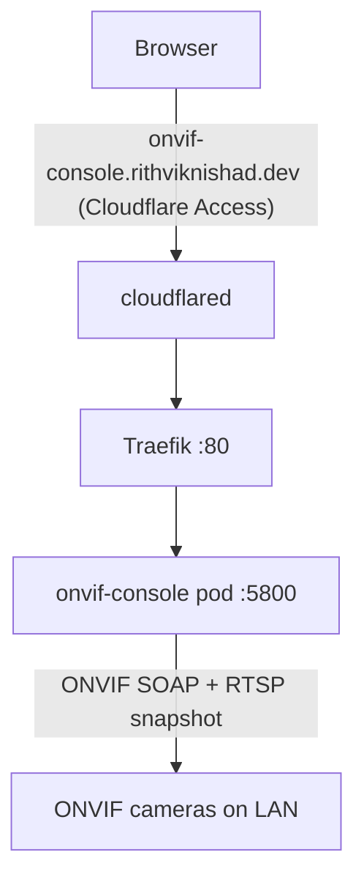

# ONVIF Camera Testing Console

[onvif-console](https://github.com/10bedicu/onvif-console) is 10bedicu's
vendor-neutral testing suite for **any ONVIF-compliant PTZ camera**: connect to
a camera by IP, run the workflow/conformance tests (connectivity, GetStatus,
relative/absolute/zoom/continuous moves, preset lifecycle, home), drive it
manually, and export a printable report. It runs on the k3s cluster
(`k8s/onvif-console/`) and is the operator's companion to the TeleICU
[CARE](care.md) camera onboarding — a quick way to sanity-check a camera before
(or after) registering it as a CARE device.

## Architecture



- **One image, one port.** A Next.js static UI is served by a FastAPI
  **sidecar** on `:5800`; the sidecar issues the actual ONVIF calls (browsers
  can't — SOAP + WS-Security digest, and cameras send no CORS headers). The
  image (`onvif-console:local`) is built on the box and imported into k3s's
  containerd — no registry, `imagePullPolicy: Never` (a missed import fails
  loudly with `ErrImageNeverPull`).
- **Ordinary pod networking.** The console connects to whatever camera IP you
  type into the UI; pods reach LAN IPs (e.g. `192.168.165.x`) via node SNAT —
  the same path the TeleICU middleware uses. Unlike [ESPHome](esphome.md) there
  is no mDNS/discovery requirement, so no `hostNetwork` is needed.
- **Server-side run history.** Every finished run is persisted by the backend
  to a **SQLite** DB (`/app/backend/data/onvif_console.db`, stdlib `sqlite3`),
  keyed per camera — so history is shared across browsers/devices and survives
  a tab closing mid-run. That directory is a **PVC** (`onvif-console-data`);
  older builds kept history in the browser (localStorage) and needed no PVC,
  and the UI auto-migrates any leftover localStorage runs into the backend once
  on first load.

## Security & exposure

The console has **no authentication of its own and relays the camera
credentials** you type into it. Its public host is therefore gated by
**Cloudflare Access**, exactly like [ESPHome](esphome.md) and the
[Formance Ledger](formance.md) console. The tunnel entry is declared in
`modules/cloudflared.nix`.

### Public access setup (one-time, order matters)

Create the Access application **before** the DNS route, or the tunnel serves
the console (and thus your cameras) wide open:

1. **Zero Trust → Access → Applications → Add → Self-hosted.** Domain
   `onvif-console.rithviknishad.dev`; policy: Allow → Emails → your address.
2. Only then: `cloudflared tunnel route dns avocado onvif-console.rithviknishad.dev`.
3. Activate the tunnel ingress entry on the box with `just deploy` (it's a
   NixOS config change in `modules/cloudflared.nix`).

The standing caveat from the [networking](networking.md) page applies: anyone
on the LAN can bypass Access by hitting Traefik with a spoofed `Host` header —
acceptable on a trusted home LAN, same tradeoff as Grafana/ESPHome.

## Deploy

```sh
just onvif-console-images   # build onvif-console:local + import into k3s
just onvif-console-deploy   # kubectl apply -k k8s/onvif-console
just onvif-console-status
```

Then do the [public access setup](#public-access-setup-one-time-order-matters)
above once. To use it: open <https://onvif-console.rithviknishad.dev>, enter a
camera's IP and credentials, and press **Connect** — device info, profiles, and
PTZ capabilities are discovered automatically, then run the tests.

## Live video (go2rtc) — deliberately omitted

Upstream's compose bundles [go2rtc](https://github.com/AlexxIT/go2rtc) for
real-time WebRTC video. It is **not deployed here**: WebRTC media needs direct
UDP, which the cloudflared tunnel cannot carry, so it would never connect for a
remote browser. Without go2rtc the console automatically falls back to ONVIF
**snapshot polling** (~1 fps) — enough to confirm a camera is streaming while
the conformance/PTZ testing (the actual point of the tool) works fully.

To add live video anyway (e.g. for LAN/Tailscale use), run a `go2rtc`
Deployment + Service in the namespace and set `GO2RTC_API` on the console (and
`GO2RTC_PUBLIC_URL` to a browser-reachable address); note that a remote browser
would still need a UDP-capable path to go2rtc, which the tunnel is not.

## Run history (SQLite) & backups

The backend writes each finished run to `/app/backend/data/onvif_console.db`;
that path is the `onvif-console-data` PVC (local-path → `rpool`/ZFS), so
history survives pod restarts and image reimports. The DB stores device
metadata and full reports (host, model, serial, ONVIF call log) — **not camera
passwords**. `ONVIF_DB_PATH` can relocate the file, but the default under the
mounted PVC is what we use.

Like every other PVC on this box it rides the **no-redundancy stripe** with no
auto-snapshots (see [storage](storage.md)); this is throwaway camera-test
history, so there's deliberately **no backup CronJob** (unlike the CARE/TeleICU
DBs). To grab a copy anyway: `kubectl -n onvif-console exec deploy/onvif-console
-- sqlite3 /app/backend/data/onvif_console.db ".backup /app/backend/data/backup.db"`
then copy it out.

## Monitoring

Gatus probes the console every minute via the in-cluster Service
(`http://onvif-console.onvif-console.svc:5800/`, `internal` group in
`k8s/monitoring/gatus.yaml`) and pushes failures to the `avocado-alerts` ntfy
topic. The probe deliberately avoids the public URL — Cloudflare Access would
answer with a login redirect and mask a dead backend (same pattern as ESPHome).

## Gotchas

- **Don't route DNS before the Access app exists** — the console relays camera
  credentials; an unauthenticated public window is a real exposure.
- **`onvif-console:local` lives only in k3s's containerd.** Rebuild + reimport
  with `just onvif-console-images` after pulling upstream changes; a missing
  image surfaces as `ErrImageNeverPull`, not a silent pull.
- **History lives in the `onvif-console-data` PVC, not the image.** Rebuilding
  and reimporting the image keeps the DB (it's on the PVC); deleting the PVC
  wipes all run history.
- **Camera reachability is via node SNAT.** If a camera is on a segment the
  node can't route to, the console (like the TeleICU middleware) can't reach it
  either — test reachability from a pod first.
