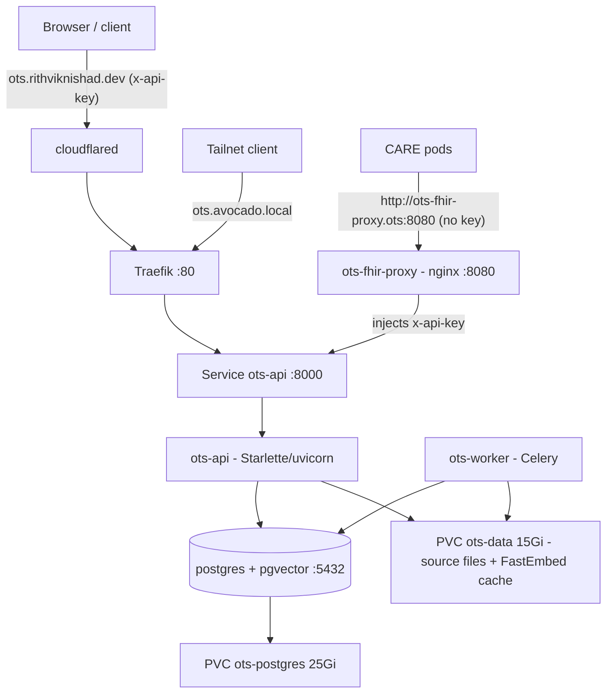

# Open Terminology Server (OTS)

[Open Terminology Server](https://github.com/ohcnetwork/open-healthcare-terminology-server)
is Open Healthcare Network's small, read-heavy terminology server: a
FHIR-compatible API for looking up and searching clinical code systems (SNOMED
CT, LOINC, ICD-10-CM, ICD-11 MMS) backed by Postgres + `pgvector`. It runs on
the k3s cluster under `k8s/ots/`.

> Upstream ships this as **testing-mode** software — not for clinical
> decision-making without independent validation. It is deployed here as an
> internal service for CARE and experimentation, not as a certified clinical
> tool.

## Architecture



One upstream image (`open-terminology-server:local`) runs three ways:

| Component | Role |
|---|---|
| `ots-api` | Starlette/uvicorn query API on `:8000` (lookup, lexical + vector search, FHIR `$expand`/`$lookup`). An initContainer runs `alembic upgrade head` on start. |
| `ots-worker` | Celery worker for embedding-population jobs. The broker **and** result backend are Postgres itself — no Redis. |
| `postgres` | `pgvector/pgvector:pg16`. One denormalized row per concept, plus model-scoped vector tables. |
| `ots-fhir-proxy` | Tiny `nginx` (`:8080`) that injects the `x-api-key` header and forwards to `ots-api`, so key-less in-cluster clients (CARE) can call the gated FHIR paths without opening them on the public edge. |

The `ots-data` PVC is mounted read-write into both `ots-api` and `ots-worker`
(single node, so k3s local-path allows the shared RWO mount). It holds imported
release files under `/app/data/raw/...` and the FastEmbed ONNX model cache.

## Access

| Path | URL | Auth |
|---|---|---|
| Public | `https://ots.rithviknishad.dev` | `x-api-key` header (app-enforced) |
| Tailscale | `http://avocado` (Host: `ots.avocado.local`) | tailnet membership + `x-api-key` |
| In-cluster (direct) | `http://ots-api.ots:8000` | `x-api-key` header |
| In-cluster (key-injecting proxy) | `http://ots-fhir-proxy.ots:8080` | none — proxy attaches the key |

Every path is gated by the shared API key **except** `OTS_PUBLIC_PATHS`
(`/health`, `/docs`, `/openapi.json`, `/favicon.ico`). Because the key is the
only gate and CARE calls it server-to-server, the public host is **not** behind
Cloudflare Access — a browser SSO wall would break those calls. This mirrors
Kite (own auth) rather than the auth-less tools (esphome/formance/onvif-console,
which need Access).

### CARE integration

CARE reaches OTS through **`ots-fhir-proxy`** (`k8s/ots/ots.yaml`), a one-pod
`nginx` that injects the `x-api-key` header from the sops secret and forwards to
`ots-api`. This exists because CARE's FHIR client
([`care/emr/fhir/client.py`](https://github.com/ohcnetwork/care/blob/develop/care/emr/fhir/client.py))
sends **no** auth header, yet OTS gates every FHIR path — and we don't want to
open the CPU-heavy `$expand`/`$lookup` operations unauthenticated on the public
edge. The proxy keeps the key in-cluster (never in CARE's config) while leaving
the edge key-gated.

CARE points at it via `SNOWSTORM_DEPLOYMENT_URL` in the `care-backend-env`
ConfigMap (`k8s/care/care.yaml`):

```yaml
SNOWSTORM_DEPLOYMENT_URL: http://ots-fhir-proxy.ots.svc:8080
```

CARE builds request URLs as `{SNOWSTORM_DEPLOYMENT_URL}/{resource}/${op}` (e.g.
`/ValueSet/$expand`, `/CodeSystem/$lookup`), and OTS serves FHIR at the **root**
(no `/fhir` prefix), so the URL is the proxy base with nothing appended. After
setting it, roll the backend:

```sh
just care-deploy
kubectl -n care rollout restart deploy/care-backend deploy/care-celery-worker deploy/care-celery-beat
```

> **Compatibility caveat:** OTS implements `/ValueSet/$expand` and
> `/CodeSystem/$lookup` but **not** `/ValueSet/$validate-code`, which CARE calls
> when validating a saved code against its value set. Search/autocomplete and
> lookups work; validate-code flows will error until upstream adds the
> operation.

Quick check once deployed and DNS is live:

```sh
curl https://ots.rithviknishad.dev/health                       # public, 200
curl -H 'Host: ots.avocado.local' http://avocado/health         # over Tailscale
curl -H "x-api-key: $KEY" https://ots.rithviknishad.dev/terminologies
```

## Embeddings (CPU FastEmbed)

avocado has no GPU, so vector search uses **FastEmbed** with
`BAAI/bge-small-en-v1.5` (384-dim ONNX), configured in the `ots-env` ConfigMap:

```
OTS_EMBEDDING_PROVIDER=fastembed
OTS_EMBEDDING_MODEL=BAAI/bge-small-en-v1.5
OTS_EMBEDDING_MODEL_KEY=fastembed:BAAI/bge-small-en-v1.5:384
OTS_EMBEDDING_DIMENSIONS=384
OTS_FASTEMBED_CACHE_DIR=/app/data/models/fastembed
```

The ~150 MB model downloads into the shared data PVC on first use and is reused
by both the api (query embeddings) and worker (concept embeddings). This model
key is the default used for query-time vector search; **embedding-population
jobs must use the same `--model-key`** (see below).

## Image

No registry — same no-registry pattern as CARE. Built on this machine with
docker and imported straight into k3s's containerd over root SSH:

```sh
just ots-images            # clone main, docker build, docker save | k3s ctr import
just ots-images v1.2.3     # pin a git ref/tag/branch instead
```

## Deploying

1. **Create the secret** (first time). Open the sops-encrypted Secret and fill
   in a strong Postgres password and API key (`openssl rand -hex 32`); see
   `k8s/ots/secret.example.yaml` for the shape and which fields must share the
   password:

   ```sh
   just ots-secrets          # opens secrets/ots.enc.yaml in sops
   ```

2. **Build + import the image** (see above): `just ots-images`.

3. **Deploy** the manifests and the secret:

   ```sh
   just ots-deploy           # kubectl apply -k k8s/ots  +  sops-decrypted Secret
   just ots-status
   ```

4. **Publish the public hostname** (one-time). The host is app-key gated, so no
   Cloudflare Access app is needed — just route DNS to the tunnel:

   ```sh
   just ots-dns              # cloudflared tunnel route dns avocado ots.rithviknishad.dev
   just deploy               # activates the modules/cloudflared.nix ingress entry
   ```

   > `just deploy` activates on the live box — confirm before running it.

## Loading data

The server boots **empty**. Terminologies are imported with the built-in CLI
(`just ots-cli ...`, which runs `python -m ots.cli` inside the api pod). Source
files live on the `ots-data` PVC under `/app/data/raw/...`. Loads are heavy —
prefer running them off-peak; embedding population is CPU-bound on this box.

### ICD-10-CM and ICD-11 — self-service

Both ICD releases download automatically (CMS tabular order + WHO simple
tabulation are open downloads — no account, no API key):

```sh
just ots-cli icd download                    # fetches both ZIPs into data/raw
just ots-cli icd load-10cm -- \
  --source data/raw/icd10cm/april-1-2026-code-descriptions-tabular-order.zip \
  --recreate
just ots-cli icd load-11 -- \
  --source data/raw/icd11/SimpleTabulation-ICD-11-MMS-en-2026-01.zip \
  --recreate
```

(Filenames follow the release the `download` step pulls — adjust the dates to
what lands in `data/raw`.)

### SNOMED CT and LOINC — license-gated, you provide the files

SNOMED CT and LOINC releases are **account/licence-gated downloads** that this
box cannot fetch unattended:

- **SNOMED CT** needs a licence. In India it is free to affiliates via the
  ABDM/NRCeS National Release Centre, but the RF2 package still downloads from a
  logged-in MLDS account.
- **LOINC** is free but the release ZIP downloads from a logged-in Regenstrief
  account.

So: download the release yourself, then stage it onto the data PVC and load it.
Copy files into the pod with `kubectl cp` (via the kubeconfig from
`just kubeconfig`):

```sh
export KUBECONFIG=~/.kube/avocado
pod=$(kubectl -n ots get pod -l app=ots-api -o jsonpath='{.items[0].metadata.name}')

# SNOMED CT International RF2 (a single zip; the loader streams it)
kubectl -n ots exec $pod -- mkdir -p /app/data/raw/snomed
kubectl -n ots cp ./SnomedCT_InternationalRF2_PRODUCTION_*.zip ots/$pod:/app/data/raw/snomed/
just ots-cli snomed load -- --rf2-dir data/raw/snomed --recreate

# LOINC (unzip locally first — the loader wants the release DIRECTORY)
kubectl -n ots cp ./Loinc_2.82 ots/$pod:/app/data/raw/loinc/Loinc_2.82
just ots-cli loinc load -- --loinc-dir data/raw/loinc/Loinc_2.82 --recreate
```

For a composed **SNOMED India** edition (International + AYUSH/drug/etc.
packages), stage the extra zips under `data/raw/india/` and use
`just ots-cli snomed load-packages -- --source-dir data/raw --edition-version ... --base-version ... --default-version`
(see upstream `docs/terminologies/SNOMED.md`).

### Embeddings (per terminology, after loading)

Populate vectors with the **same FastEmbed model key** the API queries with.
SNOMED defaults to `disorder`/`finding` concepts (add `--all-semantic-tags`
for everything); LOINC/ICD embed all active rows:

```sh
just ots-cli common embed -- --terminology icd10cm \
  --provider fastembed --model BAAI/bge-small-en-v1.5 \
  --model-key fastembed:BAAI/bge-small-en-v1.5:384 --dimensions 384 \
  --batch-size 256 --recreate-index
# repeat with --terminology icd11 / loinc / snomed
```

Embedding is resumable (it skips rows already embedded for the model key), so a
job killed by a pod restart can be re-run. It can also be queued through the
worker via `POST /embeddings/jobs`; poll `GET /embeddings/jobs/{id}`.

### Verify

```sh
export KEY=...            # the OTS_API_KEY you set in the secret
base=http://ots-api.ots:8000     # or https://ots.rithviknishad.dev
curl -H "x-api-key: $KEY" $base/terminologies
curl -X POST $base/search -H "x-api-key: $KEY" -H 'Content-Type: application/json' \
  -d '{"terminology":"snomed","query":"heart failure","mode":"lexical","limit":5}'
```

## Monitoring

Gatus (`k8s/monitoring/gatus.yaml`, group `ohcnetwork/ots`) probes two
endpoints, both hitting the keyless `/health`:

- `ots-api` — in-cluster `http://ots-api.ots.svc:8000/health` (liveness).
- `ots.rithviknishad.dev` — the public edge `/health` + `[CERTIFICATE_EXPIRATION]`.

Remember to bump the gatus Deployment's `checksum/config` annotation when the
ConfigMap changes, or the pod won't pick it up.

## Secrets

`ots-secret` (sops-encrypted in `secrets/ots.enc.yaml`, applied by
`just ots-deploy`) holds the Postgres credentials, the four `OTS_*_URL`
connection strings (all embedding the same password, pointing at the in-cluster
`postgres` Service), and `OTS_API_KEY`. Edit with `just ots-secrets`; rekey with
`just ots-secrets-rekey` after changing recipients in `.sops.yaml`. Everything
non-secret (embedding settings, public paths, header name) lives in the
`ots-env` ConfigMap in `k8s/ots/ots.yaml`.

## Using it from CARE

CARE consumes OTS in-cluster over the flat service DNS `http://ots-api.ots:8000`
with the shared `x-api-key`. CARE's terminology settings (the `SNOMED_*` /
valueset config) point at that URL; wire the key through CARE's own sops secret.
This keeps terminology traffic on the cluster network — the public edge is only
for external clients.

## Recipes

| Recipe | Does |
|---|---|
| `just ots-images [ref]` | build + import the image (docker → k3s ctr) |
| `just ots-deploy` | apply manifests + sops secret |
| `just ots-status` | pods/svc/ingress/pvc in the `ots` namespace |
| `just ots-logs [ots-api\|ots-worker\|postgres]` | tail a component |
| `just ots-cli <args>` | run the OTS CLI in the api pod |
| `just ots-secrets` / `-rekey` | edit / rekey the sops secret |
| `just ots-dns` | route `ots.rithviknishad.dev` to the tunnel |

## Notices

SNOMED CT, LOINC, ICD-10-CM, and ICD-11 MMS are third-party terminologies owned
by their respective publishers (SNOMED International, Regenstrief/LOINC
Committee, CMS/NCHS, WHO). This deployment is independent and not endorsed by
any of them; see upstream `NOTICE.md`. Load only content you are licensed to
use.
