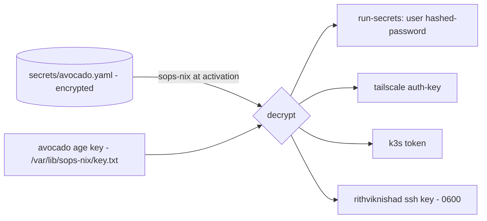

# Secrets: sops-nix

Every secret in this repo is committed **encrypted** with
[sops](https://github.com/getsops/sops) +
[age](https://github.com/FiloSottile/age), and decrypted only where it's needed.
Nothing sensitive ever lands in the repo (or in CI logs) as plaintext.

## The recipients

Defined in `.sops.yaml`. Each secret is encrypted to one or more **age
recipients**:

| Anchor | Key lives at | Role |
|---|---|---|
| `admin` | `~/.config/sops/age/keys.txt` (the Mac) | edit secrets locally |
| `avocado` | `/var/lib/sops-nix/key.txt` (the box) | decrypt at activation/boot |

The host key is provisioned **out-of-band** — it is never in the repo. That's
the whole point: the encrypted files are safe to commit because only the box (or
you) holds a key that can open them.

## Which file is encrypted to whom

`creation_rules` in `.sops.yaml` map each path to its recipients:

| File | Recipients | Contents |
|---|---|---|
| `secrets/avocado.yaml` | admin + avocado | user password hash, Tailscale auth key, k3s token |
| `secrets/ssh_id_ed25519` | admin + avocado | user's SSH private key (binary) |
| `secrets/cloudflared_credentials.json` | admin + avocado | tunnel credentials (binary) |
| `secrets/monitoring.enc.yaml` | admin + avocado | Grafana admin password, ntfy token |

## How the box consumes secrets



`modules/sops.nix` sets `secrets/avocado.yaml` as the default source and the
host key as the decryptor, then declares individual secrets:

- **`users/rithviknishad/hashed-password`** — marked `neededForUsers` so it is
  decrypted early enough to create the account (before normal `/run/secrets` is
  mounted). Wired into the user via `hashedPasswordFile`.
- **`rithviknishad/ssh_id_ed25519`** — its own binary sops file, decrypted to
  `/run/secrets/...` owned by the user (mode `0600`) and referenced by the Home
  Manager [ssh module](home-manager.md#ssh-client-ssh).

Other modules declare the secrets they need the same way:
`tailscale/auth-key` ([tailscale.nix](networking.md)), `k3s/token`
([k3s.nix](kubernetes.md)), and `cloudflared/credentials`
([cloudflared.nix](networking.md)).

## Editing secrets

Always work inside `nix develop` (it sets `SOPS_AGE_KEY_FILE`). The `justfile`
wraps the common operations:

```sh
just secrets            # edit secrets/avocado.yaml
just secrets-show       # print decrypted (mind your screen)
just secrets-rekey      # re-encrypt after changing recipients in .sops.yaml
just passwd             # generate a SHA-512 hash to paste in (mkpasswd -m sha-512)
```

There is also a parallel set of recipes for the monitoring secret file
(`just mon-secrets*`).

## Deploy-time decryption (monitoring)

The Grafana admin password is **not** read by the box. Instead
`just mon-deploy` decrypts `secrets/monitoring.enc.yaml` into the gitignored
`k8s/monitoring/values-secret.yaml` on the admin machine, right before
`helmfile sync`, and it's never committed. See [Monitoring](monitoring.md).
