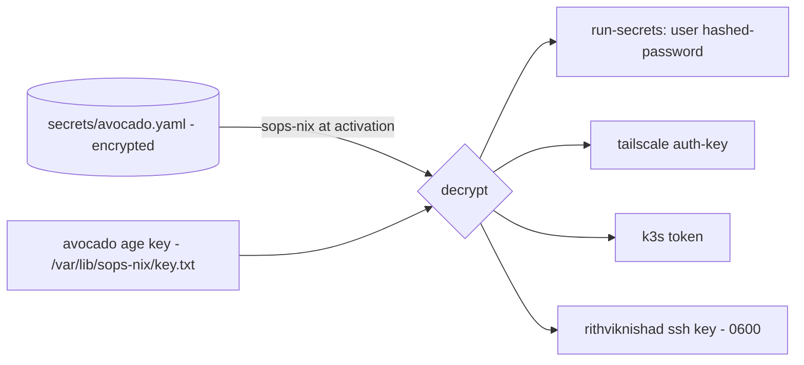
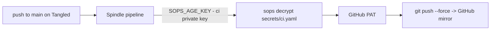

# Secrets: sops-nix

Every secret in this repo is committed **encrypted** with
[sops](https://github.com/getsops/sops) +
[age](https://github.com/FiloSottile/age), and decrypted only where it's needed.
Nothing sensitive ever lands in the repo (or in CI logs) as plaintext.

## The recipients

Defined in `.sops.yaml`. Each secret is encrypted to one or more **age
recipients**:

| Anchor | Key lives at | Role |
|---|---|---|
| `admin` | `~/.config/sops/age/keys.txt` (the Mac) | edit secrets locally |
| `avocado` | `/var/lib/sops-nix/key.txt` (the box) | decrypt at activation/boot |
| `ci` | Tangled secret `SOPS_AGE_KEY` | decrypt CI secrets in the pipeline |

The host key is provisioned **out-of-band** — it is never in the repo. That's
the whole point: the encrypted files are safe to commit because only the box (or
you) holds a key that can open them.

## Which file is encrypted to whom

`creation_rules` in `.sops.yaml` map each path to its recipients:

| File | Recipients | Contents |
|---|---|---|
| `secrets/avocado.yaml` | admin + avocado | user password hash, Tailscale auth key, k3s token |
| `secrets/ssh_id_ed25519` | admin + avocado | user's SSH private key (binary) |
| `secrets/cloudflared_credentials.json` | admin + avocado | tunnel credentials (binary) |
| `secrets/monitoring.enc.yaml` | admin + avocado | Grafana admin password, ntfy token |
| `secrets/ci.yaml` | admin + **ci** | GitHub mirror PAT |

## How the box consumes secrets



`modules/sops.nix` sets `secrets/avocado.yaml` as the default source and the
host key as the decryptor, then declares individual secrets:

- **`users/rithviknishad/hashed-password`** — marked `neededForUsers` so it is
  decrypted early enough to create the account (before normal `/run/secrets` is
  mounted). Wired into the user via `hashedPasswordFile`.
- **`rithviknishad/ssh_id_ed25519`** — its own binary sops file, decrypted to
  `/run/secrets/...` owned by the user (mode `0600`) and referenced by the Home
  Manager [ssh module](home-manager.md#ssh-client-ssh).

Other modules declare the secrets they need the same way:
`tailscale/auth-key` ([tailscale.nix](networking.md)), `k3s/token`
([k3s.nix](kubernetes.md)), and `cloudflared/credentials`
([cloudflared.nix](networking.md)).

## Editing secrets

Always work inside `nix develop` (it sets `SOPS_AGE_KEY_FILE`). The `justfile`
wraps the common operations:

```sh
just secrets            # edit secrets/avocado.yaml
just secrets-show       # print decrypted (mind your screen)
just secrets-rekey      # re-encrypt after changing recipients in .sops.yaml
just passwd             # generate a SHA-512 hash to paste in (mkpasswd -m sha-512)
```

There are parallel recipes for the CI (`just secrets-ci*`) and monitoring
(`just mon-secrets*`) secret files.

## Deploy-time decryption (monitoring)

The Grafana admin password is **not** read by the box. Instead
`just mon-deploy` decrypts `secrets/monitoring.enc.yaml` into the gitignored
`k8s/monitoring/values-secret.yaml` on the admin machine, right before
`helmfile sync`, and it's never committed. See [Monitoring](monitoring.md).

## CI: mirror Tangled → GitHub

The repo is hosted on [Tangled](https://tangled.org) and mirrored to
`github.com/rithviknishad/systems.nix`. On every push to `main`, a
[Spindle](https://docs.tangled.org/spindles) pipeline
(`.tangled/workflows/mirror-github.yml`) force-pushes the branch and tags to
GitHub.



The security model, and why the PAT never leaks:

- The **only** secret stored on Tangled is the CI age **private** key
  (`SOPS_AGE_KEY`). The PAT itself lives encrypted in `secrets/ci.yaml`.
- In the pipeline the decrypted token goes into a `0600` credentials file read
  by git's `store` helper — never into `argv`, the remote URL, or the process
  list. git redacts the `Authorization` header, so even `GIT_TRACE` output is
  safe.

One-time setup (create the empty GitHub repo, mint a fine-grained PAT scoped to
just that repo with *Contents: Read and write*, store it via `just secrets-ci`,
and add `SOPS_AGE_KEY` in the Tangled pipeline settings) is documented in the
repo `README.md`. The CI keypair is generated with `just ci-keygen`; the private
key file `ci-age-key.txt` is gitignored and uploaded to Tangled once.

> GitHub is a **downstream mirror only** — pushes there can be overwritten, so
> never commit directly to the GitHub copy.
