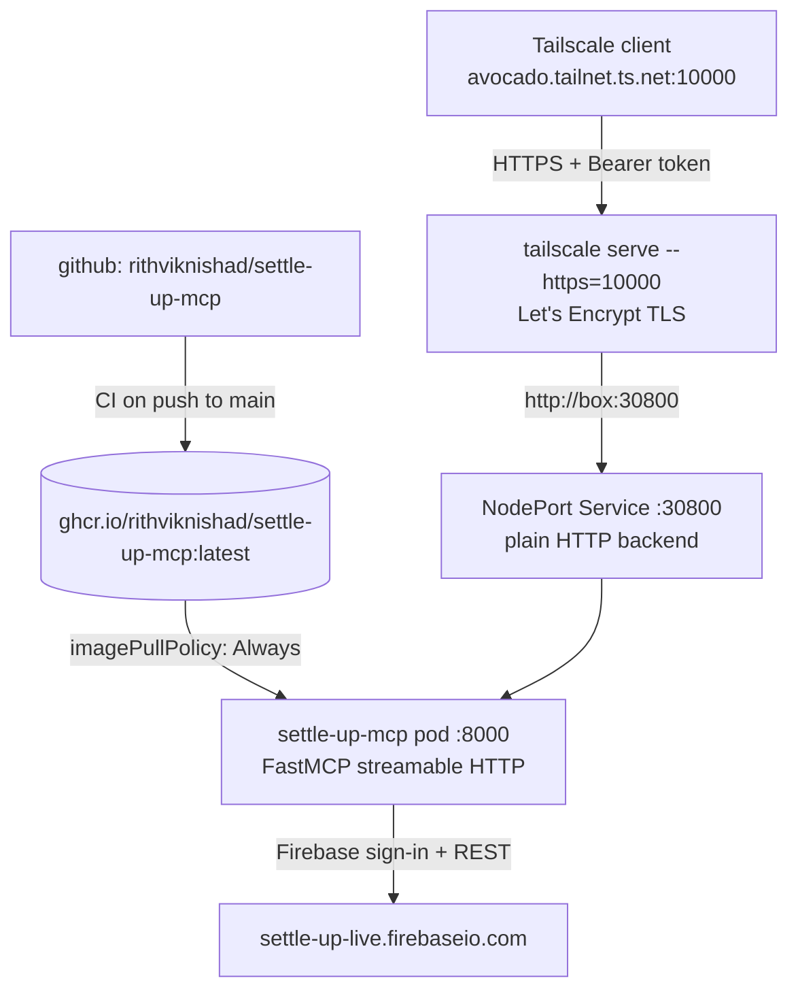

# Settle Up MCP server

[`rithviknishad/settle-up-mcp`](https://github.com/rithviknishad/settle-up-mcp)
is a [Model Context Protocol](https://modelcontextprotocol.io) server that gives
AI clients (Claude, VS Code, Cursor, ...) access to your
[Settle Up](https://settleup.io) shared-expense data — groups, members,
expenses, and balances — and can **add new expenses**. It runs on the k3s
cluster under `k8s/settle-up-mcp/`.

| Tool | Action | Read-only |
|---|---|---|
| `settleup_list_groups` | Your groups | Yes |
| `settleup_list_members` | Members of a group | Yes |
| `settleup_list_expenses` | Transactions of a group | Yes |
| `settleup_get_balances` | Who owes what in a group | Yes |
| `settleup_add_expense` | Add a new expense | **No** |

{: .warning }
> This instance is pointed at the **live** Settle Up backend, not the sandbox.
> `settleup_add_expense` writes to your real groups, and the pod holds your real
> Settle Up **account password** (the server signs in with Firebase
> email/password auth). It is deliberately reachable over the **tailnet only** —
> see [Exposure](#exposure--tailnet-only-https-via-tailscale-serve).

## Architecture

Unlike the [Zerodha Kite MCP server](zerodha-kite.md), this one is **not** built
by Nix. It is a first-party repo whose CI publishes a multi-arch image to GHCR
on every push to `main`, so the cluster simply pulls it.



- **Image**: `ghcr.io/rithviknishad/settle-up-mcp:latest` (linux/amd64 +
  linux/arm64), pulled straight from the registry — no `services.k3s.images`
  preload, no flake input, no `vendorHash` dance.
- **Transport**: streamable HTTP on `/mcp`. This server does **not** serve SSE
  (upstream runs `transport="http"` only), so clients must speak streamable HTTP
  or bridge to it with `mcp-remote`.
- **Hardening**: runs as uid 10001 with `readOnlyRootFilesystem`,
  `allowPrivilegeEscalation: false`, and all capabilities dropped — the k8s
  equivalent of the upstream compose file's `read_only` + `no-new-privileges`.

## Authentication

Every request to `/mcp` must carry a bearer token:

```
Authorization: Bearer <MCP_AUTH_TOKEN>
```

The server uses FastMCP's `StaticTokenVerifier` — one shared token, no OAuth, no
per-user identity.

{: .warning }
> If `MCP_AUTH_TOKEN` is empty the server accepts **every** request with no
> authentication whatsoever. The sops secret must always carry a real value;
> generate one with `openssl rand -hex 32`.

`/health` is the one exception: it is a FastMCP `custom_route` and therefore
sits **outside** the auth middleware. That is deliberate and load-bearing — it
lets kubelet probes and the Gatus uptime check verify liveness without the
token ever being written into a ConfigMap in this repo.

## Exposure — tailnet only, HTTPS via Tailscale `serve`

The canonical URL is **`https://avocado.orthrus-bass.ts.net:10000/mcp`**,
reachable over the tailnet only, with a real (browser-trusted) Let's Encrypt
certificate. This is the same shape as [Zerodha Kite](zerodha-kite.md):

- The pod speaks **plain HTTP** on a fixed **NodePort** (`30800`).
- **Tailscale `serve`** (`modules/settle-up-mcp.nix`, a systemd oneshot)
  terminates TLS with the box's MagicDNS cert and proxies
  `https://avocado.<tailnet>.ts.net:10000` → `http://<box tailscale IP>:30800`.
- The MagicDNS name resolves **only inside the tailnet**, and the NodePort range
  is not in the host's `allowedTCPPorts` (`modules/k3s.nix`) — so nothing here
  is reachable on the WAN/LAN. No public route, no Cloudflare gate.

Why HTTPS rather than plain NodePort: bridges like `mcp-remote` refuse plain
HTTP without `--allow-http`, and the static bearer token should not cross even
the tailnet in the clear.

{: .note }
> **Port 10000 is the last one available.** `tailscale serve` only allows HTTPS
> on **443**, **8443**, or **10000**. k3s's klipper svclb owns host `:443` for
> Traefik, and `zerodha-kite` already took `:8443`. A *third* tailnet HTTPS
> service will need path-based `serve` routes under an existing port instead of
> a fourth port.

## One-time setup: credentials

The server needs your Settle Up login plus the **live** Firebase Web API key
(from the [Settle Up API docs](https://github.com/settleup/api-docs) — the
sandbox and live projects have *different* keys, and the ConfigMap pins
`SETTLEUP_BASE_URL` to live):

```sh
just settle-up-mcp-secrets     # opens secrets/settle-up-mcp.enc.yaml in sops
```

Set all four values, save, and quit:

| Key | Value |
|---|---|
| `SETTLEUP_EMAIL` | your Settle Up account email |
| `SETTLEUP_PASSWORD` | that account's password |
| `SETTLEUP_FIREBASE_API_KEY` | the **live** Firebase Web API key |
| `MCP_AUTH_TOKEN` | `openssl rand -hex 32` — the token clients send |

## Deploy

```sh
# 1. Activate the Tailscale serve front door on the box (one time, and after
#    any change to modules/settle-up-mcp.nix). Confirm first — it is live.
just deploy

# 2. Apply the manifests + the sops secret, and roll the pod.
just settle-up-mcp-deploy

# Watch / debug
just settle-up-mcp-status
just settle-up-mcp-logs
```

Smoke-test it from any tailnet machine:

```sh
curl -s https://avocado.orthrus-bass.ts.net:10000/health
# {"status":"ok","server":"settleup_mcp","environment":"live","signed_in":false}
```

`signed_in` stays `false` until a tool actually talks to Settle Up — it is a
state readout, not a health signal.

## Connecting a client

Any machine **on your tailnet** (so it resolves `avocado.orthrus-bass.ts.net`)
can connect. Clients that speak **streamable HTTP natively** — VS Code, Cursor,
Claude Code — should point straight at the URL and set the `Authorization`
header. Clients that are stdio-only (Claude Desktop, Zed) need the
[`mcp-remote`](https://www.npmjs.com/package/mcp-remote) bridge.

{: .note }
> Always send the token **explicitly**. With a static-token verifier, FastMCP
> answers unauthenticated calls with `401` plus a `WWW-Authenticate` header
> pointing at OAuth metadata; clients that try to "helpfully" start an OAuth
> flow will fail, because this server has no OAuth provider.

### Claude Code (CLI)

```sh
claude mcp add --transport http settleup \
  https://avocado.orthrus-bass.ts.net:10000/mcp \
  --header "Authorization: Bearer YOUR_TOKEN"
```

Check it with `claude mcp list`. Add `--scope user` to make it available in
every project rather than just the current one.

### Claude Desktop

Claude Desktop cannot set custom headers on a remote server, so bridge through
`mcp-remote`. Edit `claude_desktop_config.json` (macOS:
`~/Library/Application Support/Claude/`, Linux: `~/.config/Claude/`):

```json
{
  "mcpServers": {
    "settleup": {
      "command": "npx",
      "args": [
        "mcp-remote",
        "https://avocado.orthrus-bass.ts.net:10000/mcp",
        "--header",
        "Authorization:Bearer ${SETTLEUP_MCP_TOKEN}"
      ],
      "env": { "SETTLEUP_MCP_TOKEN": "YOUR_TOKEN" }
    }
  }
}
```

Restart Claude Desktop afterwards.

{: .warning }
> Note there is **no space** after `Authorization:` in that argument. `mcp-remote`
> splits arguments on whitespace, so `"Authorization: Bearer ..."` as a single
> arg gets mangled; passing the value through `env` as shown is the supported
> workaround.

### VS Code (Copilot Chat)

Create `.vscode/mcp.json` in the workspace (or add to your user `mcp.json` via
**MCP: Open User Configuration**). VS Code speaks streamable HTTP natively, and
`inputs` keeps the token out of the committed file:

```json
{
  "inputs": [
    {
      "id": "settleup-token",
      "type": "promptString",
      "description": "Settle Up MCP bearer token",
      "password": true
    }
  ],
  "servers": {
    "settleup": {
      "type": "http",
      "url": "https://avocado.orthrus-bass.ts.net:10000/mcp",
      "headers": { "Authorization": "Bearer ${input:settleup-token}" }
    }
  }
}
```

Start it from the **Start** code-lens above the server entry, then pick the
tools in Copilot Chat's *Agent* mode tool picker.

### Cursor

`~/.cursor/mcp.json` (global) or `.cursor/mcp.json` (per project):

```json
{
  "mcpServers": {
    "settleup": {
      "url": "https://avocado.orthrus-bass.ts.net:10000/mcp",
      "headers": { "Authorization": "Bearer YOUR_TOKEN" }
    }
  }
}
```

### Other clients (Zed, Windsurf, ...)

Anything that only launches **stdio** servers can use the same `mcp-remote`
invocation as Claude Desktop — the command is
`npx mcp-remote https://avocado.orthrus-bass.ts.net:10000/mcp --header Authorization:Bearer ${TOKEN}`;
only the surrounding config schema differs (Zed calls these *context servers*
in `settings.json`). Consult your client's MCP docs for the exact key names.

### Raw HTTP (debugging)

```sh
curl -s -X POST https://avocado.orthrus-bass.ts.net:10000/mcp \
  -H "Authorization: Bearer YOUR_TOKEN" \
  -H "Content-Type: application/json" \
  -H "Accept: application/json, text/event-stream" \
  -d '{"jsonrpc":"2.0","id":1,"method":"tools/list"}'
```

The `Accept` header must list **both** types — the streamable HTTP transport
rejects requests that accept only one.

## Updating the server

The pod tracks the moving `:latest` tag with `imagePullPolicy: Always`, so a
push to `main` upstream (once its CI publishes) is picked up by a single:

```sh
just settle-up-mcp-deploy      # re-applies + rollout restart => re-pulls :latest
```

No `just deploy` is needed — the host holds nothing but the Tailscale `serve`
front door.

{: .note }
> **Rolling back a bad upstream build is not `rollout undo`.** Because the tag
> is mutable, the previous ReplicaSet's pod spec references the *same*
> `:latest` and would re-pull the broken image. To pin a known-good build,
> temporarily set the image in `k8s/settle-up-mcp/settle-up-mcp.yaml` to an
> immutable tag — `ghcr.io/rithviknishad/settle-up-mcp:sha-<commit-sha>` — and
> redeploy.

## Monitoring

Gatus probes the in-cluster Service `/health` route
(`http://settle-up-mcp.settle-up-mcp.svc:8000/health`, group `internal`) every
minute, asserting `200` and `status == ok`, and alerts on the `avocado-alerts`
ntfy topic. It probes the Service rather than the tailnet URL because the
MagicDNS name is not resolvable from inside the cluster. See
[Monitoring](monitoring.md).

## Files

| Path | Purpose |
|---|---|
| `k8s/settle-up-mcp/` | namespace, ConfigMap, Deployment, NodePort Service |
| `modules/settle-up-mcp.nix` | Tailscale HTTPS `serve` front door on :10000 |
| `secrets/settle-up-mcp.enc.yaml` | sops-encrypted Settle Up credentials + Firebase key + MCP bearer token |
| `justfile` | `settle-up-mcp-deploy` / `-status` / `-logs` / `-secrets` recipes |
