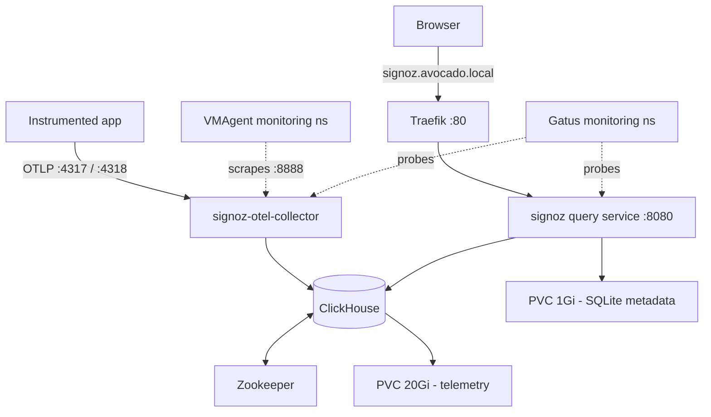

# SigNoz (application observability)

[SigNoz](https://signoz.io/) is an open-source, OpenTelemetry-native
observability platform: distributed traces, logs and metrics in one UI, backed
by [ClickHouse](https://clickhouse.com/). It runs on the k3s cluster under
`k8s/signoz/`, installed from the upstream Helm chart.

{: .note }
> SigNoz does **not** replace the [VictoriaMetrics stack](monitoring.md). The
> two answer different questions and are deliberately kept separate — see
> [Why both?](#why-both) below.

## Why both?

| | [`k8s/monitoring`](monitoring.md) | `k8s/signoz` |
|---|---|---|
| Question it answers | *Is the box healthy?* | *Why is my request slow?* |
| Scope | Host, disks, ZFS, cluster objects, pod logs | Application traces, spans, app-emitted metrics/logs |
| Data source | node-exporter, kube-state-metrics, Vector | OTLP from instrumented applications |
| Store | VictoriaMetrics + VictoriaLogs | ClickHouse |
| Alerting | VMAlert → Alertmanager → ntfy | SigNoz's own alert manager |

The important structural point: **the infra stack watches SigNoz, not the other
way round.** A `VMServiceScrape` in `k8s/signoz/vmservicescrape.yaml` hands the
collector's telemetry to the existing VMAgent, and Gatus probes both SigNoz
halves. If ClickHouse falls over, the alert still has somewhere to come from.
Pointing SigNoz at itself would make the watchdog die with the thing it watches.

## Architecture



| Component | Role | Limits |
|---|---|---|
| `signoz` Deployment | Query service + React UI on `:8080` | 1 CPU / 1 Gi |
| `signoz-otel-collector` Deployment | OTLP ingest → ClickHouse | 1 CPU / 1 Gi |
| ClickHouse (`chi-signoz-clickhouse-…`) | Trace/log/metric store | 2 CPU / 2 Gi |
| Zookeeper | ClickHouse coordination (replicated tables) | 0.5 CPU / 512 Mi |
| ClickHouse operator (Altinity) | Reconciles the `ClickHouseInstallation` CR | chart default |
| Schema migrator Job | Runs as a Helm hook on install/upgrade | chart default |
| `signoz-clickhouse` PVC | 20 Gi, `local-path` | telemetry data |
| `signoz-sqlite` PVC | 1 Gi, `local-path` | dashboards, alert rules, users |

### Resource budget — the thing to watch

This is by far the heaviest workload added to avocado, on a box that already
runs the VictoriaMetrics stack, Immich, CARE and friends in ~16 GB of RAM.
Upstream's values set requests but **no memory limits**, which on a shared node
means ClickHouse can grow until the kernel OOM-kills something unrelated.
`k8s/signoz/values.yaml` therefore gives every component an explicit ceiling:

- **Worst case (all limits at once): ~4.5 Gi.** Steady state at home-lab ingest
  volumes is closer to 2–2.5 Gi.
- ClickHouse also gets a *query-level* cap
  (`profiles.default/max_memory_usage: 1500000000`), comfortably under its 2 Gi
  container limit. A heavy dashboard query then fails with "memory limit
  exceeded" — recoverable — instead of getting the pod OOM-killed mid-insert,
  which drops the in-flight batch and needs a restart.
- `max_bytes_before_external_group_by` spills large `GROUP BY`s to disk rather
  than failing outright.

If the box starts feeling tight, the first knobs are ClickHouse's limit and
the [retention TTLs](#retention).

## Deploy

Prereqs: `nix develop` (gives `kubectl`, `helm`, `helmfile`, `sops`) and a
kubeconfig (`just kubeconfig`).

```sh
just signoz-deploy      # namespace + helm release + ingress/scrape layer
just signoz-status
```

`signoz-deploy` runs, in order: decrypt the ClickHouse password to the
gitignored `k8s/signoz/values-secret.yaml` → `kubectl apply -f namespace.yaml`
(PodSecurity labels first) → `helmfile sync` (CRDs + operator + stack) →
`kubectl apply -k k8s/signoz` (ingress + `VMServiceScrape`).

The **first run is slow**: it pulls roughly 2 GB of images and runs the
ClickHouse schema migration, so the helmfile timeout is set to 20 minutes.

{: .warning }
> ClickHouse's `udf` init container downloads the `histogram-quantile` binary
> from GitHub releases on every pod start. If the pod is stuck in `Init:0/1`,
> check egress to `github.com` before suspecting ClickHouse itself.

## First login

SigNoz has its own account system. There is no SMTP on this box, so email
invitations are disabled (`signoz_emailing_enabled: false`) — the **first
visitor to the UI creates the admin account** through the signup screen.

```sh
just signoz-ui          # -> http://localhost:3301
```

Create that account immediately after the first deploy. Until it exists, the
signup screen is open to anyone who can reach the service, which is exactly why
the UI is [tailnet-only](#exposure).

Add further users from **Settings → Members** (the UI generates invite links
that work without SMTP).

> Until that first account exists, the collector logs an OpAMP error every 30s
> (`Server returned an error response`, matched by `cannot create agent without
> orgId` on the query service). OpAMP is how SigNoz remote-configures the
> collector, and an agent record has to belong to an organisation — which does
> not exist until signup. It is noisy but harmless: ingest and querying work
> regardless, and the errors stop on their own once the admin account is
> created.

## Sending telemetry

The collector accepts OTLP and Jaeger formats. From inside the cluster:

| Protocol | Endpoint |
|---|---|
| OTLP gRPC | `signoz-otel-collector.signoz.svc.cluster.local:4317` |
| OTLP HTTP | `http://signoz-otel-collector.signoz.svc.cluster.local:4318` |
| Jaeger gRPC | `signoz-otel-collector.signoz.svc.cluster.local:14250` |
| Jaeger Thrift HTTP | `http://signoz-otel-collector.signoz.svc.cluster.local:14268` |

So a workload elsewhere on the cluster only needs the standard OTel environment
variables:

```yaml
env:
  - name: OTEL_EXPORTER_OTLP_ENDPOINT
    value: http://signoz-otel-collector.signoz.svc.cluster.local:4317
  - name: OTEL_SERVICE_NAME
    value: my-service
```

There is **no ingress for the ingest ports** — the collector has no
authentication of its own, so anything that can reach it can write telemetry.
To send from a laptop, port-forward
(`kubectl -n signoz port-forward svc/signoz-otel-collector 4317:4317`), or add
a tailnet-only Ingress/NodePort deliberately.

## Retention

Retention is configured **in the UI**, not in this repo: **Settings → General →
Retention period**, per signal (traces / logs / metrics). ClickHouse enforces it
with table TTLs, so a change applies as a background mutation rather than
immediately.

The volume is a fixed 20 Gi on `local-path`. Check what is actually using it:

```sh
just signoz-clickhouse
# SELECT table, formatReadableSize(sum(bytes)) FROM system.parts
#   WHERE active GROUP BY table ORDER BY sum(bytes) DESC;
```

## Exposure

**Tailnet only**, deliberately (`k8s/signoz/ingress.yaml`):

```sh
curl -H 'Host: signoz.avocado.local' http://avocado/
```

The SPA needs a real hostname rather than a `Host` header to work in a browser,
so either map `signoz.avocado.local` to avocado's tailnet IP in `/etc/hosts`, or
just use `just signoz-ui`.

To publish it later:

1. Create the admin account first (see [First login](#first-login)) — or put a
   [Cloudflare Access](networking.md#cloudflare-tunnel-public-access) app in
   front, like `esphome` / `ledger` / `onvif-console`.
2. Add `signoz.rithviknishad.dev` as a second host in `k8s/signoz/ingress.yaml`.
3. Add the same name to `modules/cloudflared.nix` and `just deploy`.
4. `cloudflared tunnel route dns avocado signoz.rithviknishad.dev`.
5. Update `signoz_alertmanager_signoz_external__url` in
   `k8s/signoz/values.yaml` so alert notification links point at the public URL,
   then `just signoz-deploy`.

## Monitoring

Two Gatus probes in the `internal` group (`k8s/monitoring/gatus.yaml`), split on
purpose because the halves fail independently — the UI can be perfectly healthy
while every incoming span is dropped:

| Probe | URL | Meaning |
|---|---|---|
| `signoz` | `http://signoz.signoz.svc:8080/api/v1/health` | Query service / UI alive |
| `signoz-otel-collector` | `http://signoz-otel-collector.signoz.svc:13133/` | Ingest pipeline alive |

The collector probe hits its `health_check` extension. That port is absent from
the chart's Service, so `k8s/signoz/values.yaml` adds it back — a purpose-built
health endpoint is a better up/down signal than scraping a metrics page.

Both probe in-cluster Services rather than the tailnet host, which is not
resolvable from cluster DNS. Failures push to the `avocado-alerts` ntfy topic
like every other endpoint. See [Monitoring](monitoring.md).

`k8s/signoz/vmservicescrape.yaml` additionally hands the collector's Prometheus
endpoint (`:8888`) to VMAgent, so `otelcol_receiver_accepted_spans`,
`otelcol_exporter_send_failed_spans` and friends are queryable in Grafana. That
listener only reaches the pod network because `values.yaml` overrides it — see
the comment there before touching it. Confirm the target with
`up{namespace="signoz"}`. No `VMRule` is defined yet — add one once the useful
series have been confirmed on the live box (most `otelcol_receiver_*` /
`otelcol_exporter_*` series only appear once something is actually exporting).

## Secrets

One value: the ClickHouse password, sops-encrypted at `secrets/signoz.enc.yaml`.
It is a **Helm values fragment**, not a k8s Secret manifest (the same
arrangement as `secrets/monitoring.enc.yaml`), because Helm needs a file rather
than a stream. `just signoz-deploy` decrypts it to the gitignored
`k8s/signoz/values-secret.yaml` immediately before `helmfile sync`.
`k8s/signoz/values-secret.example.yaml` shows the shape.

```sh
just signoz-secrets        # edit in sops
just signoz-deploy         # apply + roll the pods that read it
```

The chart ships a hard-coded default password. ClickHouse is only reachable
inside the cluster, but leaving a published default in place would mean anything
that lands in the cluster can read every trace and log — hence the override.

## Upgrades

The chart version is pinned in `k8s/signoz/helmfile.yaml`. Chart and app
versions move together, so a bump is also a SigNoz upgrade and will run schema
migrations against the ClickHouse volume. Read the
[release notes](https://github.com/SigNoz/charts/releases) first, then
`just signoz-deploy`. `helmDefaults.atomic` rolls back a failed upgrade rather
than leaving a half-migrated store.

## Data durability

Both PVCs use the default `local-path` StorageClass, whose reclaim policy is
**Delete** — deleting the `signoz` namespace destroys the telemetry history
*and* the dashboards/alert rules. That is an accepted tradeoff (telemetry is
regenerable, unlike the databases that get `local-path-retain`), but it is why
`just signoz-destroy` carries a warning. See [Storage](storage.md).

## Troubleshooting

| Symptom | Look at |
|---|---|
| UI down / query errors | `just signoz-logs` |
| App exports fine but nothing appears | `just signoz-collector-logs` |
| ClickHouse pod restarting | `kubectl -n signoz describe pod chi-signoz-clickhouse-cluster-0-0-0` — check for OOMKilled |
| "Memory limit exceeded" on a query | Working as designed; narrow the time range, or raise `profiles.default/max_memory_usage` *and* the container limit together |
| Pod stuck in `Init:0/1` | The `udf` init container's GitHub download (see above) |
| Zookeeper pod OOMKilled in a loop | Its memory limit was trimmed below ~1.4Gi — see the comment in `k8s/signoz/values.yaml`; the chart hardcodes a 1GB JVM heap |
| Collector OpAMP errors every 30s | Expected until the [admin account](#first-login) exists |
| Volume filling up | `just signoz-clickhouse`, then lower the [retention](#retention) |
