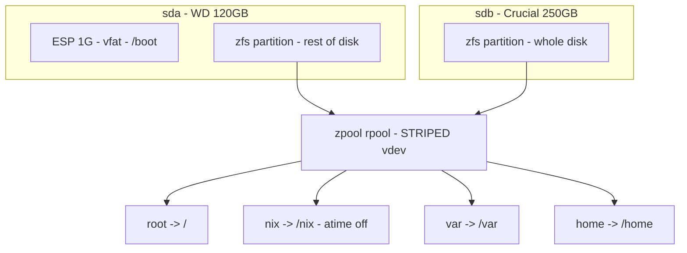

# Storage: disko & ZFS

Disks are provisioned declaratively by
[disko](https://github.com/nix-community/disko) (`hosts/avocado/disko.nix`) and
maintained by `modules/zfs.nix`. During a `nixos-anywhere` install, disko
**erases both disks** and builds the layout below from scratch.

## The layout



- **`sda`** (WD 120 GB) → a 1 GB EF00 **ESP** mounted at `/boot`
  (`umask=0077`), plus a ZFS partition using the rest.
- **`sdb`** (Crucial 250 GB) → one whole-disk ZFS partition.
- Both ZFS partitions join **one striped vdev** in pool `rpool` →
  **~342 GB usable**.

Disks are addressed by stable `/dev/disk/by-id/...` paths, not `/dev/sdX`, so
the layout is deterministic regardless of enumeration order.

## The pool: `rpool`

| Setting | Value | Why |
|---|---|---|
| `mode` | `""` (empty) | top-level vdevs are **striped** — capacity summed, no redundancy |
| `ashift` | `12` | 4K sector alignment |
| `autotrim` | `on` | continuous TRIM for the SSDs |
| `compression` | `zstd` | transparent compression on all datasets |
| `acltype` | `posixacl` | POSIX ACL support |
| `xattr` | `sa` | store xattrs in the dnode (faster) |
| `relatime` | `on` | cheaper access-time updates |
| `com.sun:auto-snapshot` | `false` | inherited default: **off** unless a dataset overrides |
| root `mountpoint` | `none` | datasets use `legacy` mounts managed by NixOS |

### Datasets

| Dataset | Mount | Notes |
|---|---|---|
| `root` | `/` | legacy mount |
| `nix` | `/nix` | `atime = off` (the store never needs access times) |
| `var` | `/var` | legacy mount — holds logs, k3s state, and **all local-path PVCs** |
| `home` | `/home` | legacy mount — user data, includes the in-home repo clone |

## Redundancy: there is none

> **A stripe means losing *either* disk destroys the *entire* pool, including
> the OS.**

This is a deliberate trade — full capacity from two mismatched disks over fault
tolerance. Because k3s's local-path PVCs live under `/var` on this same pool,
**every workload's data is on the stripe too** (Immich photos, the metrics and
logs databases, etc.).

Mitigations baked into the system:

- **Off-box backups** via `zfs send` are the intended safety net (set these up —
  see the post-install checklist in [Deployment](deployment.md)).
- **Weekly scrubs** catch silent corruption early (`modules/zfs.nix`).
- The [monitoring stack](monitoring.md) treats ZFS pool state and SMART health
  as the highest-priority alerts: `ZFSPoolNotOnline`, `ZFSPoolFaulted`, and
  `SmartDeviceUnhealthy` are all `critical` and page-worthy — on a
  no-redundancy pool a single failing disk is a "back up now" signal.

To add redundancy later you would rebuild as a **mirror** (usable capacity
capped at the smaller disk) or add disks for **RAIDZ**.

## Maintenance (`modules/zfs.nix`)

- `services.zfs.autoScrub` — **weekly** pool scrub.
- `services.zfs.trim` — periodic TRIM (in addition to pool `autotrim`).
- `services.zfs.autoSnapshot` — a retention ladder (frequent 4 / hourly 24 /
  daily 7 / weekly 4 / monthly 3) that **only snapshots datasets tagged
  `com.sun:auto-snapshot=true`**.

### Snapshots are currently inactive

The pool root sets `com.sun:auto-snapshot=false` and none of the four datasets
override it, so despite `autoSnapshot` being enabled, **nothing is snapshotted
yet**. To turn on rolling snapshots for user data, set the property on the
`home` dataset, e.g.:

```sh
sudo zfs set com.sun:auto-snapshot=true rpool/home
```

(or add `"com.sun:auto-snapshot" = "true";` to that dataset's `options` in
`disko.nix` for a fresh install). Scrub and trim are unaffected and run today.

## Metrics

Pool health and disk SMART data are surfaced to Prometheus via the host-side
timers in [`modules/monitoring.nix`](nix-modules.md#monitoringnix--host-side-metrics-glue)
(`node_zfs_zpool_state`, `smartmon_*`). ARC/ZIL metrics come from
node-exporter's built-in ZFS collector. The [Monitoring](monitoring.md) page
covers the alerts and the Grafana ZFS dashboard.
