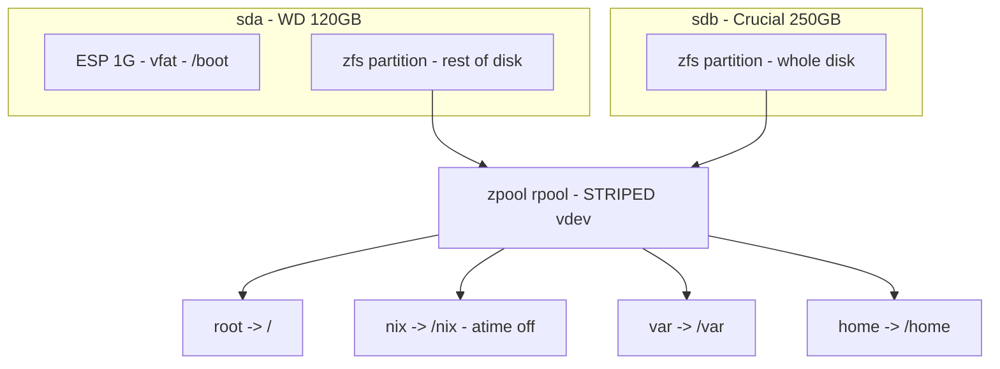

# Storage: disko & ZFS

Disks are provisioned declaratively by
[disko](https://github.com/nix-community/disko) (`hosts/avocado/disko.nix`) and
maintained by `modules/zfs.nix`. During a `nixos-anywhere` install, disko
**erases both disks** and builds the layout below from scratch.

## The layout


```mermaid
flowchart TB
    subgraph sda[sda - WD 120GB]
        esp[ESP 1G - vfat - /boot]
        z1[zfs partition - rest of disk]
    end
    subgraph sdb[sdb - Crucial 250GB]
        z2[zfs partition - whole disk]
    end

    z1 --> pool[zpool rpool - STRIPED vdev]
    z2 --> pool

    pool --> root[root -> /]
    pool --> nix[nix -> /nix - atime off]
    pool --> var[var -> /var]
    pool --> home[home -> /home]
```

- **`sda`** (WD 120 GB) → a 1 GB EF00 **ESP** mounted at `/boot`
  (`umask=0077`), plus a ZFS partition using the rest.
- **`sdb`** (Crucial 250 GB) → one whole-disk ZFS partition.
- Both ZFS partitions join **one striped vdev** in pool `rpool` →
  **~342 GB usable**.

Disks are addressed by stable `/dev/disk/by-id/...` paths, not `/dev/sdX`, so
the layout is deterministic regardless of enumeration order.

## The pool: `rpool`

| Setting | Value | Why |
|---|---|---|
| `mode` | `""` (empty) | top-level vdevs are **striped** — capacity summed, no redundancy |
| `ashift` | `12` | 4K sector alignment |
| `autotrim` | `on` | continuous TRIM for the SSDs |
| `compression` | `zstd` | transparent compression on all datasets |
| `acltype` | `posixacl` | POSIX ACL support |
| `xattr` | `sa` | store xattrs in the dnode (faster) |
| `relatime` | `on` | cheaper access-time updates |
| `com.sun:auto-snapshot` | `false` | pool-root default is **opt-in off**; `var` and `home` override it to `true` |
| root `mountpoint` | `none` | datasets use `legacy` mounts managed by NixOS |

### Datasets

| Dataset | Mount | Snapshots | Notes |
|---|---|---|---|
| `root` | `/` | no | legacy mount; ~38M, NixOS-generated — `just rollback` covers it |
| `nix` | `/nix` | no | `atime = off`; reproducible from the flake, high churn |
| `var` | `/var` | **yes** | legacy mount — logs, k3s state, and **all local-path PVCs** |
| `home` | `/home` | **yes** | legacy mount — user data, includes the in-home repo clone |

## Redundancy: there is none

> **A stripe means losing *either* disk destroys the *entire* pool, including
> the OS.**

This is a deliberate trade — full capacity from two mismatched disks over fault
tolerance. Because k3s's local-path PVCs live under `/var` on this same pool,
**every workload's data is on the stripe too** (Immich photos, the metrics and
logs databases, etc.).

Mitigations baked into the system:

- **Rolling ZFS snapshots** on `var` and `home` (see
  [Snapshots](#snapshots)) — block-level undo for accidental deletion. Note
  these live on the *same pool*, so they protect against mistakes, not disk
  failure.
- **Nightly `pg_dump` backups** per service, retained 14 days.
- **Off-box backups** via `zfs send` are the intended safety net (set these up —
  see the post-install checklist in [Deployment](deployment.md)).
- **Weekly scrubs** catch silent corruption early (`modules/zfs.nix`).
- The [monitoring stack](monitoring.md) treats ZFS pool state and SMART health
  as the highest-priority alerts: `ZFSPoolNotOnline`, `ZFSPoolFaulted`, and
  `SmartDeviceUnhealthy` are all `critical` and page-worthy — on a
  no-redundancy pool a single failing disk is a "back up now" signal.

To add redundancy later you would rebuild as a **mirror** (usable capacity
capped at the smaller disk) or add disks for **RAIDZ**.

## Maintenance (`modules/zfs.nix`)

- `services.zfs.autoScrub` — **weekly** pool scrub.
- `services.zfs.trim` — periodic TRIM (in addition to pool `autotrim`).
- `services.zfs.autoSnapshot` — a retention ladder (frequent 4 / hourly 24 /
  daily 14 / weekly 4 / monthly 3) that **only snapshots datasets tagged
  `com.sun:auto-snapshot=true`**. `daily` is 14 to line up with the 14-day
  retention of the per-service `pg_dump` CronJobs, so both recovery windows
  end on the same day.

### Snapshots

Rolling snapshots are **active on `rpool/var` and `rpool/home`**.

`rpool/var` is the one that matters: it contains
`/var/lib/rancher/k3s/storage`, i.e. every local-path PVC on the box — the
CARE and TeleICU Postgres volumes, CARE's VersityGW objects, the Immich library, and the
metrics/logs TSDBs. A snapshot there is a block-level undo for *all* cluster
state at once.

`rpool/nix` and `rpool/root` are deliberately excluded: both are reproducible
from the flake, and `/nix` churns hard enough that snapshotting it would cost
real space for no recovery value.

#### Why this needs a reconcile service

`com.sun:auto-snapshot` is a **dataset property**, so `disko.nix` only sets it
when the pool is first created — and disko only runs on a fresh `just install`.
Declaring the property in `disko.nix` alone therefore does nothing to a pool
that already exists.

That gap is not hypothetical: avocado ran for 73 days with the snapshot timers
firing green every 15 minutes while snapshotting **nothing**, because the pool
was born with `com.sun:auto-snapshot=false` at the root and no dataset ever
overrode it. When the `care` namespace was deleted on 2026-08-31, there was no
snapshot to roll back to and the database plus its in-namespace backups were
lost permanently.

So `modules/zfs.nix` owns the intent as two lists and ships a
`zfs-snapshot-properties` oneshot that reconciles the **live** pool with them
on every boot and every `just deploy`:

```nix
snapshotDatasets   = [ "rpool/var" "rpool/home" ];
noSnapshotDatasets = [ "rpool" "rpool/nix" "rpool/root" ];
```

The unit is idempotent and logs only when it actually changes something, so
`journalctl -u zfs-snapshot-properties` is a quick way to confirm intent
matches reality. `disko.nix` carries the same values so a rebuilt box is
correct from birth.

#### Working with snapshots

```sh
# what exists
zfs list -t snapshot -r rpool/var

# browse a snapshot read-only (no rollback needed) — snapdir is hidden,
# but the path is always there
ls /var/.zfs/snapshot/

# recover one PVC's data without touching anything else
cp -a /var/.zfs/snapshot/<snap>/lib/rancher/k3s/storage/<pvc-dir> /tmp/restore
```

> Prefer copying out of `/var/.zfs/snapshot/...` over `zfs rollback`. Rollback
> reverts the **entire** `/var` dataset — every PVC, every service — to that
> point in time, and discards all newer snapshots. It is a whole-cluster
> action, not a per-service one.

Snapshots of a running database are **crash-consistent**, not
application-consistent: restoring one looks to Postgres exactly like a power
cut, which it recovers from via WAL replay. That is sound, but it is why the
logical `pg_dump` layer exists alongside it — a dump is portable, verifiable,
and restorable into a different Postgres version.

#### Capacity risk

Snapshots retain freed blocks, so a large delete now costs space until the
snapshot ages out. `rpool/var` shares the pool with everything else, and a ZFS
pool at 100% is very unpleasant to recover from. The `ZFSPoolFillingUp` /
`ZFSPoolCriticallyFull` alerts in [Monitoring](monitoring.md) exist
specifically to catch this before it bites.

## Backup volumes and reclaim policy

k3s ships a single StorageClass — `local-path`, the default, with
`reclaimPolicy: Delete`. **Delete** means the PersistentVolume *and its data
directory under `/var/lib/rancher/k3s/storage`* are destroyed as soon as the
bound PVC goes away. Because deleting a namespace deletes its PVCs, a single
`kubectl delete ns <x>` permanently destroys every volume in that namespace.

On **2026-08-31** that is exactly what happened: `kubectl delete ns care`
destroyed the CARE Postgres volume *and* the volume holding its 14 days of
`pg_dump` backups, because the backup PVC lived in the same namespace under
the same policy. With no ZFS snapshots either (see above), nothing was
recoverable.

`k8s/storage/local-path-retain.yaml` adds a second class:

| StorageClass | Reclaim | Use for |
|---|---|---|
| `local-path` (default) | `Delete` | ordinary service data — automatic cleanup is what you want |
| `local-path-retain` | `Retain` | anything not recoverable by redeploying — backup volumes above all, and CARE's uploaded files (`versitygw-data`) |

Under `Retain` the PV is left behind in state `Released` when its PVC goes
away and the data directory is untouched, so recovery is re-binding or copying
files out rather than a restore from nothing.

```sh
just storage-deploy     # install the local-path-retain StorageClass
just backups-status     # do I actually have a restorable backup right now?
```

### Retro-fitting existing volumes

`storageClassName` is **immutable on an existing PVC**, so a volume that
predates this cannot simply be moved onto the new class — that would mean
copying the data out, recreating the PVC, and copying it back.

The live PV's reclaim policy, however, *can* be patched in place, which buys
the same protection with no data movement:

```sh
just backups-protect    # idempotent; patches *-db-backups PVs to Retain
```

> A separate `backups` namespace was considered and rejected: it would isolate
> the volumes further, but PVCs are namespaced, so the CronJobs would have to
> move too and each would need a **copy of its database credentials** in the
> new namespace. That duplication drifts the moment a password is rotated.
> `Retain` fixes the actual failure mode without that ongoing cost.

## Metrics

Pool health, capacity, snapshot coverage and disk SMART data are surfaced to
Prometheus via the host-side timers in
[`modules/monitoring.nix`](nix-modules.md#monitoringnix--host-side-metrics-glue):

| Metric | Meaning |
|---|---|
| `node_zfs_zpool_state` | pool health state (online/degraded/faulted/...) |
| `node_zfs_zpool_size_bytes` | total pool size |
| `node_zfs_zpool_allocated_bytes` | allocated bytes — drives the capacity alerts |
| `node_zfs_zpool_free_bytes` | free bytes |
| `node_zfs_dataset_snapshot_count` | snapshots per dataset tagged `auto-snapshot=true` |
| `node_zfs_dataset_latest_snapshot_timestamp_seconds` | creation time of the newest snapshot (0 if none) |
| `smartmon_*` | per-disk SMART attributes |

The two snapshot metrics exist so that "snapshots are configured" can be
*verified* rather than assumed — they back `ZFSSnapshotsMissing` and
`ZFSSnapshotsStale`. ARC/ZIL metrics come from node-exporter's built-in ZFS
collector. The [Monitoring](monitoring.md) page covers the alerts and the
Grafana ZFS dashboard.
