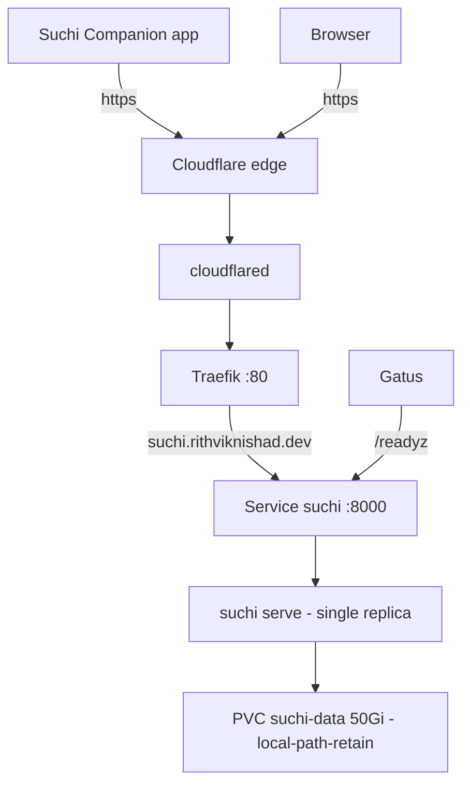

# suchi — self-hosted document archive

[suchi](https://suchi.page) is a document archive that files itself: documents
arrive by upload, the mobile Companion app, watched folders or email, get OCR'd,
titled and filed into a numbered (Johnny.Decimal) tree, and every word becomes
searchable. It runs on the k3s cluster under `k8s/suchi/` and is public at
**`https://suchi.rithviknishad.dev`**. Upstream docs:
[docs.suchi.page](https://docs.suchi.page).

## Shape



| | |
|---|---|
| Image | `ghcr.io/johnnybravo-xyz/suchi:v0.1.0-full`, **pinned by digest** |
| Process | one `suchi serve` (Go binary, SQLite) — no DB server, cache or broker |
| Replicas | exactly 1, `Recreate` strategy (SQLite is single-writer) |
| Storage | `suchi-data` 50 Gi on **`local-path-retain`** at `/data` |
| Secrets | none (see [Auth](#auth-and-first-boot)) |
| Exposure | public via Cloudflare Tunnel, **no** Cloudflare Access gate |
| Uptime | Gatus `suchi` (internal `/readyz`) + `suchi.rithviknishad.dev` (public + TLS) |

Why the **`-full`** image: it's the same app as the standard image plus
OCRmyPDF, so scanned PDFs are stored with an embedded searchable text layer —
the copy you download stays searchable outside suchi, not just inside it.

### What lives on the PVC

| Path | What | Loss impact |
|---|---|---|
| `suchi.db` (+ `-wal`) | metadata, users, jobs, FTS index, audit log | catastrophic |
| `blobs/` | content-addressed originals + derived files | catastrophic — the documents |
| `.decrypt-key` | AES-256-GCM key sealing mailbox / LLM / PDF passwords | sealed creds unrecoverable |
| `backups/` | built-in daily DB snapshots (keep 7) | DB-only, not a full backup |
| `rendered/` | filing-tree projection | rebuildable (`suchi refile --skip-automations`) |

## Deploy

```sh
just suchi-deploy          # kubectl apply -k k8s/suchi
just suchi-status          # pods/svc/ingress/pvc
just suchi-dns             # ONE-TIME: route suchi.rithviknishad.dev to the tunnel
```

The tunnel ingress entry lives in `modules/cloudflared.nix`, so the host also
needs a `just deploy` before the public URL works (see
[Networking](networking.md#adding-a-public-service)).

## Auth and first boot

A stock install needs **no secret**. On first boot, with no admin yet, suchi
logs a **one-time setup token**:

```sh
just suchi-setup-token     # greps token_minted from the pod log
```

Open `https://suchi.rithviknishad.dev/bootstrap`, paste the token, and create
the admin. **Do this right after the first deploy** — the host is public, and
until an admin exists the bootstrap page is the open door (the token is the
only thing guarding it). Then pick a filing tree in **Settings → Archive
configuration → Filing tree** (the only required setup step).

There is deliberately **no Cloudflare Access** in front: the Companion mobile
app and API-token clients call the API directly, and an SSO wall would break
them (same reasoning as [ntfy](ntfy.md)). suchi's own auth gates everything;
`/metrics` is admin-only in-app. `/healthz` and `/readyz` are public by design.
OIDC can be added later (`OIDC_*` env + a sops secret for the client secret).

## Configuration choices

All config is env in `k8s/suchi/suchi.yaml`; see
[upstream config](https://docs.suchi.page/config) for the full list.

| Setting | Value | Why |
|---|---|---|
| `PUBLIC_URL` | `https://suchi.rithviknishad.dev` | cookies, share links, OIDC callbacks |
| `BODY_LIMIT` | `100M` | match Cloudflare's free-plan ~100 MB request cap |
| `TRUSTED_PROXY_CIDRS` | `10.42.0.0/16,10.43.0.0/16` | trust Traefik's `X-Forwarded-For` for rate limits |
| `OCR_LANGUAGES` | unset (= `eng`) | unpinned so Archive configuration can change it live |
| `LLM_*` | unset | model assistance off → **zero egress** |

- **More OCR languages** need the tesseract packs baked into a derived image as
  well as the setting — see
  [upstream](https://docs.suchi.page/formats#additional-ocr-languages).
- **AI classification** is planned via a future in-cluster Ollama; point
  `LLM_ENDPOINT_URL` at it then (a private endpoint needs no `LLM_EGRESS_ACK`).
- **Client IPs:** Traefik isn't yet configured to trust cloudflared's
  `X-Forwarded-For` (no `forwardedHeaders.trustedIPs`), so suchi may see every
  client as the same address. Effect: the login rate limit acts as one shared
  bucket. Fixing it is a cluster-wide Traefik change (it would also fix ntfy).
- **Mail intake** (IMAP) is configured in the UI, not here; credentials are
  sealed into SQLite with `.decrypt-key`. Polling adds visible egress
  (`just suchi-doctor` lists it).

## Backups and restore

Three layers, none of them off-box yet:

1. **ZFS snapshots** — the PV lives under `/var/lib/rancher/k3s/storage` on
   `rpool/var`, which gets rolling snapshots (see [Storage](storage.md#snapshots)).
   A ZFS snapshot captures `suchi.db`, its WAL, `blobs/` and `.decrypt-key`
   **atomically** — the consistent "filesystem snapshot" method upstream
   recommends. Same pool as the data, so it covers mistakes, not disk loss.
2. **Built-in DB snapshots** — `$DATA_DIR/backups/`, daily, keep 7. Database
   only (no blobs or key); useful for a quick DB rollback, not a full restore.
3. **`local-path-retain`** — deleting the namespace leaves the PV and its
   directory intact (`Released`), so a stray `kubectl delete ns suchi` is
   recoverable rather than final.

> **Gap:** nothing leaves the box. The rpool is a stripe with no redundancy, so
> a disk failure loses the archive together with its snapshots. Off-box
> `zfs send` (host-wide) is the intended fix — prioritise it before trusting
> suchi with originals you don't hold elsewhere.

Restore = stop suchi (`kubectl -n suchi scale deploy/suchi --replicas=0`),
restore the whole data directory from a snapshot (DB + WAL + blobs + key
together, never piecemeal), scale back to 1, then check `/readyz`, open a known
document, run a search. See
[upstream backup-restore](https://docs.suchi.page/backup-restore).

## Upgrading

Database migrations are **one-way**, so an upgrade is a backup-first change:

1. Check the target release's
   [DB compatibility table](https://docs.suchi.page/release-process#stable-v1-database-compatibility).
2. Take a complete backup (a manual ZFS snapshot of `rpool/var` is enough —
   confirm before touching ZFS).
3. Resolve the new digest:
   `docker buildx imagetools inspect ghcr.io/johnnybravo-xyz/suchi:<tag>-full`
   and replace the `image:` line (keep `tag@sha256:<index digest>`).
4. `just suchi-deploy`, then `just suchi-doctor` and check `/readyz`.

Rollback = restore the pre-upgrade data directory **and** the previous digest;
never run an older binary against a database a newer one has migrated.

## Operating

| Recipe | Action |
|---|---|
| `just suchi-deploy` | apply `k8s/suchi` |
| `just suchi-status` | pods/svc/ingress/pvc in `suchi` |
| `just suchi-logs` | tail the server log |
| `just suchi-setup-token` | print the first-boot setup token |
| `just suchi-doctor` | schema, filesystem, OCR binaries/languages, jobs, egress |
| `just suchi-cli <args>` | any `suchi` subcommand in the pod |
| `just suchi-ui` | port-forward to `http://localhost:8000` (edge-down break-glass) |
| `just suchi-dns` | one-time tunnel DNS route |

**Monitoring:** Gatus probes `/readyz` in-cluster (`internal`) and over the
public edge (`public`, plus certificate expiry). PVC fill is already covered by
the cluster-wide PVC alerts. No metrics scrape yet: `/metrics` needs an admin
API token, so wiring a `VMServiceScrape` means minting one after bootstrap and
storing it via sops.
