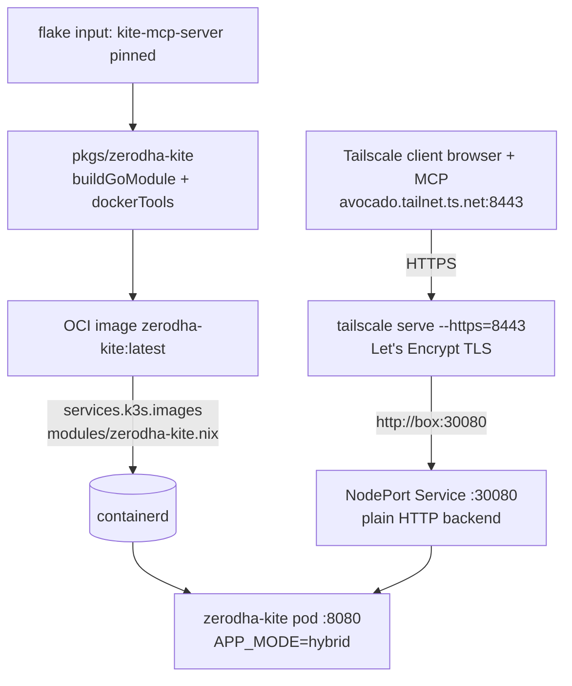

# Zerodha Kite MCP server

[`zerodha/kite-mcp-server`](https://github.com/zerodha/kite-mcp-server) is a
[Model Context Protocol](https://modelcontextprotocol.io) server that gives AI
clients (Claude Desktop, VS Code, Cursor, ...) access to the **Kite Connect
trading API** — market data, holdings, positions, orders, and GTTs. It runs on
the k3s cluster under `k8s/zerodha-kite/`.

{: .note }
> **Why "zerodha-kite" and not "kite"?** The repo already runs the
> [Kite Kubernetes dashboard](kite.md) (`kite-org/kite`, `k8s/kite`). To avoid a
> name clash across the flake, image, namespace, `just` recipes, and the MCP
> client config, this trading server is namespaced `zerodha-kite` everywhere.

{: .warning }
> This instance runs the **full tool set with no exclusions** — it can place,
> modify, and cancel **real orders and GTTs** on your live Zerodha account. It
> is deliberately reachable over the **tailnet only** (see exposure below).
> Anyone who can reach `https://avocado.orthrus-bass.ts.net:8443` and complete a
> Kite login can trade as you.

## Architecture

The server is built by Nix from a pinned source and preloaded into k3s — the
same no-registry pattern as [Bingo](kubernetes.md#bingo-multiplayer-game--k8sbingo).



- **Image**: `buildGoModule` compiles the Go binary; `dockerTools.buildLayeredImage`
  wraps it with CA certificates (HTTPS to `api.kite.trade`) and `tzdata` +
  `TZ=Asia/Kolkata` (Kite quotes/candles are IST). See
  `pkgs/zerodha-kite/default.nix`.
- **Preload**: `modules/zerodha-kite.nix` adds the image tarball to
  `services.k3s.images`; `just deploy` restarts k3s so it is imported into
  containerd before the pod starts. The pod uses `imagePullPolicy: IfNotPresent`
  — there is no registry.
- **Mode**: `APP_MODE=hybrid` serves **both** `/mcp` (streamable HTTP) and
  `/sse` (SSE) on port 8080, so any client's preferred transport works.

## Exposure — tailnet only, HTTPS via Tailscale `serve`

The canonical URL is **`https://avocado.orthrus-bass.ts.net:8443`**, reachable
over the tailnet only, with a real (browser-trusted) Let's Encrypt certificate.

How the request path is built:

- The pod speaks **plain HTTP** on a fixed **NodePort** (`30080`). NodePort
  (not a Traefik ingress) because the browser OAuth callback needs one real
  `host:port` for both the MCP transport and the redirect — a Host-header
  `*.avocado.local` route can't be followed by a browser redirect.
- **Tailscale `serve`** (`modules/zerodha-kite.nix`, a systemd oneshot)
  terminates TLS with the box's MagicDNS cert and proxies
  `https://avocado.<tailnet>.ts.net:8443` → `http://<box tailscale IP>:30080`.
- Port **8443**, not 443, because k3s's klipper svclb already binds host
  `:80`/`:443` for Traefik (the public ingress). Tailscale `serve` allows HTTPS
  on 443/8443/10000; 8443 is free, and the Kite console accepts an HTTPS
  Redirect URL with that explicit port.

Why it stays tailnet-only: the MagicDNS name resolves **only inside the
tailnet**, and the NodePort range is not in the host's `allowedTCPPorts`
(`modules/k3s.nix`) — so nothing here is reachable on the WAN/LAN. No public
route, no Cloudflare Access gate. This is deliberate: the server can place
**real trades**.

Three things must agree: `PUBLIC_BASE_URL` (in
`k8s/zerodha-kite/zerodha-kite.yaml`), the `tailscale serve` front door
(`modules/zerodha-kite.nix`), and the Kite Connect app's **Redirect URL** —
all on `https://avocado.orthrus-bass.ts.net:8443`.

{: .note }
> Prerequisite: HTTPS certificates must be enabled for the tailnet (Tailscale
> admin console → DNS → *Enable HTTPS*). This box's cert domain
> (`avocado.orthrus-bass.ts.net`) is already provisioned. The first HTTPS
> request after a fresh `serve` may be slow while the cert is minted.

## One-time setup: create a Kite Connect app

You need your own Kite Connect API credentials (the hosted `mcp.kite.trade`
would work too, but self-hosting is the point here):

1. Sign up / log in at [developers.kite.trade](https://developers.kite.trade)
   and **create a new app** (Kite Connect). This has a one-time fee on
   Zerodha's side.
2. Set the app's **Redirect URL** to exactly:

   ```
   https://avocado.orthrus-bass.ts.net:8443/callback
   ```

3. Copy the **API key** and **API secret** into the sops secret:

   ```sh
   just zerodha-kite-secrets      # opens secrets/zerodha-kite.enc.yaml in sops
   # set KITE_API_KEY and KITE_API_SECRET, save & quit
   ```

## Deploy

```sh
# 1. Preload the Nix-built image into k3s (also builds it). Confirm before this
#    — it activates on the live box.
just deploy

# 2. Apply the manifests + the sops secret, and roll the pod.
just zerodha-kite-deploy

# Watch / debug
just zerodha-kite-status
just zerodha-kite-logs
```

`just deploy` is what puts `zerodha-kite:latest` into containerd (via
`services.k3s.images`); `just zerodha-kite-deploy` only applies the k8s
manifests and secret.

## Connecting a client

Any machine that is **on your tailnet** (and so resolves
`avocado.orthrus-bass.ts.net`) can connect. The bridge is
[`mcp-remote`](https://www.npmjs.com/package/mcp-remote) (run through `npx`),
which lets stdio-only clients talk to the HTTP/SSE endpoint. No `--allow-http`
is needed — the endpoint is real HTTPS.

### Claude Desktop

Edit `claude_desktop_config.json` (macOS:
`~/Library/Application Support/Claude/`, Linux: `~/.config/Claude/`):

```json
{
  "mcpServers": {
    "zerodha-kite": {
      "command": "npx",
      "args": ["mcp-remote", "https://avocado.orthrus-bass.ts.net:8443/mcp"]
    }
  }
}
```

Restart Claude Desktop. To use the SSE transport instead, swap `/mcp` for
`/sse`.

### VS Code / Cursor / other MCP clients

VS Code (`.vscode/mcp.json` in a workspace, or the global MCP settings):

```json
{
  "servers": {
    "zerodha-kite": {
      "command": "npx",
      "args": ["mcp-remote", "https://avocado.orthrus-bass.ts.net:8443/mcp"]
    }
  }
}
```

Clients that speak streamable HTTP natively can instead point straight at the
URL `https://avocado.orthrus-bass.ts.net:8443/mcp` with no `mcp-remote`
wrapper.

### Logging in (per client, each session)

1. Ask the assistant to run the **`login`** tool. It replies with an
   `https://avocado.orthrus-bass.ts.net:8443/authorize?...` link.
2. Open that link **in a browser on a tailnet machine**. It bounces you to the
   Kite login; sign in and authorize.
3. Kite redirects to `https://avocado.orthrus-bass.ts.net:8443/callback` and the
   session is bound to your MCP client. Now the portfolio/market/order tools
   work.

Sessions are per MCP client and **expire** — re-run `login` when tools start
returning "session not found".

{: .note }
> **Not on the tailnet?** Add the client machine to your Tailscale network
> (`tailscale up`) so it resolves the MagicDNS name and can reach `:8443`.
> There is no LAN or public fallback by design.

## Updating the server

```sh
just update kite-mcp-server        # bump the pinned input (confirm-first)
# If go.sum changed, the build fails with the correct vendorHash — paste it
# into pkgs/zerodha-kite/default.nix (vendorHash).
just eval                          # sanity check
just deploy                        # re-preload the new image (confirm-first)
just zerodha-kite-deploy           # roll the pod onto :latest
```

## Monitoring

Gatus probes the in-cluster Service status page
(`http://zerodha-kite.zerodha-kite.svc:8080/`, group `internal`) every minute
and alerts on the `avocado-alerts` ntfy topic if it stops returning `200`. This
proves the server is up; it does **not** track whether any Kite login session
is active (those are per-client and transient). See [Monitoring](monitoring.md).

## Files

| Path | Purpose |
|---|---|
| `flake.nix` | `kite-mcp-server` input + `zerodha-kite-app` / `zerodha-kite-image` packages |
| `pkgs/zerodha-kite/default.nix` | `buildGoModule` binary + `dockerTools` OCI image |
| `modules/zerodha-kite.nix` | preload the image into k3s (`services.k3s.images`) + Tailscale HTTPS `serve` front door on :8443 |
| `k8s/zerodha-kite/` | namespace, ConfigMap, Deployment, NodePort Service |
| `secrets/zerodha-kite.enc.yaml` | sops-encrypted `KITE_API_KEY` + `KITE_API_SECRET` |
| `justfile` | `zerodha-kite-deploy` / `-status` / `-logs` / `-secrets` recipes |
